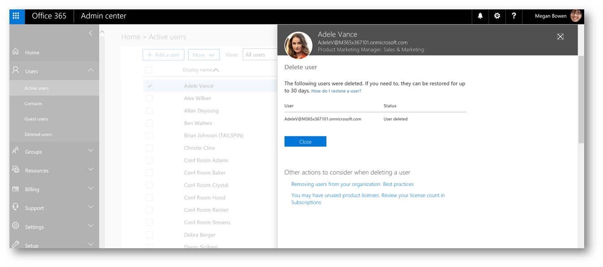
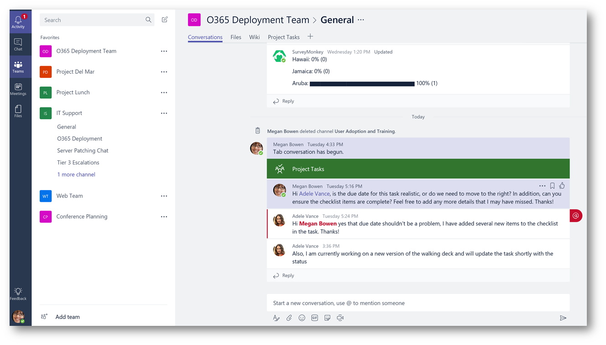
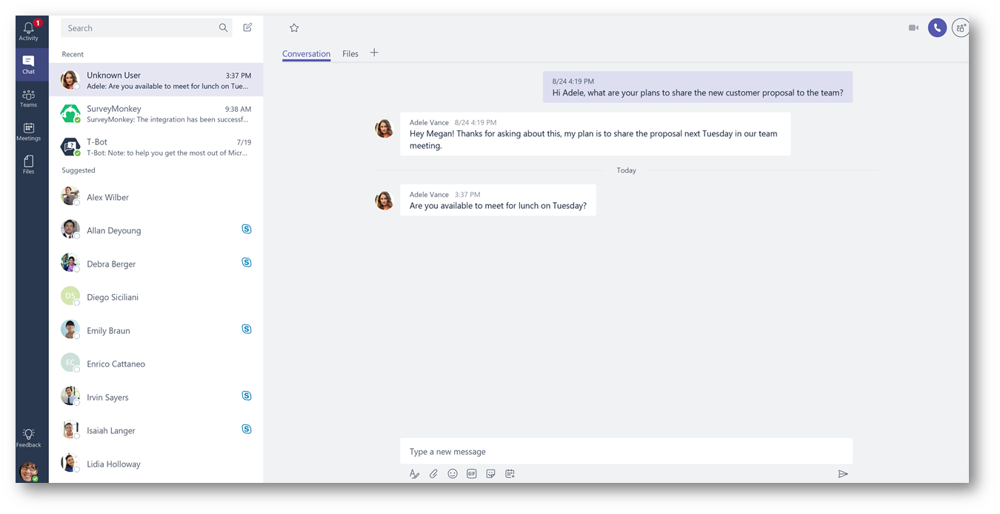
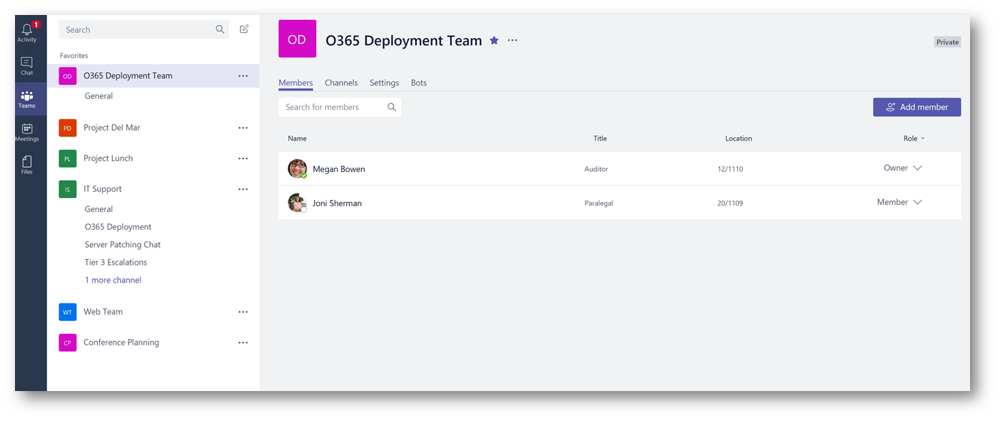

### 介绍：
此博客文章的目的是演示从Office 365删除用户的账号后，此用户在Microsoft Teams群聊和私聊中的历史聊天记录会发生什么改变。

以下是Microsoft Teams聊天对话，其中Adele和其他团队成员正在参与对话：

此外, Adele和Mega还在进行私聊；

### 删除员工账户：

要删除Adele用户账号，我需要删除她的Office 365帐号，此帐户也会从Azure Active Directory中被删除。在Office 365管理员账户下的“Active Users”下，选择“Delete User”，然后单击“Delete”;

可以看到Adele该用户帐户现在已被删除, 然后单击 " Close ":

现在, 该用户已经被删除了, 让我们来看看在Microsoft Teams历史聊天对话中显示的内容。

### Channel聊天记录:

正如您所看到的, 在Teams的聊天对话中, Adele的聊天记录仍然可见:

### 私人聊天记录：

在与Megan的私人聊天对话框中，历史聊天记录仍然可见。但是在左侧用户名显示的是 “未知用户”而不是Adele；

### Team 成员：

单击团队名称旁边的省略号’….’并选择View Team，在成员选项卡下 - 
Adele不再显示为Team成员;

注意：该用户账户如果在30天内被恢复, 该用户将自动添加到原来的Team群组中。

### 总结:
当用户账户从 Office 365 中删除时, 该用户的群聊或者私聊的历史聊天记录 将会被保留。如果有任何问题，意见，建议或反馈或想了解的更加深入，请下面的评论中留言。

\[原文\] [https://blogs.technet.microsoft.com/skypehybridguy/2017/09/01/microsoft-teams-what-happens-to-a-terminated-employee-and-their-conversation-history/](https://blogs.technet.microsoft.com/skypehybridguy/2017/09/01/microsoft-teams-what-happens-to-a-terminated-employee-and-their-conversation-history/)

