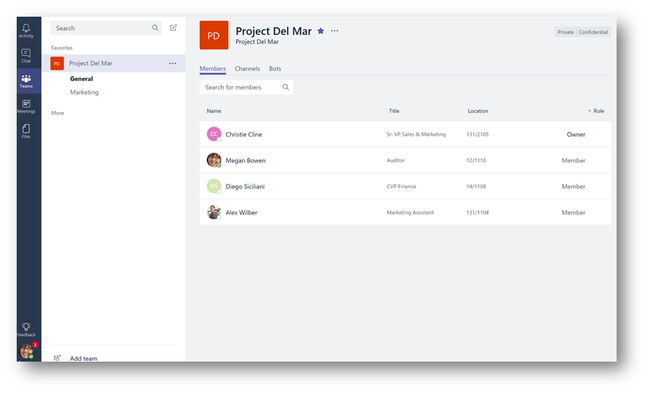
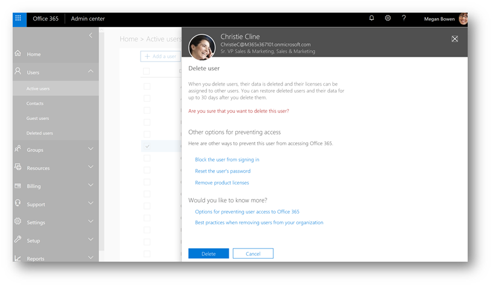
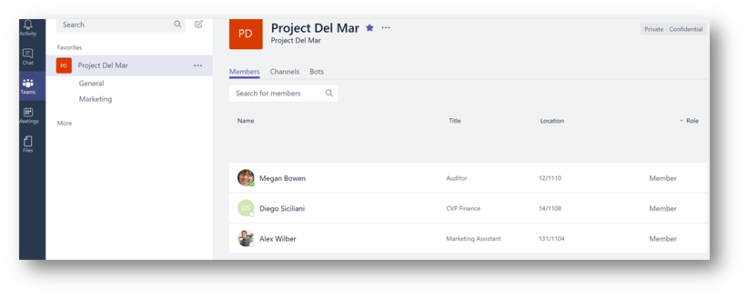
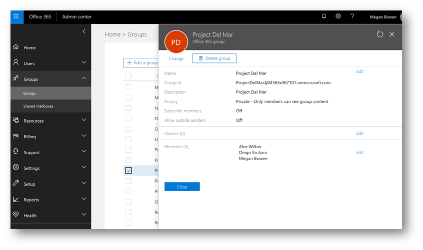
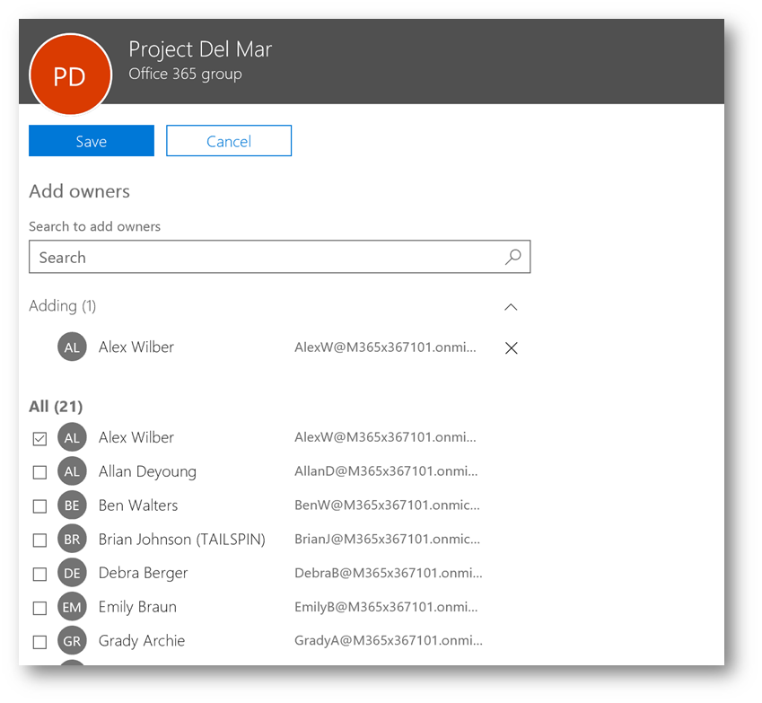
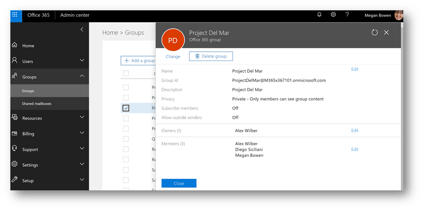
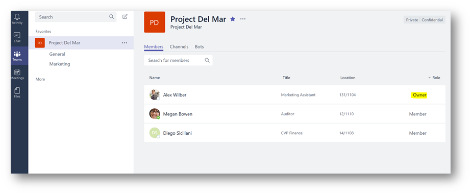

\[原文\] [https://blogs.technet.microsoft.com/skypehybridguy/2017/11/29/microsoft-teams-help-the-team-owner-left-the-company-and-we-dont-know-what-to-do/](https://blogs.technet.microsoft.com/skypehybridguy/2017/11/29/microsoft-teams-help-the-team-owner-left-the-company-and-we-dont-know-what-to-do/)

您是否曾在这么一个团队里，该团队唯一有Owner权限的人离开了公司？不幸的是,如果这个人不再在公司里，您可能觉得没有办法让其他团队成员再成为team的owner。我有一个简单易用的解决方案，但您需要成为Office 365租户的Admin或联系你公司的help desk。

在Microsoft Teams中创建团队时，它也会创建Office 365 Group。 Office 365 Group提供访问团队所需的基础权限和成员身份。拿 Contoso organization 举个例子，Christie Cline(公司销售市场部副总裁)离开了该team。Christie在Microsoft Teams上是Del Mar项目团队的owner。此时team还有其他成员，但没有owner了。没有团队管理者，我们将如何添加/删除成员并管理团队？

因为我们使用的是Office 365 Groups，Office 365管理员可以手动设置该组的另一个成员（以及随后的团队）拥有该team的管理权限，从而为team提供现在可以管理团队的owner。我们来看看如何做到这一点。

您可以在下面看到，Christie目前是Project Del Mar team的管理者：

Christie离开公司，IT接到通知在Office 365中删除她的用户帐户：

当她的账户被删除后，回到Microsoft Teams，我们可以看到她在名单中已经不存在 - 除了team成员被列出，owners 名单为空：

我们现在需要该team的另一名成员成为team owner。在Office 365 Admin Portal中，查看“Groups ”并选择相关的组（team）。我会看到Project Del Mar group其属性：

查看Owners，单击 Edit -> Add Owner，选择一个新 owner，然后单击Save。 （在这种情况下，选择Alex Wilber，因为他已经是团队成员，并同意接管团队所有权责任）。

更改完成后，在group的属性中确认Alex现在已是owner：

可能需要等待一小时让新的Owner生效，在团队的设置中（Microsoft Teams），我现在可以看到Alex已被提升为owner：

结论： 添加owner是一个简单的过程，但需要在Office 365租户中具有管理员权限的人员。

