作为 IT 专业人员, 我一直在寻找自动化任务的方法, 并使日常操作简单。当使用Microsoft Teams时, 是否能够在团队中自动创建团队，渠道和设置对于Microsoft Teams组建的成功与否至关重要。PowerShell对Microsoft Teams的支持使您可以做到这一点，它为我提供了额外的很多方法，使得团队管理变得更容易：

* 自动化的创建新的团队、团队中的新渠道、添加成员和设置选项 (如图片和成员权限)。
* 使用PowerShell创建一个自助服务工具，使创建团队变得非常容易，并同时让IT得到控制。例如，用户浏览填写网页表格来创建团队。PowerShell可以检查重名的团队，以确保用户不会创建具有相同名称的团队。我认为这是一个简单的例子，但当我们开始考虑如何为Microsoft Teams上的业务提供管理时，这个例子就很有意义。
* 如果我需要向团队添加大量成员，使用PowerShell我可以从csv文件中批量添加这些成员
* 创建每个团队时使用标准化的设置。

https://github.com/MicrosoftDocs/office-docs-powershell/tree/master/Teams/Teams-ps/Teams

在这个博客中, 我将带您了解如何下载, 安装和运行 Microsoft Teams  PowerShell module中的几个示例。目前，我们可使用以下这些cmdlets:
* Add-TeamUser
* Get-Team
* Get-TeamChannel
* Get-TeamFunSettings
* Get-TeamGuestSettings
* Get-TeamMemberSettings
* Get-TeamMessagingSettings
* Get-TeamHelp
* Get-TeamUser
* New-TeamChannel
* New-Team
* Remove-Team
* Remove-TeamChannel
* Remove-TeamUser
* Set-TeamFunSettings
* Set-TeamGuestSettings
* Set-TeamMemberSettings
* Set-TeamMessagingSettings
* Set-Team
* Set-TeamChannel
* Set-TeamPicture
* Connect-MicrosoftTeams
* Disconnect-MicrosoftTeams 

作为演示, 我将允许 PowerShell 从 PowerShell Gallery自动下载和安装模块。让我们一起来完成这一步:

首先, 在 "开始" 菜单中输入 PowerShell, 然后右键单击 "Windows PowerShell", 然后选择 "Run as administrator", 以管理员的身份启动 PowerShell。在 UAC 提示符处单击 "Yes"。

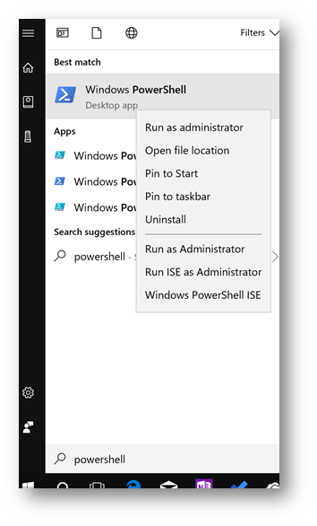

接下来, 在 PowerShell 中输入以下内容并按 Enter键:

```powershell
Install-Module MicrosoftTeams
```

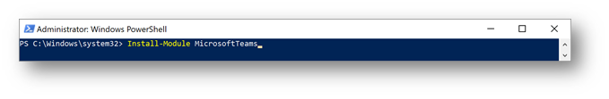

在提示处输入 Y 和按 enter:

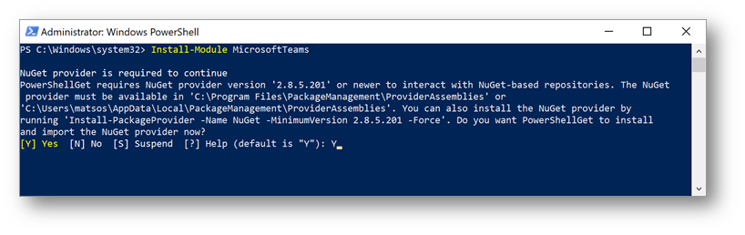

如果系统提示您输入untrusted repository, 请输入 A (所有都是“同意”), 然后按 enter。模块将进行安装。

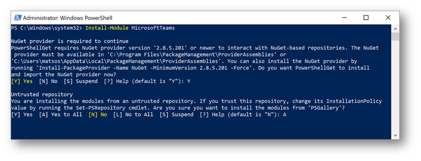

一旦安装完成, 我们现在就可以连接到 Microsoft Teams。输入以下内容, 然后按Enter键:

```powershell
Connect-MicrosoftTeams
```

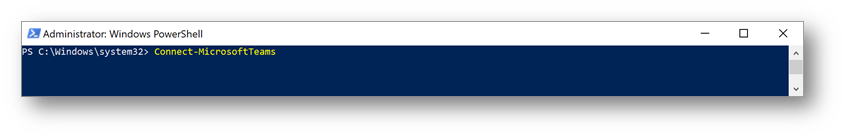

在 "Microsoft Teams PowerShell Cmdlet" 对话框中, 输入 Office 365 凭据并按 Enter键

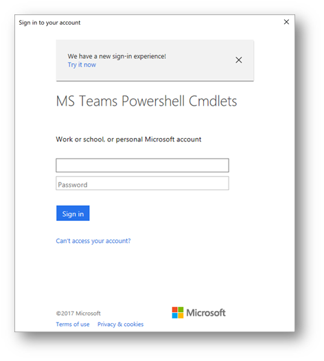

一旦连接到 Office 365租户中的 Microsoft Teams实例, 将显示以下内容:

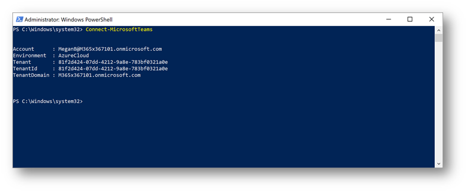

现在, 您可以开始运行 cmdlet 或运行 Microsoft Teams的脚本了! 注意, 您可以在任何时候输入 "Get-Command -Module MicrosoftTeams”, 以查看可用完整的命令列表:

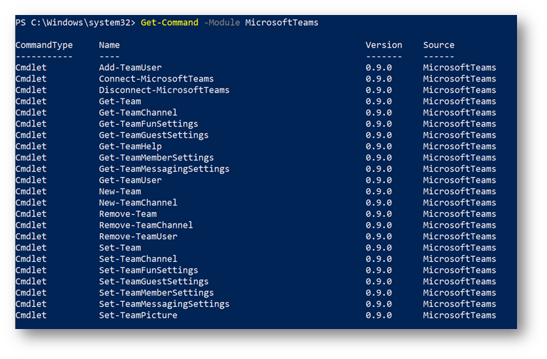

To return a list of the Teams in the environment, type the following and press Enter: 
要返回当前环境中的团队列表, 输入以下命令并按 Enter键：

```powershell
Get-Team
```

注意：在PowerShell中，Teams被引用为基础Office 365 Group的GroupID。

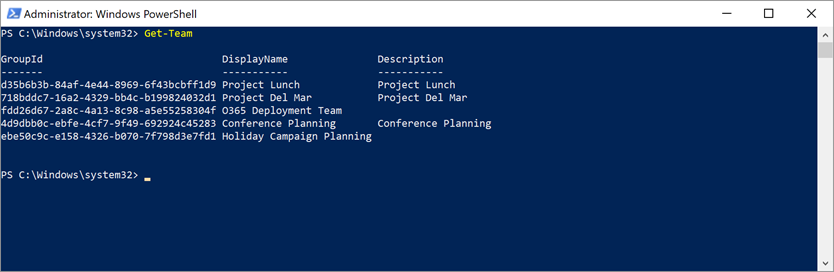

For the next example, let's create a new Team for marketing employees in San Diego that is a private Team. Type the following command and press Enter:
在下一个示例中，让我们为San Diego团队的市场营销员工创建一个新团队。 输入以下命令，然后按Enter键：

```powershell
New-Team -DisplayName "San Diego Marketing" -AccessType Private
```

将使用分配的Office 365 GroupID创建团队：

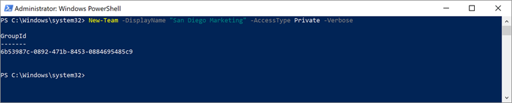

注意：GroupID非常重要，除了在删除团队时需要外，当你希望将分类策略分配给基础Office 365 Group时，也需要GroupID。

在 Microsoft Teams客户端 (teams.microsoft.com) 中, 我们可以看到Team已经创建:


要删除团队，请键入以下内容并按Enter键。 其中<GroupID>是您创建的团队的GroupID：

```powershell
Remove-Team -GroupID <GroupID>
```

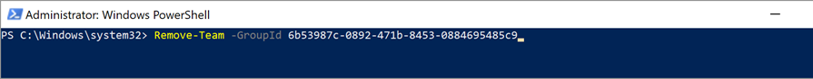

结论：这些是你可以使用Microsoft Teams PowerShell模块执行的一些基本功能。 随着时间的推移，我们将使用PowerShell添加其他方案！


\[原文\] [https://blogs.technet.microsoft.com/skypehybridguy/2017/11/07/microsoft-teams-powershell-support/](https://blogs.technet.microsoft.com/skypehybridguy/2017/11/07/microsoft-teams-powershell-support/)

