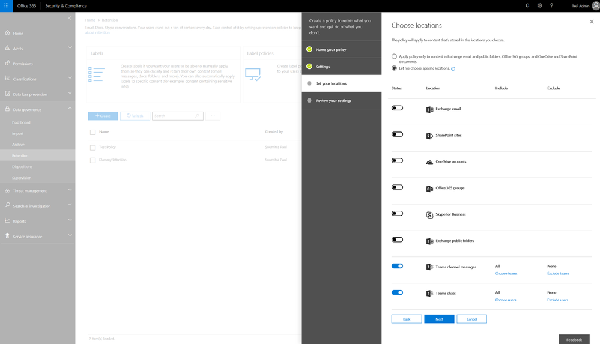
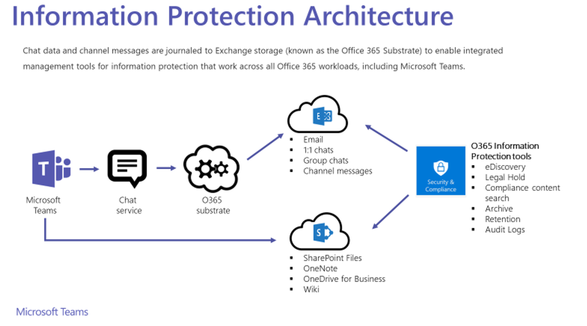

## Microsoft Teams保留策略现在可在Office 365安全性和合规性中心里进行配置

今天，我们很自豪地宣布，我们正在开始推出针对Microsoft Teams的保留策略。 推出预计将在未来几周内完成。 通过此次发布，Teams管理员可以使用Office 365安全性和合规性中心为Team设置保留策略，并主动决定是保留内容还是删除内容 - 适用于整个组织，特定位置或用户或特定Team。

这是我们努力为IT管理员提供Team中更多安全性和合规性功能的一个重要里程碑，也是我们将Skype for Business Online功能引入Team的路线图的重要部分。

## 什么是Team的保留政策？
对于大多数组织而言，其数据的容量和复杂性每天都在增加 - 电子邮件，文档，Team消息等。管理或管理此信息对于管理员需要：

* 主动遵守要求组织在最短时间内保留内容的行业法规和内部政策 - 例如，“Sarbanes-Oxley Act”可能要求您保留某些类型的内容七年。
* 通过永久删除不再需要保留的旧内容，使得组织在发生诉讼或安全漏洞时可以降低风险。
* 通过确保其用户仅使用当前与其相关的内容，帮助组织有效地共享知识并更加灵活。

使用团队保留策略，您可以：
* 主动决定是保留内容，删除内容还是同时保留内容 - 保留然后根据时间删除内容
* 使用SCC策略创建用户体验或Teams Retention的Powershell命令
* 为Team聊天消息和Team频道消息设置不同的保留时间
* 使用这些位置行和目标特定用户（针对Team聊天消息保留）和特定Team（针对Team频道消息保留）来定位整个组织
* 使用SharePoint和OneDrive的保留策略来处理“Team中的文件”

注意：请记住，在Team中，私人聊天中共享的文件存储在发件人的OneDrive for Business帐户中，而在渠道会话中上传的文件存储在Team的SharePoint网站中；

## 它是如何工作的？

对于Team聊天和频道消息，副本（Team客户端的工作）存储在Azure驱动的聊天服务中，并且单独的副本存储（存档）在Exchange Online邮箱（用户和组）中。 我们在之前关于Team信息保护功能的帖子中详细介绍了这一点。
* 1x1聊天或群聊中的聊天消息或IM被提取到隐藏文件夹（TeamChat）中，进入1xN聊天参与者的每个用户的EXO邮箱（n = 1,2,3 ...）
* 将Team \ channel中的频道消息提取到隐藏文件夹（TeamChat）中，并将其提取到代表Team的Office 365组的EXO邮箱中。
* 现在，保留策略由SCC中的管理员设置，Exchange Lifecycle助理查看Team项目中的邮箱及其年龄（基于创建日期）并对其进行操作（根据存在租户里的所有策略来保留或删除它们）。 然后，此信息将级联返回到Team和聊天服务，这些项目将从所有存储位置中删除：
   * Mailboxes（从而使得它们在eDiscovery或合规性内容搜索中不再可用）
   * 聊天服务后端
   * Teams客户端（最终与聊天服务同步）；

## 我从哪里可以找到更详细的信息和文档？
有关更多信息，操作方法，已知问题和常见问题，请参阅：
* [Teams安全和合规性帮助文档](https://docs.microsoft.com/en-us/MicrosoftTeams/security-compliance-overview)
* [保留策略文档总览](https://support.office.com/en-us/article/overview-of-retention-policies-5e377752-700d-4870-9b6d-12bfc12d2423#more)

在推出完成后（4月中旬），我们建议您登录账户，设置相应的权限以创建保留策略，并在与您的法律/治理组织进行讨论后尝试为Team对话创建保留策略。

## 产品规划线路图的下一步是什么？

我们目前正在努力为Team中的电话和会议尽快发布eDiscovery。 路线图中的下一个重要项目是对话和文件的数据丢失防护（Data Loss Prevention, DLP）。与此同时，我们还专注于解决客户对现有关键功能的反馈，如Team数据的eDiscovery，Teams审计日志等。

谢谢，敬请期待更多更新。 请随时通过其他渠道提供有关Team安全性和合规性功能的问题或反馈。我们随时聆听您的反馈。

\[原文\] [https://techcommunity.microsoft.com/t5/Microsoft-Teams-Blog/Retention-policies-for-Microsoft-Teams/ba-p/178011](https://techcommunity.microsoft.com/t5/Microsoft-Teams-Blog/Retention-policies-for-Microsoft-Teams/ba-p/178011)

