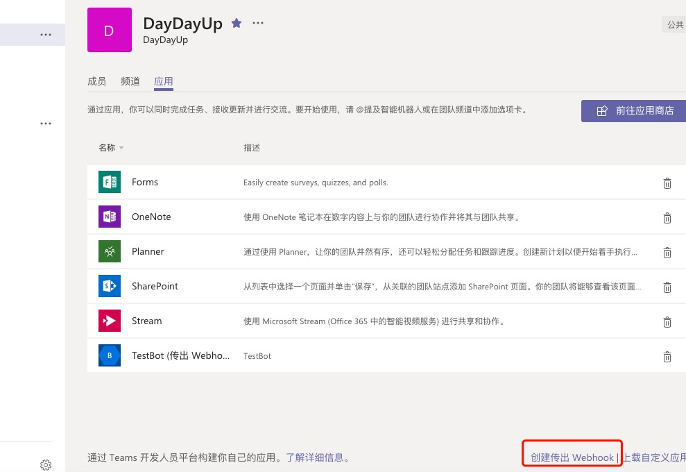
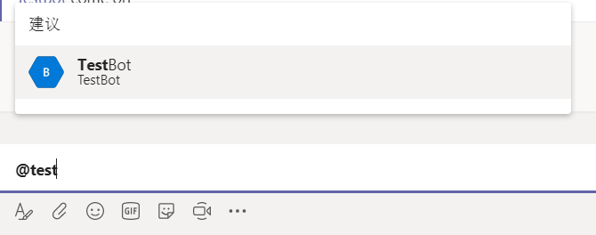
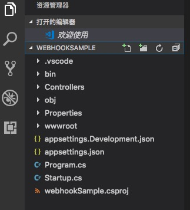
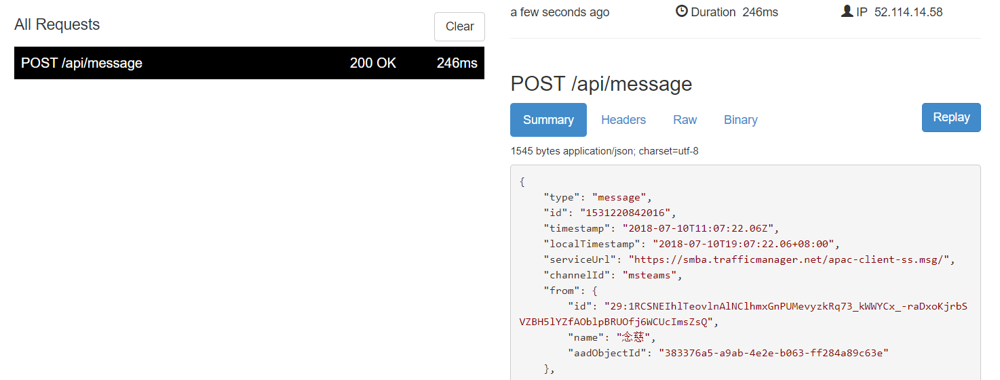
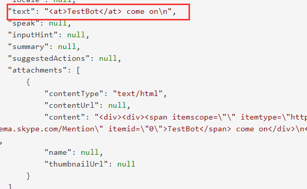
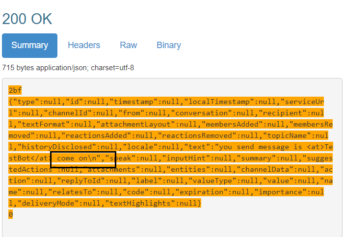
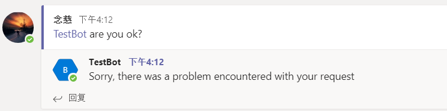
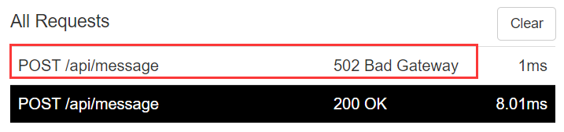
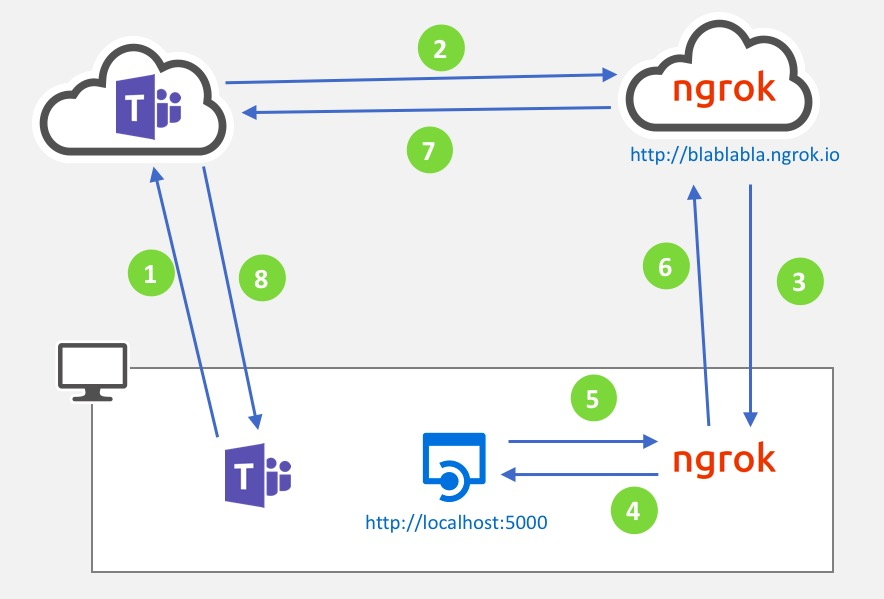

Microsoft Teams的应用程序有几种形式：
1. Tabs
2. Bots
3. Connectors
4. Messaging extensions
5. Activity feed integrations
6. Outgoing web hooks

这篇我们主要介绍如何使用 ASP.NET Core来开发最简单的Outgoing web hook。

## 什么是outgoing webhook

> Outgoing webhooks allow you to create a simple bot for basic interaction, like kicking off a workflow or other simple commands you may need. Outgoing webhooks live only in the team in which you create them and are intended for simple processes specific to your company's workflow.   
> If you've worked with outgoing webhooks or slash commands in other chat platforms, you can now bring what you have developed over to Microsoft Teams via outgoing webhooks. Outgoing webhooks are an easy way of extending your team without having to go through the full process of creating a bot via the Microsoft Bot Framework. You can use them for custom workflows and commands such as kicking off a build or checking the latest set of livesite issues.  
> You also have an effective way of ensuring that your service is accessible only by authorized users, as the security token used by your outgoing webhook will only be scoped to the team in which it has been added

上面是微软官方对outgoing webhook的说明，其实简单来说，outgoing webhook就是当我们想要创建一个Bot应用时，可以不必使用微软Bot Framework来创建，这个应用可以执行我们团队的一些自定义工作流和简单命令。

## 如何在teams里面创建outgoing webhook

要创建一个outgoing webhook, 进入到Teams应用, 导航到“团队” Tab页， 选中需要建立的Channel, 选中“应用”这个Tab，点击最下方的“创建传出webhook”(英文版本叫Outgoing Webhook), 如下图所示:



在“创建传出webhook”对话框中，可以配置传出webhook在频道中的显示方式

* **名称** 将显示为机器人的标题，也是用户将如何命名机器人
* **回调URL** 是将从团队接收消息的端点
* **说明** 是一个详细的字符串，它将显示在配置文件卡和团队级应用程序仪表板中
* **配置文件图片是** 传出webhook的可选显示图片

  

这里我们创建一个名为“TestBot”的程序，填入ngrok中的https的地址（关于ngrok下文会详细说到），单击“创建”，将在当前团队中提供传出webhook。它不会在任何其他团队中提供。下一个对话框将显示一个安全令牌，您将使用该令牌验证来自Microsoft Teams的请求

  

这里我们把这个Security Token复制，保存起来。一旦关闭这个页面以后我们无法再进入到这个页面复制，如果需要拿到这个Token，必须重新创建新的传出webhook。

让我们来试一下新鲜出炉的webhook。将传出webhook添加到团队后，它的外观和行为就像机器人一样，我们可以轻松地进行交互。它使用带有webhook名称的@mention监听消息，并可以回复丰富的消息，包括图像和卡片等

 


## 开发传出webhook的后端服务

上面我们讲到如何在Teams中创建webhook的应用，那当我们发送@这个机器人，并且发送消息时，这个bot应用是如何接受到消息，并且响应这个消息的呢。这里我们基于dotnet core搭建这个bot的后端响应服务程序。  
如果你开发机器上还没有安装 dontnet，那可以到 http://www.dot.net 下载官方SDK，下载完成后，进入到windows标准的安装， 一路“下一步”直到完成。
进入到cmd，输入 ```dotnet --version```，可以看到我们安装的当前dotnet core的版本：

```cmd
c:\Users\demouser> dotnet --version
2.1.300
```

这里我们看到显示的版本时2.1.300，这个版本是 .NET Core 2.1, 如果是2.1.301，则是 .NET Core 2.1.1

```dotnet --info```，我们可以看到整个开发环境的详细信息：  
    
```cmd     
c:\Users\demouser> dotnet --info     
```     

安装完dotnet core后，我们就可以开始新建web api项目。

```cmd
c:\demo> dotnet new webapi -n WebhookSample
```

用vs code打开我们新建的项目的文件夹，可以看到 .Net Core通过模板，为我们新建的web api的项目结构：


 
修改```Startup.cs```文件，注释其中```app.UseHttpsRedirection()```
```csharp
public void Configure(IApplicationBuilder app, IHostingEnvironment env)
{
    if (env.IsDevelopment())
    {
        app.UseDeveloperExceptionPage();
    }
    else
    {
        app.UseHsts();
    }

    //app.UseHttpsRedirection();
    app.UseMvc();
}
```

这里注意下：去掉```app.UseHttpsRedirection()```的原因是为了简化一些配置自签名证书，如果大家已经配置过了，这个不注释掉也可以。

修改```ValuesController.cs```文件，改为如下所示的代码：

```csharp
[ApiController]
public class ValuesController : ControllerBase
{
    [HttpPost]
    [Route("api/message")]
    public Activity Post([FromBody]Activity request)
    {
        return new Activity()
        {
            Text = $"you send message is {request.Text}"
        };
    }
}
```

执行```dotnet run```命令来运行项目，默认本地是以 ```http://localhost:5000``` 端口运行

到这里我们的web api项目就整个跑起来了，那么如何和我们在Teams中配置的webhook机器人产生交互呢？这里需要借助于我们上面说到的ngrok这个工具了。

> ngrok 是一个反向代理，通过在公共端点和本地运行的 Web 服务器之间建立一个安全的通道，实现内网主机的服务可以暴露给外网。  
> ngrok 可捕获和分析所有通道上的流量，便于后期分析和重放    
> 简单来说就是，我们在webhook中配置了一个https的外网地址，需要将bot的信息转发到我们内网localhost:5000提供的web api服务，以响应Teams中的消息
>      
> ngrok官网下载： https://ngrok.com/     
> 运行ngrok.exe，输入命令 ```ngrok http 5000`` 这个命令是让ngrok的服务器把请求转发到本地的5000端口，协议使用HTTP。     
> 从下面的截图，我们可以看到工具为我们提供的http和https的两个外网转发地址，两个地址都是指向我们本地的localhost:5000端口
> 

这里的https地址，就是我们上面在Teams中配置webhook时候需要填入的地址，为了让webhook中的消息转发到我们本地，并且识别信息，进行响应。那我们重复上文中的步骤：在Teams的channel中输入```@Testbot```，然后再输入```come on```， 此时我们会收到一个响应消息，如下图：


ngrok还为我们提供了一个非常实用的控制面板，打开你喜欢的浏览器，输入```http://localhost:4000```，ngrok就会列出所有转发的请求和响应：



点击任何一个请求，在右边就会显示这个请求的详细信息和它所对应的服务响应内容。





此时，我们把本地的web api服务停止掉（在运行服务的窗口按Ctrl + C），看是否还能响应消息，同样在Teams中发送消息

 

这里我们看到Bot响应失败了，查看ngrok的控制面板，看到响应报了 ```502 Bad Gateway``` 的错误

 

**总结一下，整个的逻辑是：
我们在webhook中填入服务的响应地址（必须是https的)，随后通过ngrok转发到我们本地5000端口运行的web api程序，程序处理后返回，然后ngrok再返回给teams，teams server再返回给你。



### 总结

这篇文章主要是讲解什么是outgoing webhook，如何在Teams中创建一个webhook，如何使用ASP.NET Core开发webhook后端服务程序，并且通过ngrok这个桥梁，把Teams和你本地运行的服务串联起来。
  
在下一篇文章中，我们将会讲到，**如何使用dotnet template快速开发带card功能的outgoing webhook**

### 官网链接
* [Outgoing webhook](https://docs.microsoft.com/zh-cn/microsoftteams/platform/concepts/outgoingwebhook)
* [Code samples for the Microsoft Teams developer platform](https://docs.microsoft.com/zh-cn/microsoftteams/platform/samples/code-samples)
* [Add bots to Microsoft Teams apps](https://docs.microsoft.com/en-us/microsoftteams/platform/concepts/bots/bots-overview)
  