作为一个相对看重个人信息安全与隐私的人，个人附件等资料在Microsoft Teams中的存储方式、文件访问权限、可见范围问题引起了我的好奇。

众所周知，Teams包含3大主要的模块：单人聊天、团队、会议。那下面让我们一起来看一下，对这三个模块进行一些操作，相应的在SharePoint以及OneDrive上会有什么变化？

### **聊天信息存储位置验证**

1. 创建与单个Teams成员1:1的聊天，分别查看SharePoint以及OneDrive中的变化；
我们在Microsoft Teams下创建一个单人聊天会话，并发送信息，如图：

分别回到SharePoint以及OneDrive界面下进行刷新，我们发现SharePoint界面无变化，但是在OneDrive的/personal/yy_oteams_onmicrosoft_com路径下创建了一个【Microsoft Teams 聊天】子文件夹，如下图：

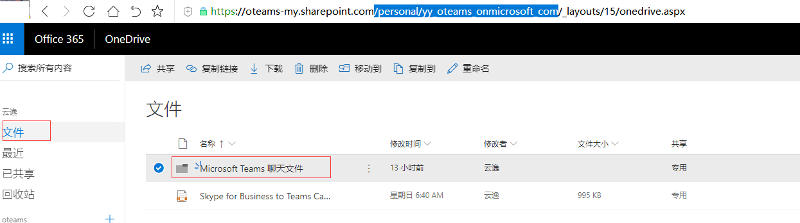

2. 在单人聊天界面中互相发送附件，分别查看SharePoint以及OneDrive中的变化；
我们在刚刚创建的聊天室中互相发送附件，如图：
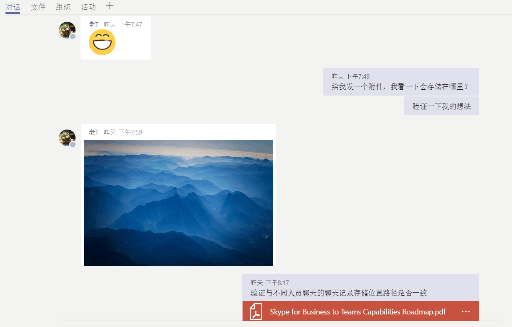

分别回到SharePoint以及OneDrive界面下进行刷新，我们发现SharePoint界面无新文件生成，但是在OneDrive的/personal/yy_oteams_onmicrosoft_com/Microsoft Teams 聊天 目录下出现了我们互相发送的附件：

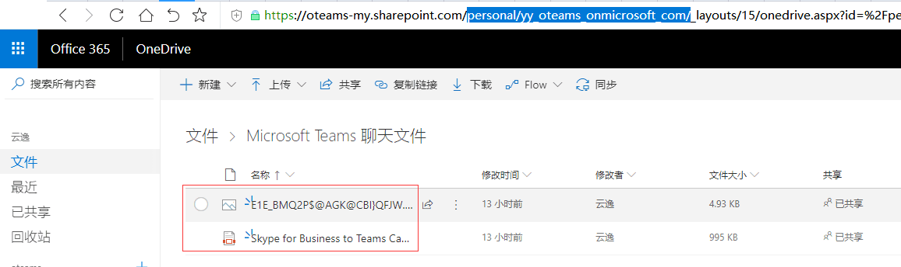

3. 与第二个人在聊天界面发送附件，验证与不同人员聊天的聊天记录存储位置路径是否一致
我给第二个人发送了聊天附件，如图：

并观察到OneDrive的/personal/yy_oteams_onmicrosoft_com/Microsoft Teams 聊天  目录下出现了新的附件，截图如下：
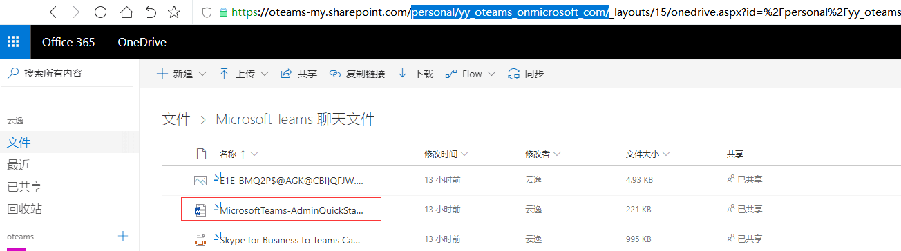

4. 删除OneDrive中的发送的附件，查看Teams 单人聊天见面发生的变化；
我尝试删除了单人聊天目录下的MicrosoftTeams-AdminQuickStart-EnableTeams.docx文件，然后在teams界面观察到聊天窗口界面无变化，双击打开文件时候提示：【对不起，找不到你的文件】，截图如下：

5. 小结
- 对于每个用户，OneDrive下 [Microsoft Teams 聊天文件] 目录用于存储私人聊天中与其他用户共享（一对一或一对多）的所有文件
- 私人聊天对话框中发送的附件，存储在发送方的 OneDrive for Business中
- 私人聊天对话框中发送的附件，Microsoft Teams会自动配置权限以限制仅目标用户可以访问这些附件
- OneDrive下 [Microsoft Teams 聊天文件] 目录存储的附件种类包含图片、文件（Word、PPT、PDF、Excel等）

### **团队文件存储位置验证**

1. 创建一个全新的[团队]，分别查看SharePoint以及OneDrive中的变化；
我们在Microsoft Teams下创建一个全新的[团队]，可以看到它默认只有一个【常规】频道，如图：
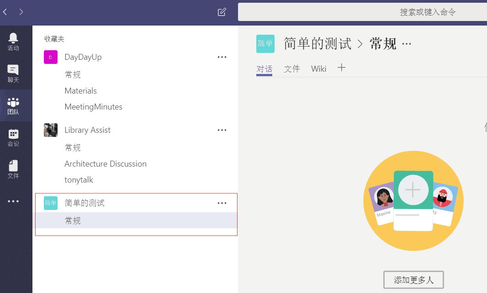

分别回到SharePoint以及OneDrive界面下进行刷新，我们发现OneDrive文档目录界面无变化，但是在SharePoint中创建了一个团队网站，且新建的Teams团队【简单的测试】中的【常规】频道在默认网站文档库中有一个【General】文件夹，如下图：

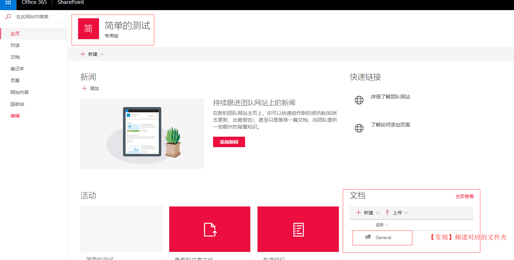

2. 在创建的[团队]中新建一个频道，分别查看SharePoint及OneDrive中的变化；
我们在刚刚创建的【简单的测试】团队下新建一个频道【测试1】，如图：
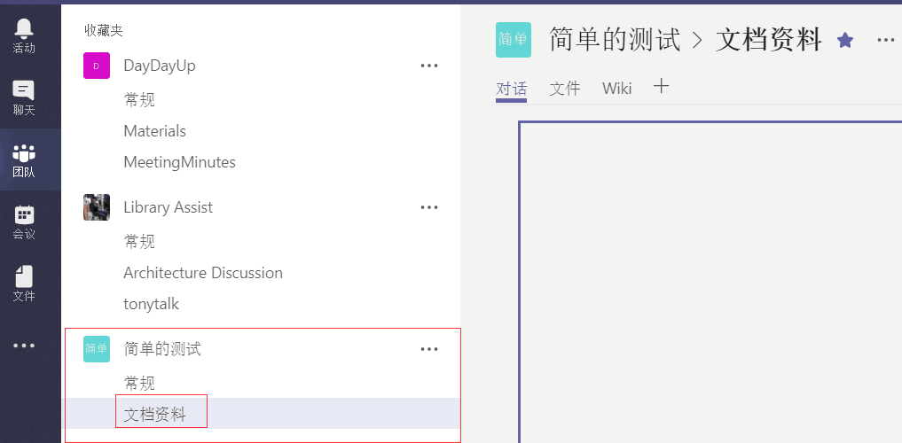

分别回到SharePoint以及OneDrive界面下进行刷新，我们发现OneDrive文档目录界面无变化，但是在SharePoint中的【简单测试】团队网站的文档库中多了一个文件夹，可见Teams 团队中的每个频道在其对应归属的SharePoint团队网站文档库中都对应一个文件夹，如下图：

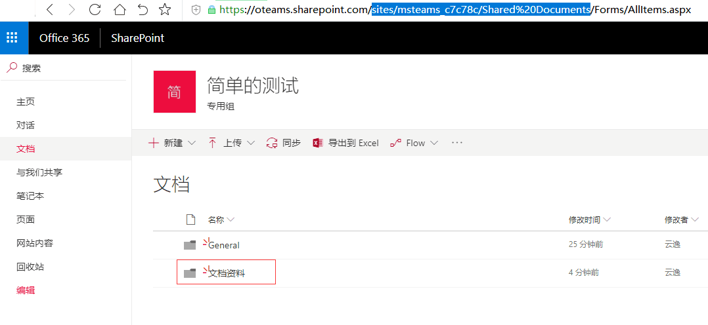

3. 在创建的[频道]中发送一个附件，分别查看SharePoint及OneDrive中的变化；
我们在【常规】频道下通过使用OneDrive上载方式上传一个OneDrive中的附件到【常规】频道的对话选项卡中，如截图：

我们回到SharePoint的文档库中，发现其被存储在../sites/msteams_c7c78c/Shared Documents/General 目录下，如下图
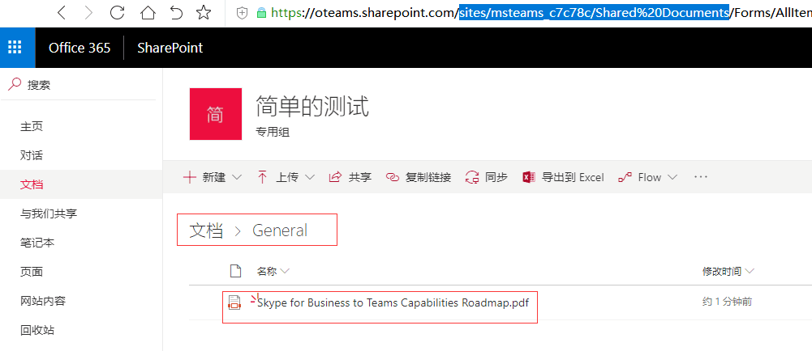

4. 删除SharePoint中的附件，查看对应的Teams频道中的变化；
我在SharePoint的文档库中，删除刚刚上传的附件，然后回到Microsoft Teams的【常规】频道下，观察到该附件无法被打开，提示：对不起，找不到你的文件，如截图：

我们打开OneDrivw的目录下，发现仍然能该文件，并可以正常打开，如截图：
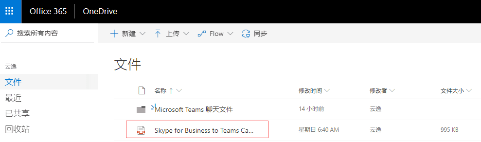

可见，从Teams的频道下删除来源于OneDrive共享的文件，不影响个人对该文件的私有性质；
5. 小结
- Microsoft Teams 中的每个团队在 SharePoint Online 中都有一个团队网站，初步判断Microsoft Teams中的团队概念实质上是由SharePoint的团队网站作为后台支撑体系
- 团队中的每个频道在默认团队网站文档库中都有一个文件目录用于存储该频道的附件，包括每个团队的默认频道“常规”频道。
- 频道对话中共享的文件会自动添加到文档库中，在 SharePoint 中做的删除、权限变更和文件安全选项会自动反映在Teams 中。
- Teams 团队对应SharePoint文档库中共享文件的删除不会影响到个人OneDrive中的文件。

### **会议文件的存储位置**
1. 发起一个会议，并在会议中输入文字及发送附件，分别查看SharePoint及OneDrive中的变化；
我们创建并加入一个会议，加入会议后输入文字及发送附件，如截图：

我们打开OneDrivw的目录下，我们发现SharePoint界面无新文件生成，但是在OneDrive的/personal/yy_oteams_onmicrosoft_com/Microsoft Teams Data/Wiki 目录下出现了会议纪要，如截图：

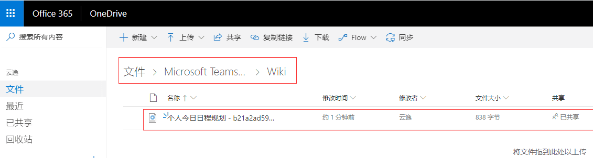
在OneDrive的/personal/yy_oteams_onmicrosoft_com/Microsoft Teams 聊天 目录下出现了我们会议中发送的附件，如截图；
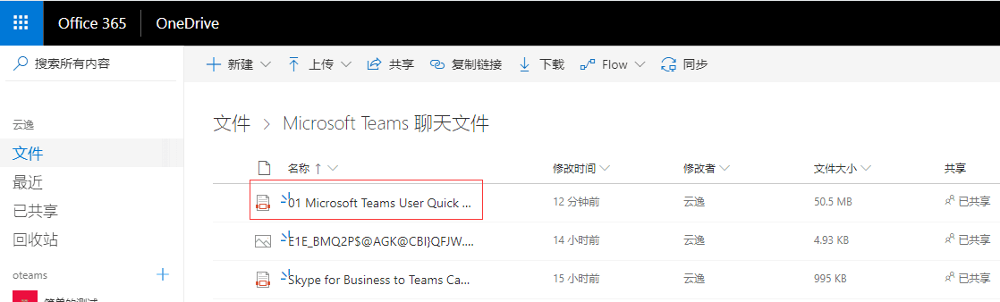

6. 小结
- Teams 的会议中的附件存储位置同同单人聊天室

### **结论**

综上可知
- Microsoft Teams内附件通过在 SharePoint Online 文档库和 OneDrive for Business 中存储文件
- 团队相关附件存储在SharePoint团队网站共享文档库中
- 1:1个人聊天附件，存储在OneDrive个人目录中，共享给接收方
- Microsoft Teams的会议附件存储遵循附件由创建人拥有的原则，故存储位置同1:1聊天存储在个人的OneDrive中，共享给他人时遵循OneDrive的共享规则
- Microsoft Teams附件权限设置，分别遵循OneDrive和SharePoint在租户级别配置的权限
