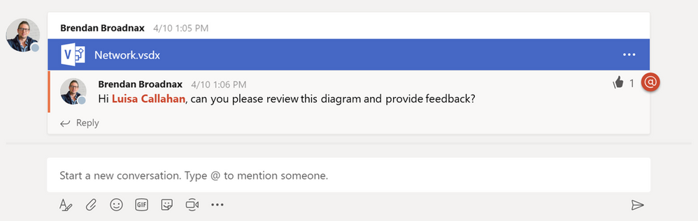
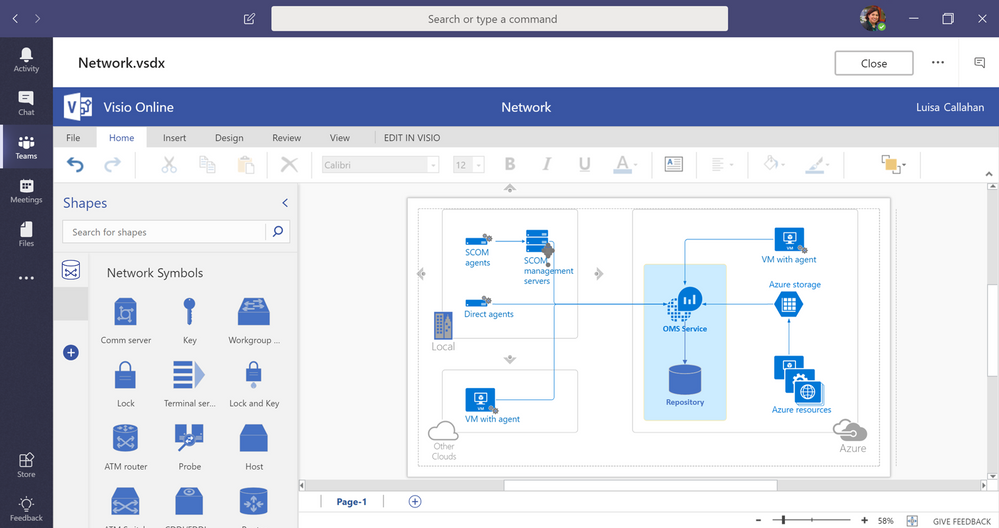
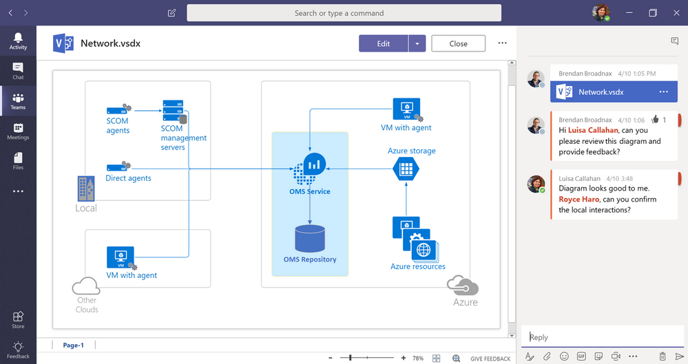

所有Team站点都带有专用文件库，用于存储所有工作组的内容。 您现在可以从桌面或云存储站点将Visio文件上载到此库，例如，您所在Team的资产都集中在一个位置，供具有权限的任何人进行访问。与其他存储文件一样，您可以直接从Team对话链接到Visio图表。

## Teams中直接编辑图表
不过，Teams不仅仅是一个文件存储库。 借助Office Online的编辑功能，您可以直接在Teams中编辑Word，Excel和PowerPoint文件。我们已将这些编辑功能扩展到Visio文件，使您无需离开Teams应用程序即可对diagrams进行简单更改。 您还可以选择在Visio Online中编辑diagrams，或者在Visio桌面版中编辑以获得更强大的功能。Team成员将在刷新图表时看到您的最新更改。

## 提供图表反馈
 
Team成员可以通过应用内对话在图表上一起工作，以实时提供反馈。对话能针对于您正在处理的图表，并在您提交时出现。 您还可以链接到其他文件并使用@mentions来引起各个Team成员的注意。 此外，您的图表注释会显示在Team的整体“对话”选项卡中，以及来自所有其他存储文件的反馈，从而提供跨资产的所有对话的单一视图。 “对话”选项卡中对评论的响应也会显示在图表的专用对话窗格中。

Viewing diagrams within Teams is free for?most Office 365 customers, but editing is only available for those with a Visio Online Plan 1 or Plan 2 subscription. Please note, neither of these licenses include Teams, which available through Microsoft 365.
Please visit the?Visio website?for more details on each plan, as well as options for trying the Visio Online experience and our cloud-first innovations for free. We also invite you to submit ideas for more cloud innovations on our?UserVoice?site. For questions about our latest releases, please email us at tellvisio@microsoft.com. To stay informed of the latest Visio releases, follow us on?Facebook?and?Twitter?and visit our?blog?and?Tech Community?sites.

## Visio Online的更多功能

对于大多数Office 365客户而言，在Team中查看图表是免费的，但编辑仅适用于具有Visio Online Plan 1 or Plan 2订阅的人员。 请注意，这些许可证都不包括通过Microsoft 365提供的Teams。
请访问Visio网站，了解有关每个计划的更多详细信息，以及免费试用Visio Online体验和云端创新的选项。 我们还邀请您在UserVoice网站上提交更多云创新的想法。 有关我们最新版本的问题，请发送电子邮件至tellvisio@microsoft.com。 要了解最新的Visio版本，请在Facebook和Twitter上关注我们，并访问我们的博客和技术社区网站。

\[原文\] [https://techcommunity.microsoft.com/t5/Microsoft-Teams-Blog/Collaborate-on-Visio-files-inside-Microsoft-Teams/ba-p/206279](https://techcommunity.microsoft.com/t5/Microsoft-Teams-Blog/Collaborate-on-Visio-files-inside-Microsoft-Teams/ba-p/206279)

