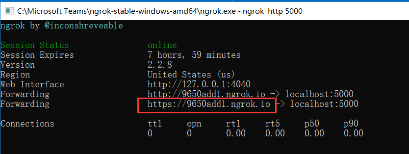
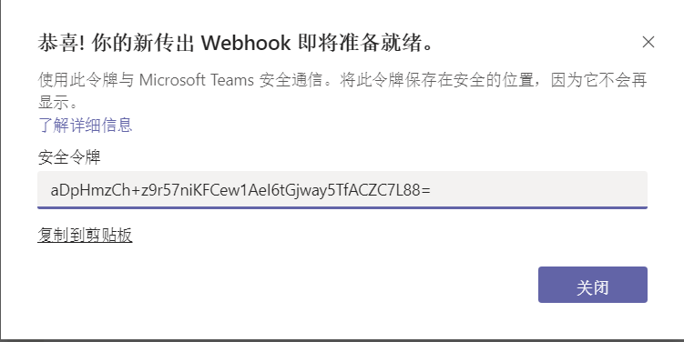
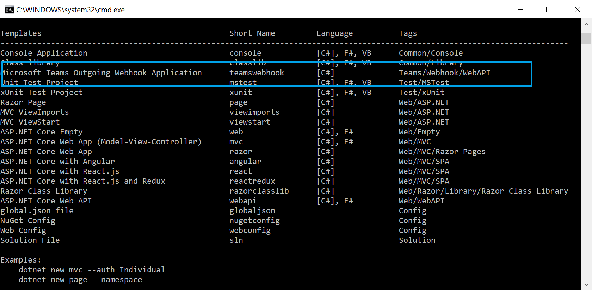
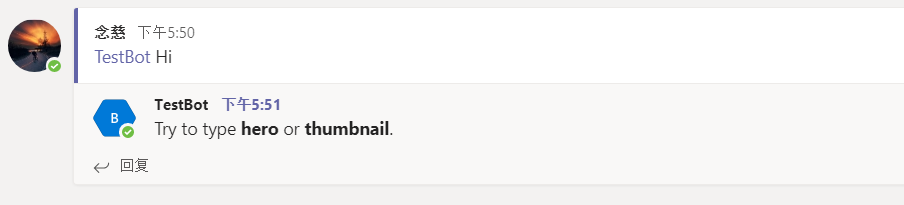
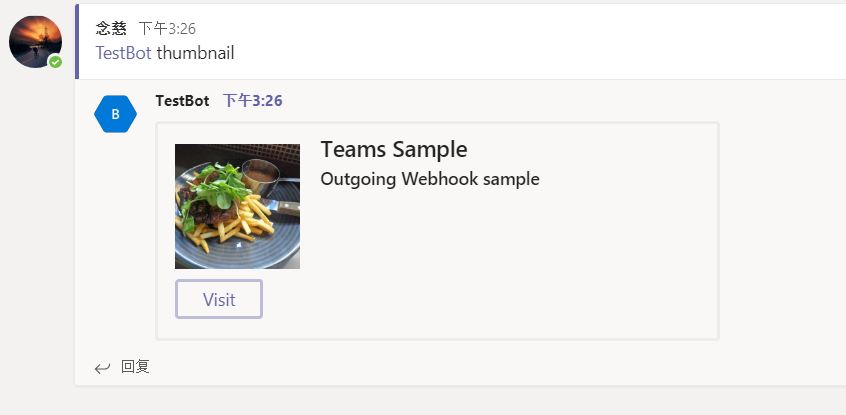
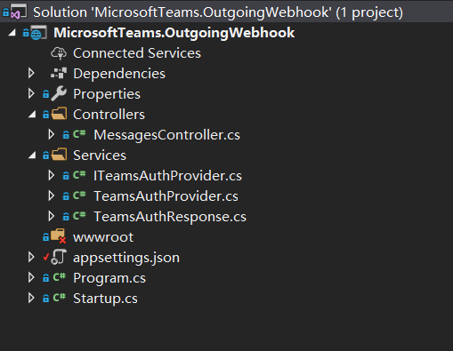

在[上一篇文章](https://tony-xia.github.io/teams_outgoing_webhook_simple/)中，我们一步步从无到有在Microsoft Teams中开发了一个简单的Outgoing Webhook，并和我们本地的Web API应用程序产生交互，总结起来的步骤大概如下：

* 导航到“团队” Tab页， 选中需要建立的Channel, 选中“应用”这个Tab，点击最下方的“创建传出webhook”
* 开发传出webhook的后端服务
* 配置ngrok进行请求转发
* Team中发送消息，后端程序响应消息 

这篇文章我们一起来看看如何使用dotnet的模板来快速开发一个带安全验证机制的Outgoing Webhook

### 1. 运行ngrok，记下转发的地址

> 

### 2. 在teams里新建一个app，这次记下security token

具体的创建步骤见第一篇文章



### 3. 安装dotnet的模板

因为Teams的模板默认没有安装，所以我们需要在dotnet里添加模板

```cmd
c:\demo> dotnet new -i MicrosoftTeams.Templates
```



### 4. 使用模板创建Teams Outgoing Webhook项目

运行以下命令来在当前目录下创建工程

```cmd
c:\demo> dotnet new teamswebhook
```

使用VS code打开这个目录，找到```appsettings.cs```文件，修改配置节点```TeamsAppSecurityToken```， 填入我们创建Webhook时生成的```security token```

```csharp
{
  "Logging": {
    "LogLevel": {
      "Default": "Warning"
    }
  },
  "AllowedHosts": "*",
  "TeamsAppSecurityToken": "aDpHmzCh+z9r57niKFCew1AeI6tGjway5TfACZC7L88="
}
```

### 5. 运行程序

```cmd
c:\demo> dotnet run
```

## 返回到Teams的对话框中，我们发送一条消息，观察Teams的消息返回

 

注意到消息正常返回，且提示我们尝试输入```hero 或者 thumbnail```，那我们根据提示，分别发送hero和thumbnail 

  

 

上面的整个过程就是我们基于Microsoft Teams的模板创建的整个可交互的Outgoing Webhook的应用，下面我们来分析下整个的代码结构：

 

首先，看到```Services```中定义的接口```ITeamsAuthProvider.cs```：  
```csharp
public interface ITeamsAuthProvider
{
    /// <summary>
    /// Validates the specified authentication header value.
    /// </summary>
    /// <param name="request">The HTTP request message.</param>
    /// <returns>
    /// Response containing result of validation.
    /// </returns>
    TeamsAuthResponse Validate(HttpRequest request);
}
```

其中的```Validate```方法用于对请求的授权认证，```TeamsAuthProvider.cs```继承```ITeamsAuthProvider```，实现了```Validate```
的认证授权逻辑。这个验证用来确保这个请求是从微软Teams的服务器发过来的，而不是其他恶意的程序发送的请求，从而确保的请求的发起源是受信任的。

接着看下```MessagesController```中,```GetMessage```这个Action，首先实现对请求授权的判断，  
```csharp
var authResult = _teamsAuth.Validate(this.Request);
if (!authResult.AuthSuccessful)
{
    return new Activity()
    {
        Text = "You are not authorized to call into this end point."
    };
}
```

重点我们看下下面这段代码，
```csharp
Attachment attachment = null;
if (activity.Text.Contains("hero", StringComparison.InvariantCultureIgnoreCase))
{
    var card = CreateSampleHeroCard();
    attachment = new Attachment()
    {
        ContentType = HeroCard.ContentType,
        Content = card
    };
}
else if (activity.Text.Contains("thumbnail", StringComparison.InvariantCultureIgnoreCase))
{
    var card = CreateSampleThumbnailCard();
    attachment = new Attachment()
    {
        ContentType = ThumbnailCard.ContentType,
        Content = card
    };
}
```

从上面的代码中看到，我们在Teams中发送```hero```或者```thumbnail```时，会看到响应的消息是一个带有图片的消息回复，具体的这种图片消息，
我们可以简单理解为是一种图片附件的形式，我们来分析其中```hero```图片附件的代码：

```csharp
private HeroCard CreateSampleHeroCard()
{
    return new HeroCard()
    {
        Title = "Superhero",
        Subtitle = "An incredible hero",
        Text = "Microsoft Teams",
        Images = new List<CardImage>()
        {
            new CardImage()
            {
                Url = "https://github.com/tony-xia/microsoft-teams-templates/raw/master/images/cbd_after_sunset.jpg"
            }
        },
        Buttons = new List<CardAction>()
        {
            new CardAction()
            {
                Type = "openUrl",
                Title = "Visit",
                Value = "http://www.microsoft.com"
            }
        }
    };
}
```

可以比较清楚的看到，一些标题Title和显示问题Text, 其中Image作为显示图片URL, 这里的```Buttons```是这一种行为，当我们点击时，跳转到对应设置的网站，点击可以看到跳转到微软的官网。

可以看到使用dotnet template来创建outgooing webhook项目方便快速，而且使用了card，使得返回的消息格式非常丰富。
