Microsoft Teams推出有一段时间了，如果想要体验Teams，必须需要有Office365的订阅。最近微软为了进一步推广Teams，突然宣布Teams免费了。使用过Teams的读者知道Teams是基于Office365账号和组的，那它免费后，不使用Office365账号是否也可以登入？如果可以，那它在Azure体系里是怎么做的呢？免费版本在功能上会有什么不同吗？让我们一起来体验一下。

## 免费版本的注册
打开你的浏览器，输入注册地址：https://products.office.com/zh-cn/microsoft-teams/free
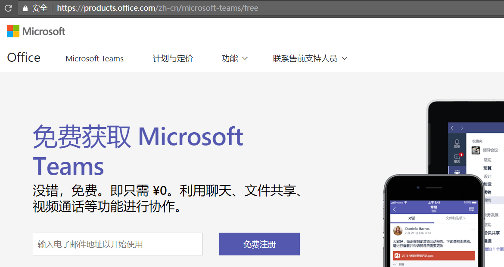

注册只需要3步，预计需要1-2分钟即可完成注册，非常方便快捷。

1. 设定电子邮箱账号：输入一个有效的电子邮箱并进行验证

2. 介绍一下你自己：填写自己的基本信息
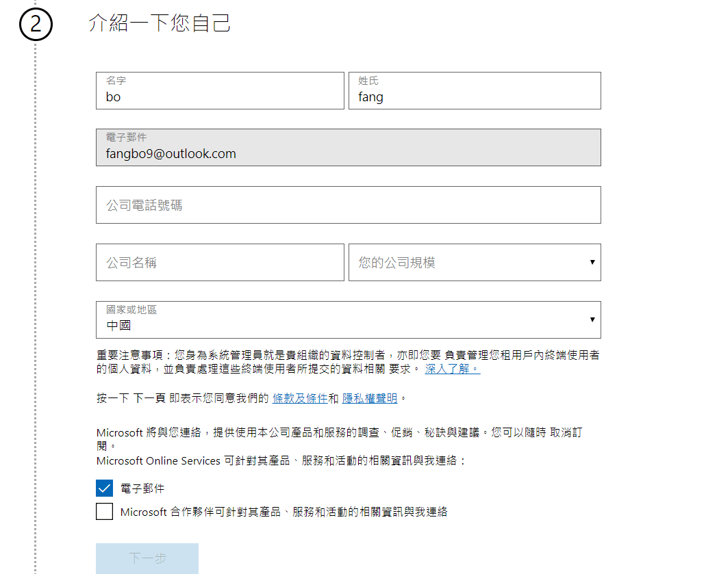
PS:注意在保存自己基本信息后不要刷新页面哟！

3. 开始使用：注册完成
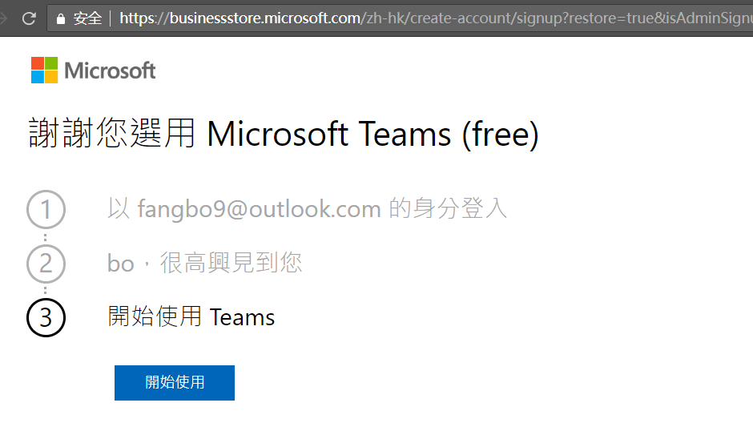

## 免费版本与付费版本的使用区别
首先让我们先看一下官网上Microsoft Teams不同付费版本之间的功能差异。

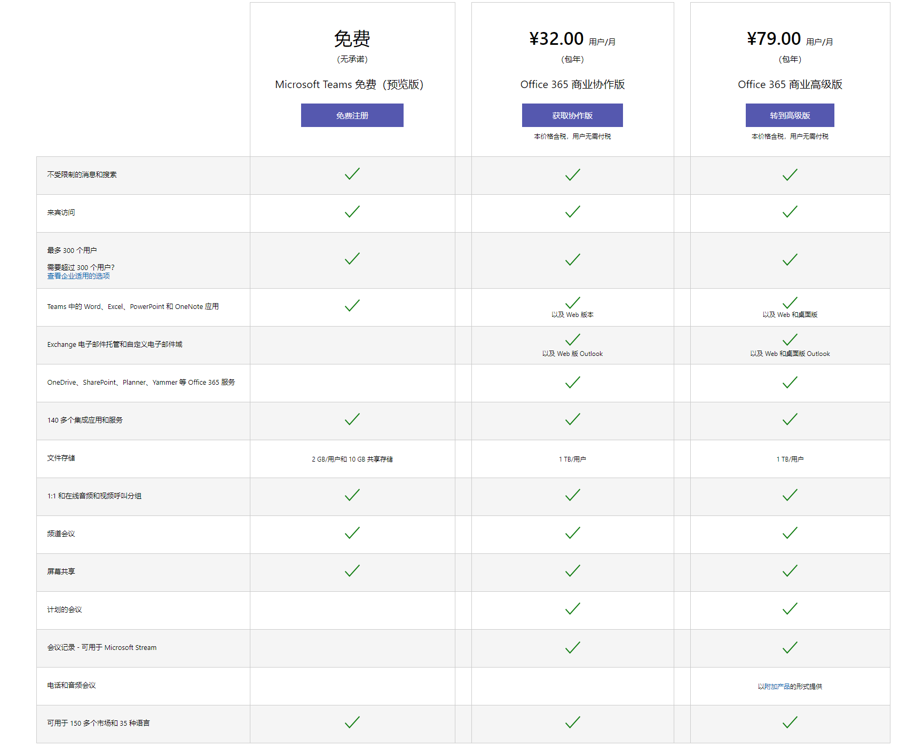

* 核心的实用基础功能点，付费版本和免费版本基本一样，没有变化
    * 1:1单聊
    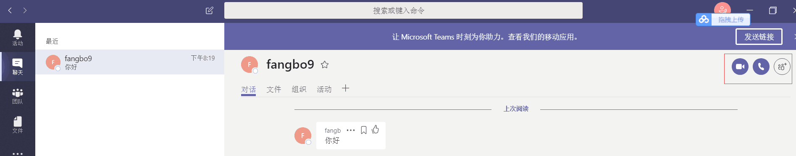

    * 共享文档编辑
    Teams 中的 Word、Excel、PowerPoint 和 OneNote 应用的共享文档多人协同编辑在Teams 免费版本上依然很好用。
    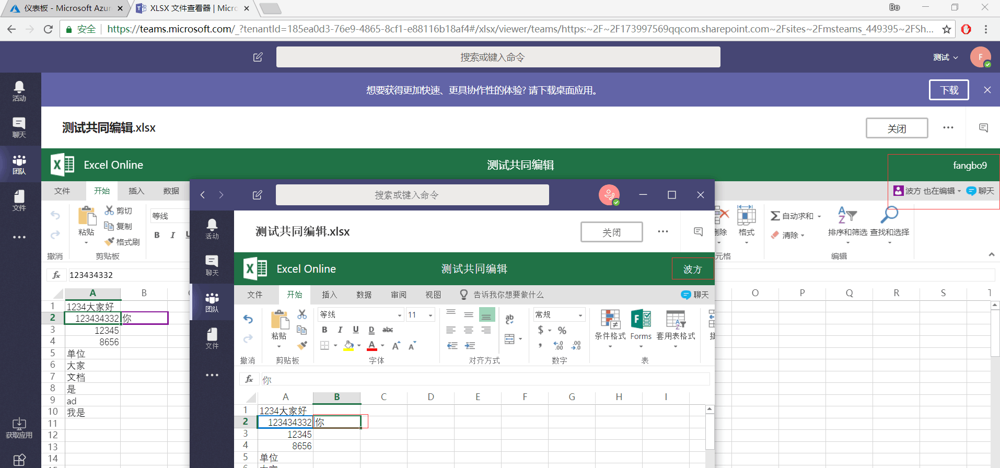

* 付费版本与免费版本的区别主要有以下几点

    * 免费版本的用户数量限制为300，付费版本无限制
    免费版本账号登录portal.azure.com 后在Azure的许可证下面我们可以看到我们的免费版本只有300个许可
    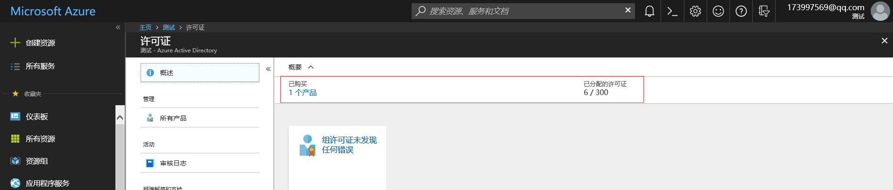

    * Exchange 电子邮件托管和自定义电子邮件域
    可以看到付费的账号实质上是开通了一个Office的企业版付费订阅，而免费版本的账号实质是是微软为我们开通了一个个人（非工作或者学校组织账号）Outlook的邮箱并关联我们注册的邮箱。详情如下图：
    个人免费版本截图：
    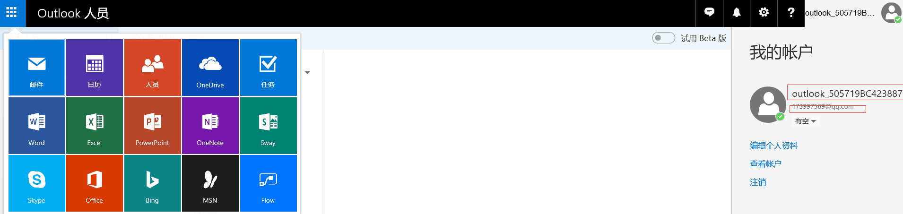
    付费版本截图：
    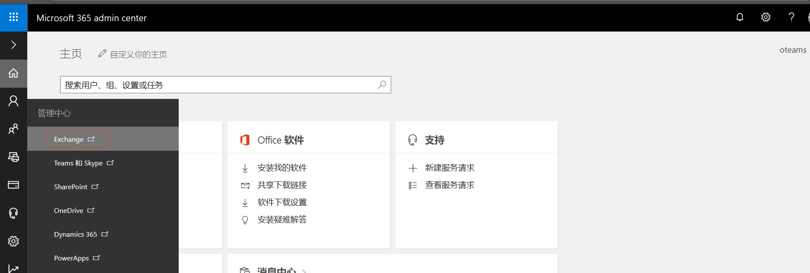

    * 免费版本单用户的存储空间是2G，付费版本单用户存储空间1T
    我们可以在付费用户打开OneDrive查看存储空间是1T,在免费用户的OneDrive是无法打开的。
    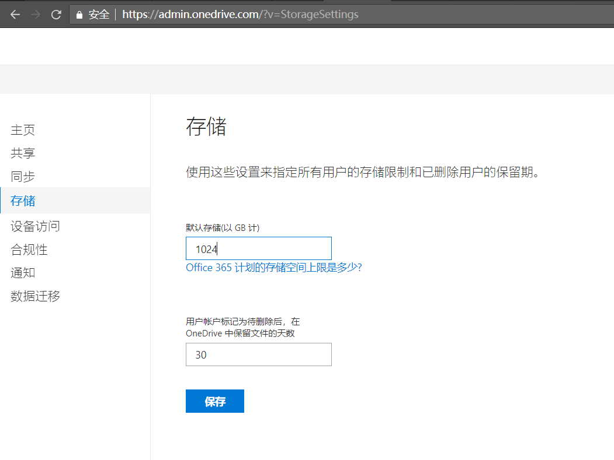

    * 计划的会议及会议记录
    登录后，可以看到两者的界面上，付费用户比免费用户多了一个会议按钮菜单。
    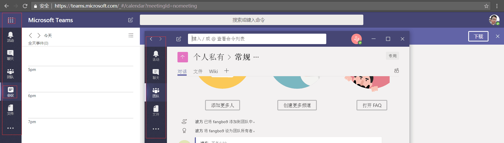

    * OneDrive、SharePoint、Planner、Yammer 等其他 Office 365 服务不可使用，因为微软之免费了Teams，其他功能功能还是属于微软Office 365d订阅里的功能

我自己使用下来，免费版的Teams非常好用，基本满足了小型企业或组织的沟通协作需求，而且最重要的是：和它的竞品Slack相比，Teams在国内可以基本流畅的访问使用。 :)
