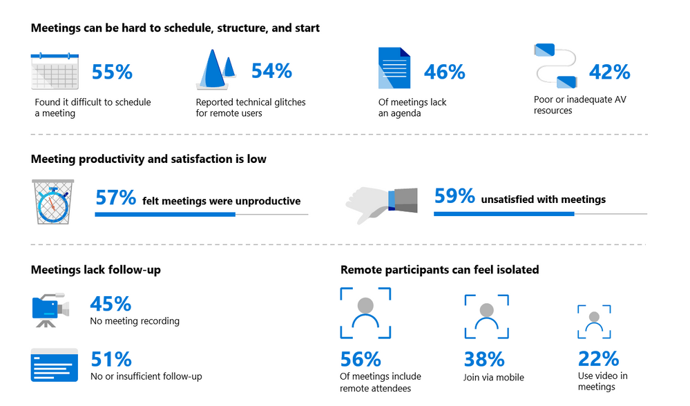
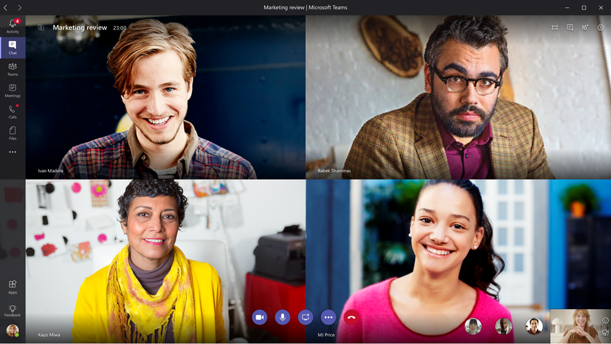
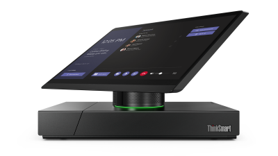
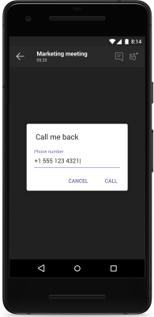
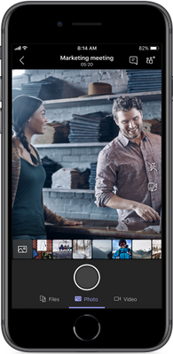
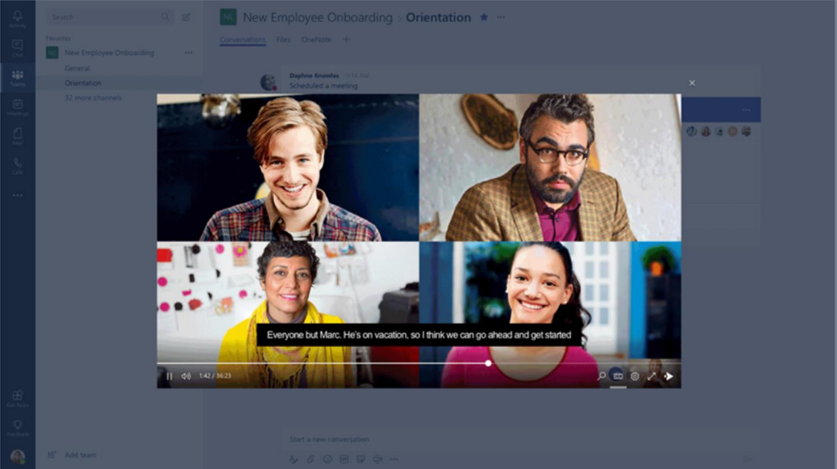

今天，我们宣布完成了Skype for Business to Teams路线图中首次披露的几项关键会议功能。当个人联系，沟通和协作时，工作就自然而然的完成了，我们相信这些功能（除了我们2月的公告之外）使Microsoft Teams为所有类型的会议做好了准备。

会议将两个或两个以上的人聚集在一起，无论是面对面还是数字，占了一周工作时间的1/3以上。然而，仍旧有近60％的与会者表示他们需要更多更好的会议体验。他们引用了以下原因：
* 55％的会议很难安排和开始
* 54％的会议存在技术挑战
* 57％的人认为会议没有成效

*Microsoft funded research, 2018*

会议在走廊，会议场所，商场楼面或每日站立时举行。无论用户身在何处，最近在Teams会议上进行的投入将有助于更快地完成工作。

以下是过去6个月内在会议功能方面的一些投入：

### 易于连接

随着最近发布的功能，使得会议可以更快地开始。当决定开会后，会议就可以被非常容易地创建出来，并且让参会人非常方便的链接上。

* **在加入会议之前完成设置** 我们新的加入会议的体验允许您在呼叫之前选择设备和音频配置。视频预览可快速浏览，确保您已准备好进入舞台。如果您从会议室加入，则可以轻松加入您的个人设备，仅提供内容而不提供音频。 这可以防止回声，客户端甚至会在发现问题时提醒您。
  
* **查看谁在敲门** 除了外部访客，Teams会议大厅现在将支持音频会议拨入用户。 匿名用户和拨入用户都可以在大厅等待，直到公司内的与会者接纳来宾。 会议大厅增加了额外的安全性和信心，只有受邀参加者才能收听。
 
* **跨企业边界** 我们现在支持基于现有企业关系与的联合会议。使用您的本地企业标识加入合作伙伴会议不需要额外的步骤。这是对其他客户方案的补充，例如与Teams访客会议或者匿名会议加入。

* **适合所有人的房间** 通过多种会议室的技术选项（仅音频和视频优化），所有会议在Teams里都可以得到中最佳体验。 Surface Hub（预览版），Skype会议室系统和Polycom Trio都支持Teams会议的一键式加入体验。[此处](https://techcommunity.microsoft.com/t5/Microsoft-Teams-Blog/Teamwork-devices-at-InfoComm-this-week/ba-p/201839)提供了完整的设备公告列表。

*Skype Room System from Lenovo*

* **大型会议支持** Teams现在将为这些大型群组连接支持最多250个与会者。

### 质量和可靠性

在全新的现代化基础架构的支持下，Teams专为云计算而设计，采用高度可扩展的微服务架构，并通过全局对等点进行优化。因此，与会者将看到更快的会议加入时间和更好的整体体验。但有时意外发生，Teams可以迅速做出反应，以确保您的工作继续下去。

* **智能警报** Teams将检测导致会议中断的情况，并主动告知您如何解决问题，以便继续开会。 Teams提供各种反馈，从糟糕的网络连接到甚至告诉您何时尝试发言并且可能忘记取消麦克风静音。 减少中断意味着更有效的会议。

* **当网络故障时** 如果桌面或移动设备上的呼叫被丢弃，则Teams桌面，移动和Web客户端可以快速，平滑的重新连接。 Teams监视并响应网络丢失并自动尝试重新连接以保持呼叫进行。如果WIFI或LTE不可靠，移动用户还可以选择通过PSTN进行服务回叫。

*Call me back in Teams Mobile*
 
* **控制您的体验** - 您现在可以关闭Teams移动设备上的传入视频，以便在低带宽条件下优先考虑核心音频通信。
 
### 会议生产力
通过将演示文稿转化为深入的协作讨论，分享您的想法并加快决策速 会议不再仅仅限于开会的那段时间。与会者希望在会议之前分享材料会前，在会议中有效沟通，并参考决策和可交付成果。

* **打磨会议表现** 发送者在Teams会议中安全的用PowerPoint共享演示文稿。与会者可以跳过或重新访问私人观看的幻灯片。Graph API会优先处理来自Office 365的最新文件，从而可以轻松选择PowerPoint以开始使用。

* **白板** 现在，用户可以在会议中使用第三方白板应用程序（如Invision）进行创造性地工作。Invision是Teams的第一个白板应用程序，未来几个月将有更多应用程序。
 
* **移动共享** 当您在旅途中时，并非每次会议都在桌面上进行。现在，与会者可以随时随地分享照片，PowerPoint文件，实时视频和移动桌面。

*Sharing on Teams mobile*

* **会议记录** 与会者现在可以在整个会议生命周期中轻松地收集共享会议记录。在会议之前共享议程，在会议期间记笔记以及在会议结束后查找备注（使用备注选项卡）。这些笔记可由不同的参与者共同编辑，如果您想将他们的注意力集中在特定的笔记项上，您也可以@提及人。会议记录也可在手机上找到！
 
* **广泛的沟通** Teams中的现场活动将Teams会议体验扩展到数千名与会者，无论是桌面还是移动。 [在此](https://techcommunity.microsoft.com/t5/Microsoft-Teams-Blog/Live-events-in-Microsoft-Teams/ba-p/214955)处详细了解直播活动（公开预览）。
 
* **会议录制** Teams和Microsoft Stream提供录制会议和存储在Office 365云中的功能。录制可在会议的聊天记录中找到，以便其他Teams成员将来查看。会议录制（在公共预览中可用）还允许用户访问文字字幕并搜索会议期间发出的关键词或短语。

*Recording Playback and Transcript*

所有这些新功能都伴随着我们企业客户所需的IT控制。 用户级会议策略，联合策略等可根据您自己组织的要求进行配置。

目前正在不断努力为Teams会议增添更多创新。 在Tech Community中与我们保持联系，并了解更多关于Teams会议的信息。

\[原文\] [https://techcommunity.microsoft.com/t5/Microsoft-Teams-Blog/Meet-Now-with-Microsoft-Teams/ba-p/237029](https://techcommunity.microsoft.com/t5/Microsoft-Teams-Blog/Meet-Now-with-Microsoft-Teams/ba-p/237029)

