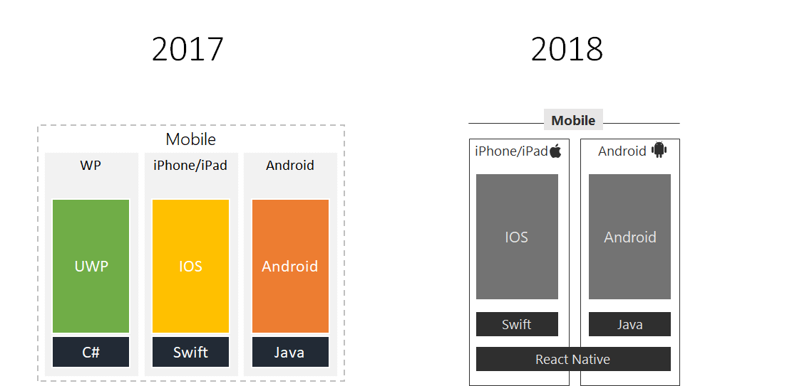
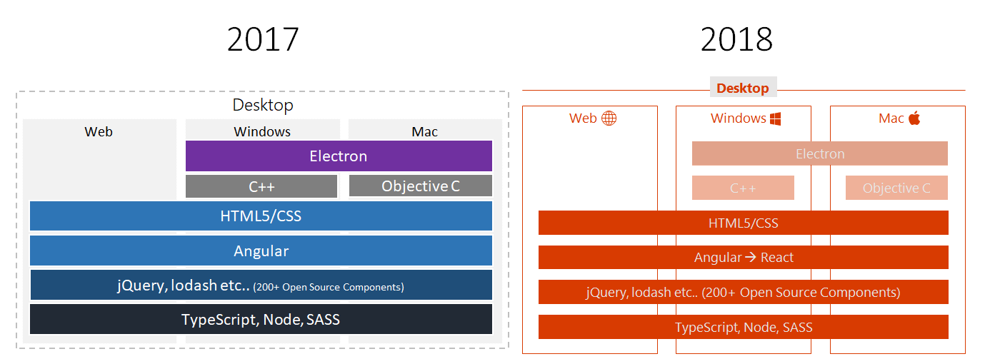
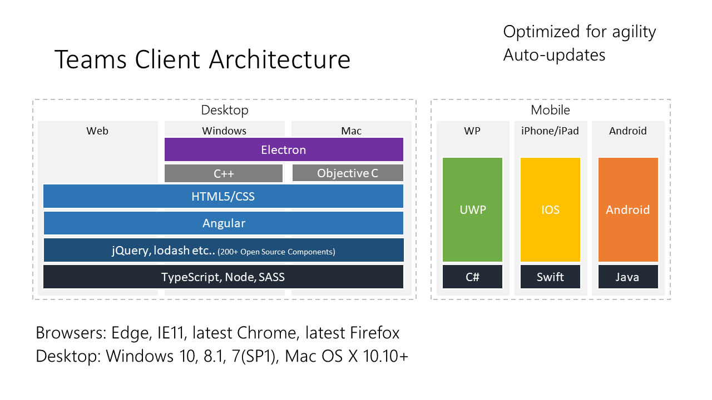
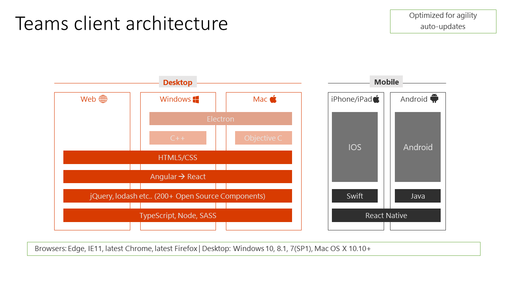

在前不久的微软美国一年一度的Ignite大会上，微软宣布Microsoft Teams是微软历史上发展最快的应用。它将取代Skype for business，成为语音视频协作的主打产品。

我也有幸在上个月微软中国年度技术大会Tech Summit 2018上被邀请作为讲师讲解基于Teams平台的app开发。会上时间有限，没有太多展开Teams的前端技术栈，会后有很多人来咨询，希望进一步了解。我这篇文章就对比一些Teams的2017年和2018年技术的变化，让我们看看业界领跑的软件巨头是采用什么技术的。

## 手机客户端

可以看到几个明显的变化：
* Windows Phone平台没有在2018年再提到了(大家都懂的)
* 之前都是使用手机平台的原生语言开发的，Android使用Java，iOS使用Swift。可以看到微软在2017之前就已经在使用swift
* 到2018年，Teams手机客户端已经大量使用React Native。好处十分明显，可以在两大手机平台重用代码，提高研发效率。

## 桌面客户端

* 三大桌面端：Web，Windows，Mac。技术栈基本统一
* 使用TypeScript，大牛Anders Hejlsberg的力作啊，此语言在web开发上快要一统江湖了
* 之前使用Angular，但目前正在慢慢的转成React，原因也很简单，一旦全部转成React，就可以和手机客户端的React Native重用大量代码，进一步降低研发成本。代码重用、重用、重用！重要的事讲三遍。
* Windows和Mac桌面端使用Electron作为外壳，提供原生系统的调用能力。并且使用C++和ObjectiveC来处理音频视频编码和桌面共享等功能。Electron目前使用很广，微软的Visual Studio Code，Azure Storage Explorerd等，凡是需要跨系统的桌面应用，基本都能看到electron的身影。

看一下你目前使用的前端技术栈，对比一下微软的Teams，你get到什么了吗？ :)

> 以上技术栈的所有图片都来自于微软2017年和2018年两次ignite大会上的PPT。
> 
*2017技术栈，来源Ignite 2017，课程编号BRK3071*
> 
*2018技术栈，来源Ignite 2018，课程编号BRK3118*

