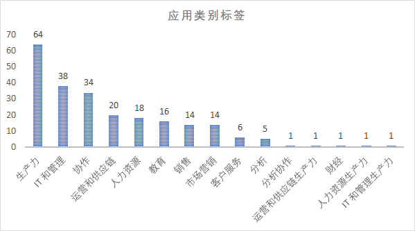
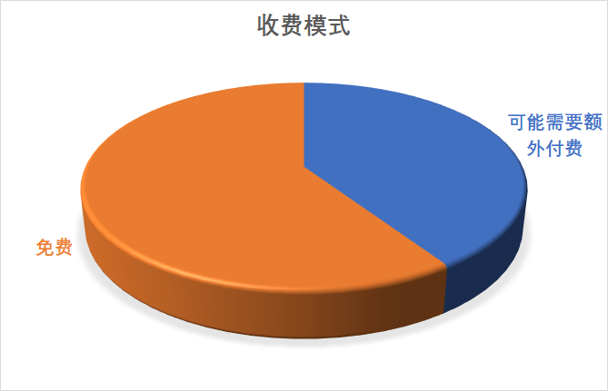
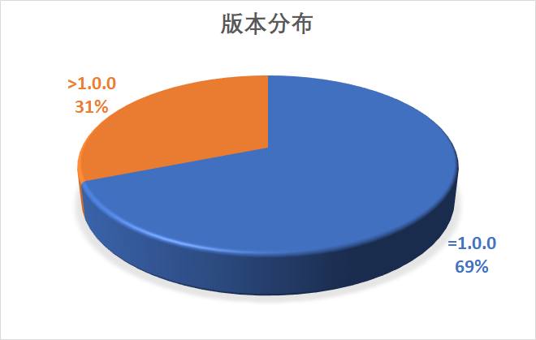
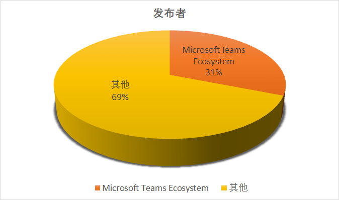
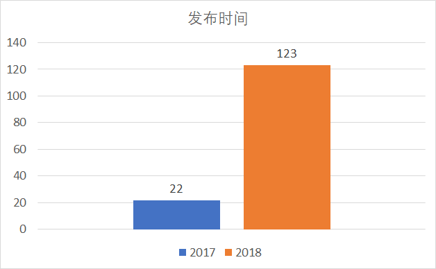

周末闲来无事，统计了一下Teams的app商店里的app ( [Teams App Store](https://appsource.microsoft.com/en-us/marketplace/apps?product=office%3Bteams&page=1&src=office) )。截至到现在（2018年11月）一共有145个app。要注意一点：如果app不是公开的（即单独安装到Office365租户里，并没有提交到office store），那不在这个统计里。

大多数app集中在*生产力*，*IT和管理*和*协作*三方面。

目前大家都在抢用户阶段，所以大多数应用都采用免费的模式，或者先免费，高级功能再收费。

下面三张统计分别是app的版本，app的开发者，和app的发布时间

可以看到版本基本都集中在第一版，目前app有很大一部分是由微软自己开发的，重要是来给大家sample。从发布时间我们可以看到虽然2018年还没有结束，但是teams app数目已经是去年的5倍多，说明大家都开始对这个平台感兴趣了，要知道Office的用户群里有1个billion多，只要自己开发的teams app可以弄个百分之一，就是一个非常成功的产品了。

让我们开始抢Office用户吧：
* Office开发者网站：[http://dev.office.com/](http://dev.office.com/)
* Teams开发文档：[https://docs.microsoft.com/en-us/microsoftteams/platform/concepts/apps/apps-overview](https://docs.microsoft.com/en-us/microsoftteams/platform/concepts/apps/apps-overview)
* Teams的Graph API: [https://developer.microsoft.com/en-us/graph/docs/concepts/teams-concept-overview](https://developer.microsoft.com/en-us/graph/docs/concepts/teams-concept-overview)
* Teams app的C#代码模板：[https://github.com/tony-xia/microsoft-teams-templates](https://github.com/tony-xia/microsoft-teams-templates)
* Teams app的nodejs代码模板：[https://www.npmjs.com/package/generator-team](https://www.npmjs.com/package/generator-team)
