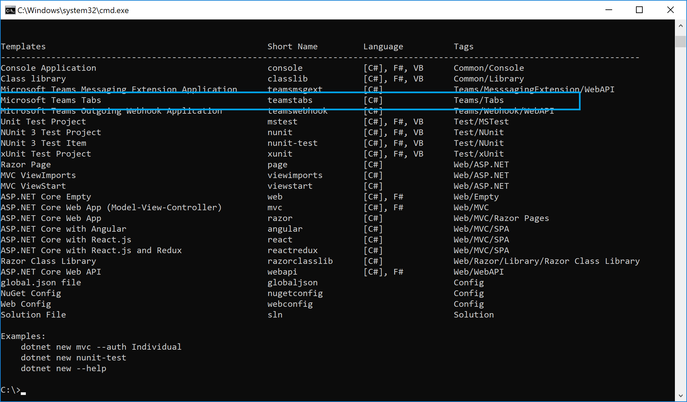

### 什么是Teams Tabs
Tabs是微软Teams的一种十分有用的扩展方式。可以非常方便的和现有的网站或者网页应用进行整合。具体的说明不在这里展开了。可以阅读微软官方的详细说明：
* [https://docs.microsoft.com/en-gb/microsoftteams/platform/concepts/tabs/tabs-overview](https://docs.microsoft.com/en-gb/microsoftteams/platform/concepts/tabs/tabs-overview)

### 准备工作
因为开发一个Tabs涉及到的方面比较多，我在本地dotnet里添加一个Teams的模板，让开发更加简单

```cmd
c:\demo> dotnet new -i MicrosoftTeams.Templates
```



另外，Tabs里内嵌的是一个网页应用，我们将使用目前流行的React框架，所以我们还需要nodeJS

[NodeJS](https://nodejs.org/en/)

## 步骤

- 下载 [ngrok](https://ngrok.com/)
- 运行`ngrok.exe http 5000`。因为我们项目启动会监听 5000 端口.
- 拷贝 ngrok 的 url (注意是：http**s**).
  

- 运行`dotnet new teamstabs`命令生成项目。

- 打开 manifest.json 文件, 将相关 url 替换为上一步拷贝的 url。
  

- 将 manifest.json、icon-outline.png 和 icon-color.png 三个文件打包为 manifest.zip. 这个 zip 包就是我们要上传到 teams 的应用包。

  

- 运行以下命令.

  1. > dotnet build
  2. > dotnet run

- 打开 Microsoft Teams, 创建一个 Tab.

  1. 找到某个 team 并进入，导航到'Apps'标签页.
  2. 点击页面右下角的'Upload a custom app'(上传自定义应用)按钮.
  3. 选择并上传刚才的压缩包 manifest.zip.
     

- 点击刚才上传的"MSTeamsTab"应用并且为需要的Channel进行设置。
  

现在，你就可以在你Team的Channel里看到这个Tab，点击此Tab后就能看到我们的页面了。
