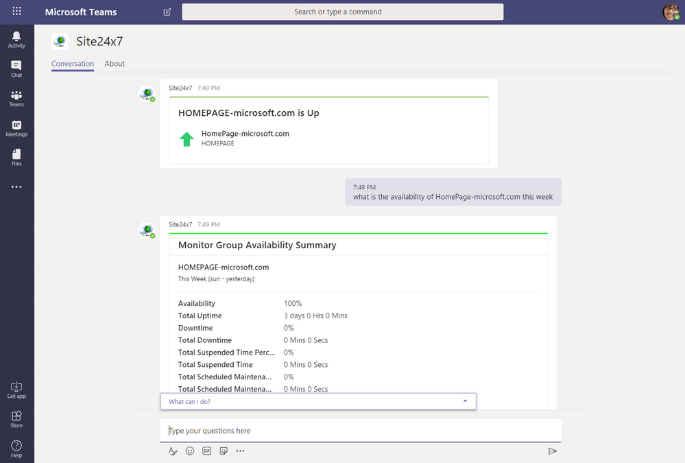
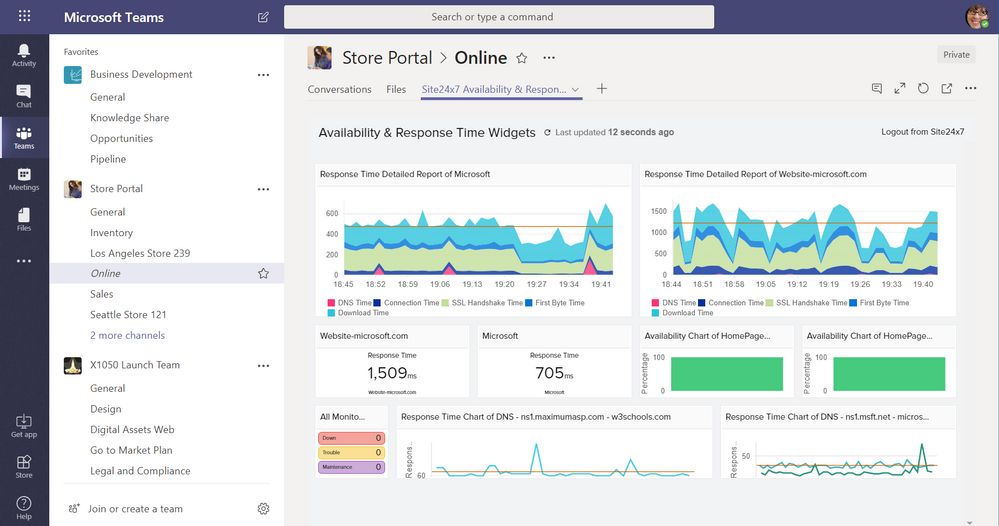

我们生活在一个云的时代, SaaS 应用程序每天都在推动我们的生产力。作为一个消费者, 很难想象如果你最喜欢的应用无法访问，即使只是一秒钟无法访问。作为 SaaS业务, 更难以想象您的服务面临停机, 每一分钟停止服务都会花费大量的资金, 当然还损失客户的信任。Site24x7 创新的基于云的 it 监控工具提供了对基础架构 (网站、服务器、网络等) 关键性能参数的监控, 并提供了对服务运行状况的主动洞察, 使您的客户永远不会面临停机。
   
Microsoft Teams中新的Site24x7应用程序让DevOps在您最喜爱的协作工具里变得轻而易举。怎么做到的？见下文：

信息触手可及-随时随地, 在您的任何设备上!
使用 Microsoft Teams中的 Site24x7 机器人, 使用自然语言处理 (NLP) 支持的会话界面, 提出问题并接收实时监控数据的准确响应。专为行动而打造, 新注册的机器人 Site24x7 确保您始终能获得最新情况。

使用智能和美观的仪表板实现监控的民主化!
将 Site24x7 实例中的自定义万能仪表板添加到任何 Microsoft Teams的频道中。为您的 DevOps 团队提供一个单一的窗格, 以监督您的资源的运行状况, 而无需跨多个监视设备和接口跳转。借助 Site24x7 的团队自定义仪表板, 实现更快的分析和故障排除。

不要是最后一个发现的人!
在 Microsoft 团队中使用Site24x7 的连接器, 获取有关可能严重影响服务正常运行时间的实时警报和报告的通知。让您的整个团队信息同步, 丰富的通知直接发送到您选择的团队频道。
 
是时候让您的敏捷 DevOps 员工得到他们真正应得的环境。为组织、协作和警报修正的优先级，像以往一样采取即时故障排除和纠正措施而构建的环境。Site24x7 + Microsoft Teams, 使 DevOps 在这一刻成为现实。
 
等不及要开始了吗？前往AppSource, 立即为 Microsoft Teams[安装 Site24x7 应用程序](https://appsource.microsoft.com/en-gb/product/office/WA104381289)。
 
正在寻找 Azure 支持？在近乎实时的情况下监控 100多个 Azure 产品，获取可进一步操作的警报, 在Microsoft Teams内部使用[Site24x7 Azure监视](https://www.site24x7.com/azure/)，缩短解决时间，从而做出更快的决策。
 
想了解更多？查看如何[在此](https://www.site24x7.com/microsoft-teams-integration.html)处利用 Site24x7 的智能和强大的 Microsoft Teams应用程序集成。

\[原文\] [https://techcommunity.microsoft.com/t5/Microsoft-Teams-Blog/NEW-Site24x7-s-updated-app-for-Microsoft-Teams-enables/ba-p/289930](https://techcommunity.microsoft.com/t5/Microsoft-Teams-Blog/NEW-Site24x7-s-updated-app-for-Microsoft-Teams-enables/ba-p/289930)

