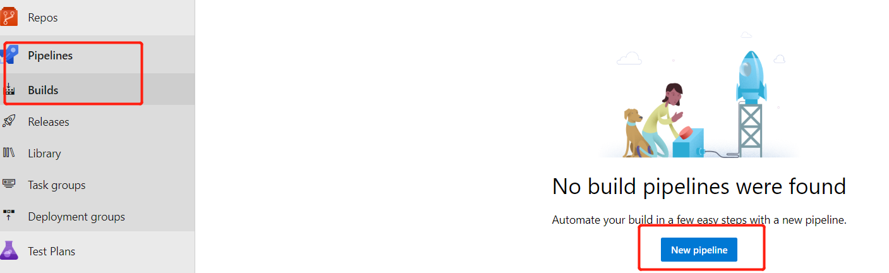
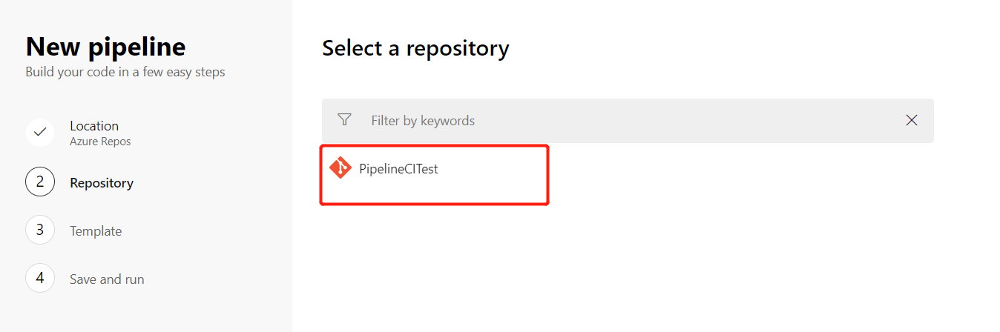
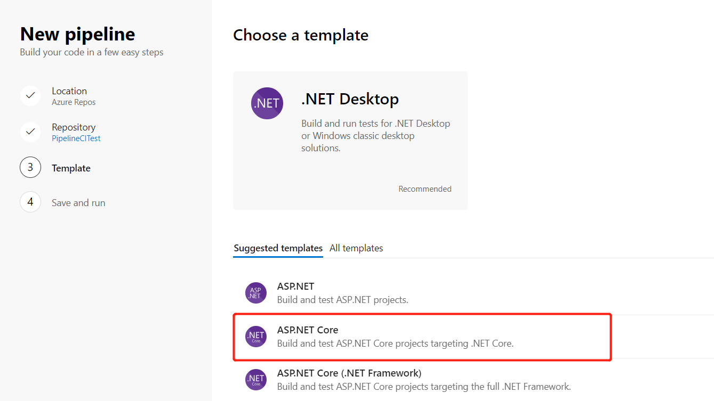
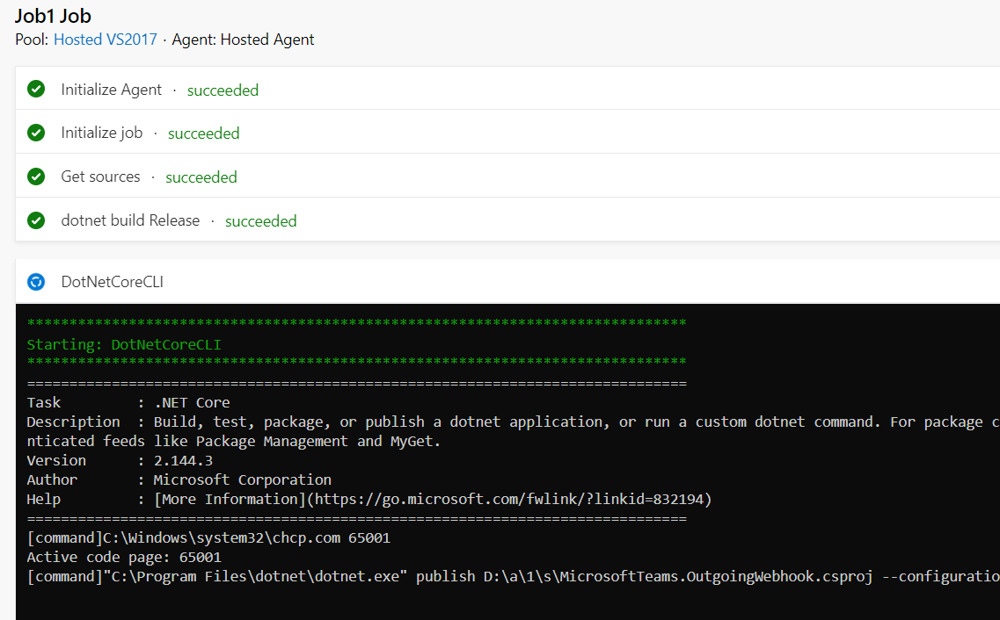
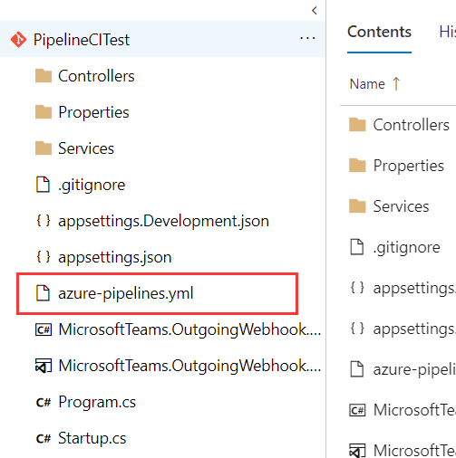
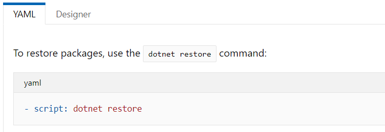
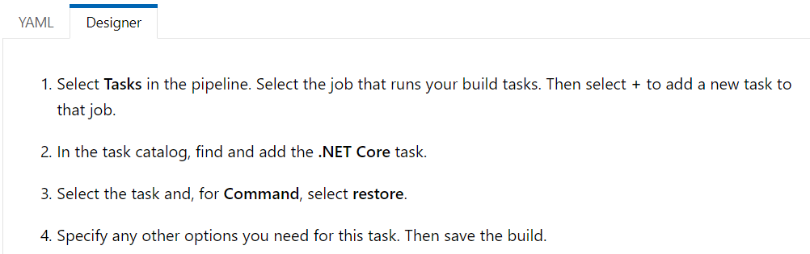

我在之前的文章里介绍了如何一步步配置CI/CD来部署Teams App( [之前的文章](https://tony-xia.github.io/deploy_outgoing_webhook_to_azure/) )，随着Azure DevOps的发展，微软推出了Azure Pipelines。在这篇文章中，主要介绍什么是Azure Pipelines，以及如何使用Azure Pipelines来进行Teams App的构建、测试和部署工作负载

## 什么是Azure Pipelines

> 微软发布了Azure Pipelines，他们新的 CI/CD 服务，是 Azure DevOps 产品的一部分。Azure Pipelines 可用于构建、测试和部署工作负载，并可以让各种语言、项目类型和平台协同工作。

作为 Visual Studio Team Services（VSTS）的后续产品，Azure DevOps 由几个组件组成，Azure Boards、Azure Repos、Azure Test Plans、Azure Artifacts和 Azure Pipelines。Azure DevOps 提供了端到端服务，用于共享代码、跟踪工作并提供类似于其他服务（如Atlassian Stack）的解决方案。
这些组件都是 Azure DevOps 链中的一个链接，Azure Pipelines 实现了 CI/CD 管道的角色。
此外，Azure Pipelines 具有以前在 VSTS 中可用的所有功能，并补充了一些新功能：

* Azure Pipelines 是一项独立服务，可以独立于其他 Azure DevOps 组件使用。
* 可以直接通过 GitHub Marketplace 获取和配置新的管道。
* 更好地与 GitHub 集成，包括拉取请求的构建和跟踪代码提交及其相关问题。
* 通过容器作业来支持原生容器。
* 开源项目可以免费使用 Azure Pipelines。
* 相比 VSTS，Azure Pipelines 提供了更加灵活的免费使用限制。


## 如何利用Azure Pipelines来构建Build

之前的文章中，提到如何利用Azure DevOps来Build、Deploy应用到Azure上，实现CI/CD的整个部署过程，简单回顾下配置的步骤：
 
  1、在Azure DevOps中新建Repo, 本地Clone，Push代码  
  2、在Azure DevOps中并编译生成一个 .NET Core应用, 配置持续集成环境  
  3、将Azure添加到Azure DevOps的Service Endpoint（仅限中国区的Azure）  
  4、在Azure中创建App Service  
  5、配置Azure DevOps中构建的应用Release到Azure App Service  


下面，一步步的演示，如何使用Azure Pipelines构建一个新的Build，其中一个文件```azure-pipelines.yml```，是整个Azure Pipelines服务的关键，
我们将逐个分析整个yml配置的含义

#### 一、配置build pipelines 

1、进入到Azure Devops, 看到整个的功能模块导航，和之前已经有很大的变化，这里我们略过新建Repos，Check in代码的过程, 找到 “Pipelines”，点击 “Build”,新建```New build pipelines``` 


2、这里“Location” 选择 “Azure Repos”


3、选择项目代码的Repos


4、Build的配置模板，选择“ASP.NET Core”,


5、配置完成，开始整个Build的过程


到此整个自动化Build的过程就已经配置好了，和之前最大的一个不同是，回到Code Repos, 看到在我们的项目代码中，自动生成了一个名为```azure-pipelines.yml```文件  


打开这个yml文件，看下里面的配置参数

```yml
pool:
  vmImage: 'vs2017-win2016'

variables:
  buildConfiguration: 'Release'

steps:
- script: dotnet build --configuration $(buildConfiguration)
  displayName: 'dotnet build $(buildConfiguration)'

- task: DotNetCoreCLI@2
  inputs:
    command: publish
    publishWebProjects: False
    projects: 'MicrosoftTeams.OutgoingWebhook.csproj'
    arguments: '--configuration $(BuildConfiguration) --output $(Build.ArtifactStagingDirectory)'
    zipAfterPublish: True
```

#### 二、Azure Pipelines中yml文件释义

1、首先，```pool vmImage```参数  
```yml
pool:
  vmImage: 'vs2017-win2016'
```
这里的```pool vmImage```参数表示：Build Environment, 其中的可选项有 'ubuntu-16.04'、'macOS-10.13'、'vs2017-win2016'，在Microsoft-hosted agents中有不同
的系统环境及其版本供选择 

2、```variables```  
```yml
  variables:
  buildConfiguration: 'Release'
```
这里的```buildConfiguration```参数表示： Build的版本是Release版本

3、```steps```  
```yml
steps:
- script: dotnet build --configuration $(buildConfiguration)
  displayName: 'dotnet build $(buildConfiguration)'
```
这里的```script: dotnet build```表示：执行build的工作脚本，命令，并且进行build的输出配置，或者使用```.NET Core task```的模式进行配置，如下：
```yml
steps:
- task: DotNetCoreCLI@2
  inputs:
    command: restore
    projects: '**/*.csproj'
    feedsToUse: config
    nugetConfigPath: NuGet.config    # Relative to root of the repository
    externalFeedCredentials: <Name of the NuGet service connection>
```
```command```表示进行的操作命令

在restore之前，如果我们想要在Microsoft-hosted agent指定 .Net Core SDK的版本进行Build,可以在yml配置中加入如下配置
```yml
- task: DotNetCoreInstaller@0
  inputs:
    version: '2.1.300' # replace this value with the version that you need for your project
```

4、```task```  
```yml
- task: DotNetCoreCLI@2
  inputs:
    command: publish
    publishWebProjects: False
    projects: 'MicrosoftTeams.OutgoingWebhook.csproj'
    arguments: '--configuration $(BuildConfiguration) --output $(Build.ArtifactStagingDirectory)'
    zipAfterPublish: True
```
其中```task```表示：使用```.NET Core task```的进行模式执行任务构建, ```command```则别是构建的执行的命令，比如常用的build、test、publish等


#### 三、总结

从上面的yaml的脚本配置，结合微软的官方文档, 如下截图：  
  

  

我们可以这样去理解，相当于以前从可视化的界面进行CI的配置（截图中的Designer模式），现在在Azure Pipelines中使用yaml文件进行配置（截图中的YAML模式），这进一步方便了对CI过程的配置，当我们需要改变
我们的CI行为，比如增减组建，步骤等，直接修改配置文件，当push代码，merge到分支后，则整个构建流程会按照新的配置文件进行构建，这无疑提供了更大的灵活性。 


## 参考文档
* 1、[Build, test, and deploy .NET Core apps in Azure Pipelines](https://docs.microsoft.com/zh-cn/azure/devops/pipelines/languages/dotnet-core?view=vsts&tabs=yaml)
* 2、[Build .NET Core projects with Azure Pipelines or Team Foundation Server](https://docs.microsoft.com/en-us/azure/devops/pipelines/languages/dotnet-core?view=vsts&tabs=yaml)
* 3、[Free Azure Build Pipelines for Open Source Projects](https://samcogan.com/free-azure-build-pipelines-for-open-source-projects/)
* 4、[微软发布 Azure Pipelines，开源项目可无限制使用 CI/CD](https://www.infoq.cn/article/2018%2F09%2Fmicrosoft-azure-pipelines)

