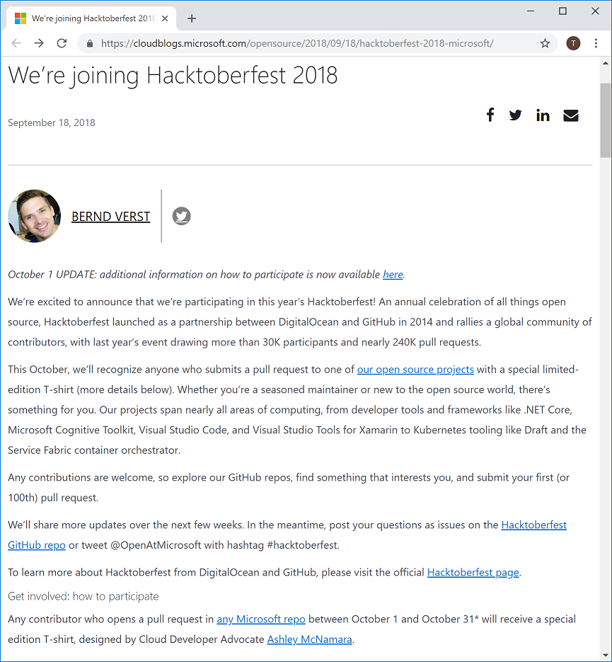
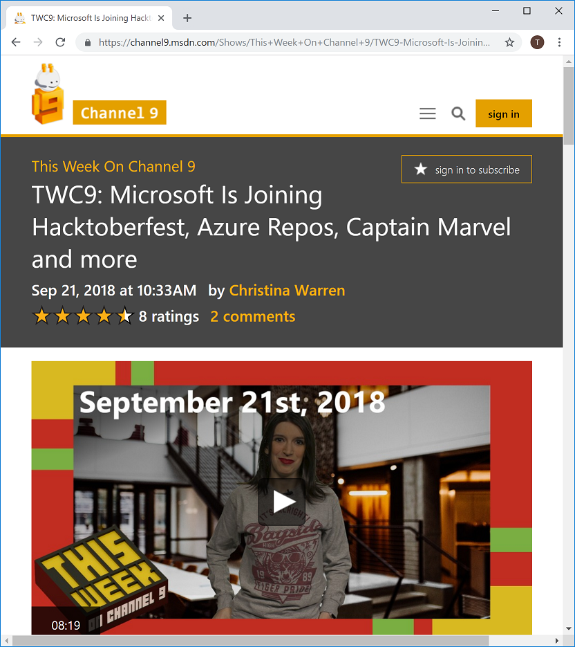
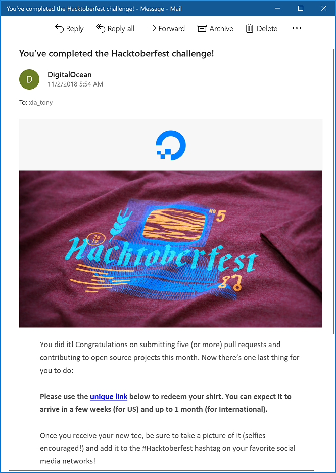
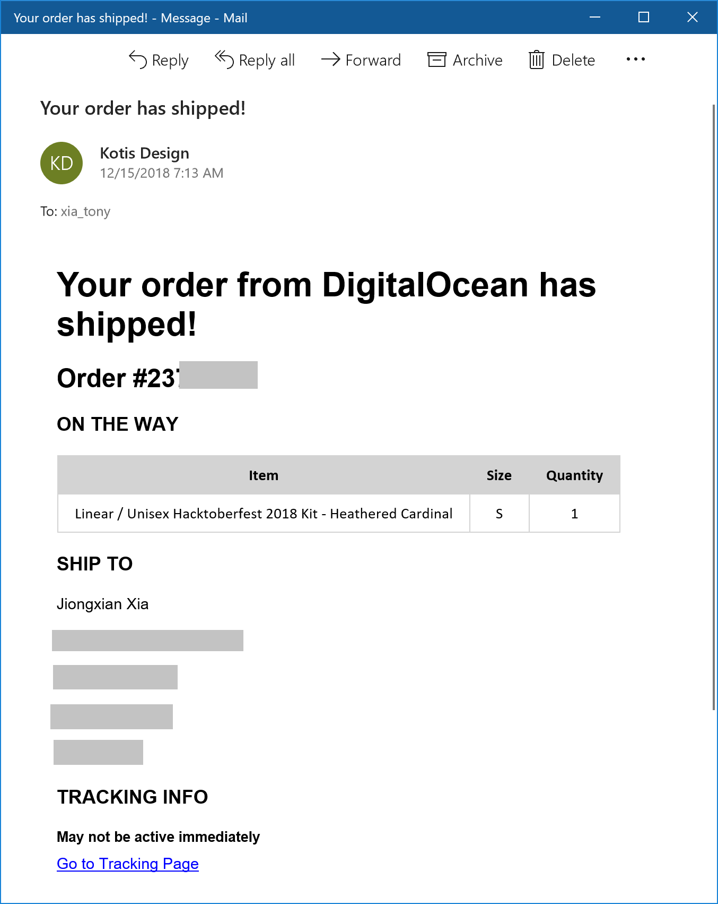

昨天收到邮件，我的HacktoberFest 2018奖品终于从美国寄出来了，不知道飘洋过海多久可以寄到。

今年的HacktoberFest 2018除了[微软官方博客](https://cloudblogs.microsoft.com/opensource/2018/09/18/hacktoberfest-2018-microsoft/)的宣传，连Channel 9的美女主播也在[TWC](https://channel9.msdn.com/Shows/This+Week+On+Channel+9/TWC9-Microsoft-Is-Joining-Hacktoberfest-Azure-Repos-Captain-Marvel-and-more?term=Hacktoberfest&lang-en=true)上大肆宣传。

活动内容是在整个10月份需要给微软的开源代码贡献5个或者5个以上的PR。任何的微软在github上的repo都在活动范围内。我10月份一直在忙微软的Tech Summit 2018 (China)的session，10月份最后几天突击了一下PR，终于在最后一天达成了，哈哈。

完成后，11月2日就收到了确认邮件。

但是。。。但是。。。之后就是漫长的等待，直到昨天才收到了奖品T shirt寄出的邮件，终于有邮寄的Tracking information了，期望DHL能快点送达。

