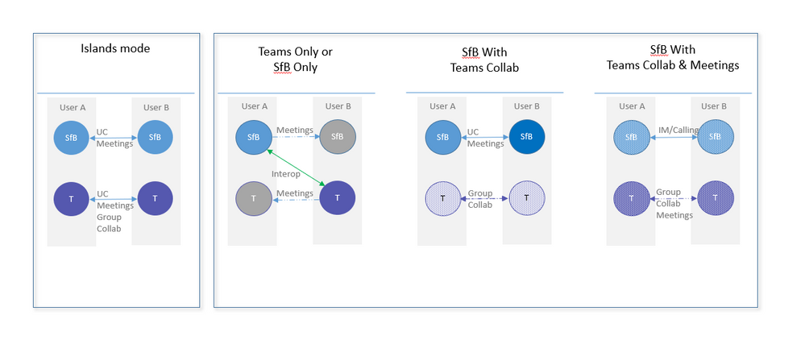

根据用户反馈，我们正在改进：当组织同时使用Microsoft Teams和Skype for Business时的用户在线状态。通过此更新，路由和在线状态将完全保持一致。为确保路由能跟随用户的在线状态，所以在线状态的更新现在会基于用户的共存模式。

如果用户处于TeamsOnly模式，则其他任何用户（无论是在Teams还是Skype for Business中）都会根据用户在Teams中的活动看到在线状态。

如果用户处于以下任何一种模式：SfbOnly，SfbWithTeamsCollab，SfbWithTeamsCollabAndMeetings  - 那么其他任何用户，无论是在Teams还是Skype for Business中，都会根据用户在Skype for Business中的活动看到在线状态。

如果用户处于离群或传统模式，则在线状态是独立的，并且值不需要匹配。
* 从Teams中，同一租户中的其他任何用户将根据该用户在Teams中的活动查看在线状态。来自同一租户的Teams用户与该群用户的聊天和呼叫将依赖Teams。
* 从Teams中，联合租户中的其他任何用户都将根据用户在Skype for Business中的活动查看在线状态。 来自该用户的联合租户中的Teams用户的聊天和呼叫将依赖Skype for Business。
* 从Skype for Business，任何其他用户将根据用户在Skype for Business中的活动查看在线状态。

请注意，如果之前与之对话的用户在升级为Teams后，则该对话将不再反映准确的在线状态，并且将不再可路由。 你应该开始一个新的对话线程。您可以在[此处](https://docs.microsoft.com/en-us/microsoftteams/migration-interop-guidance-for-teams-with-skype#coexistence-modes)找到有关共存模式的更多信息

\[原文\] [https://techcommunity.microsoft.com/t5/Microsoft-Teams-Blog/Update-Presence-now-respects-a-user-s-coexistence-mode/ba-p/280190](https://techcommunity.microsoft.com/t5/Microsoft-Teams-Blog/Update-Presence-now-respects-a-user-s-coexistence-mode/ba-p/280190)

