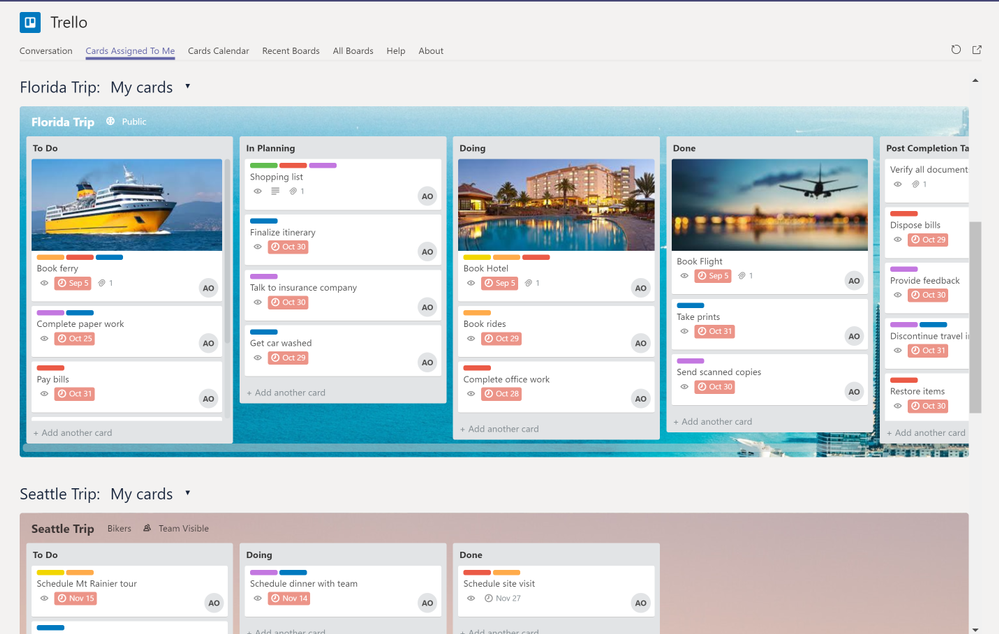
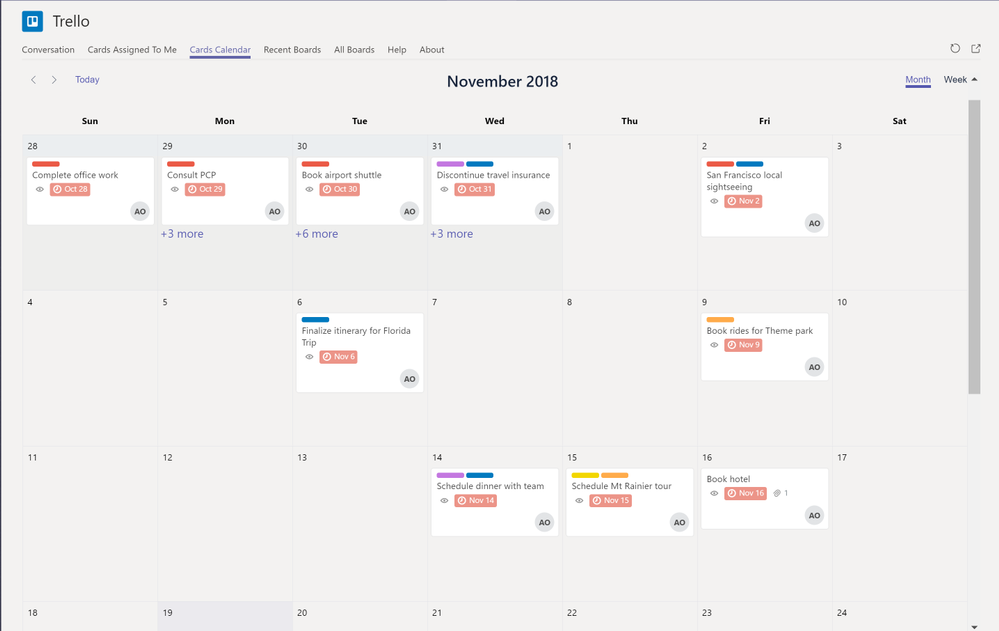
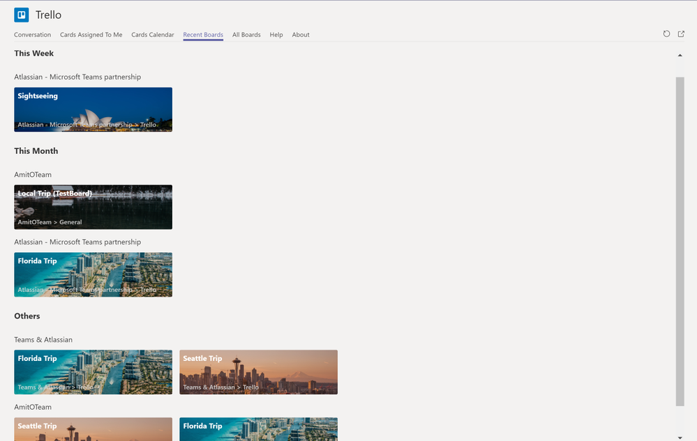
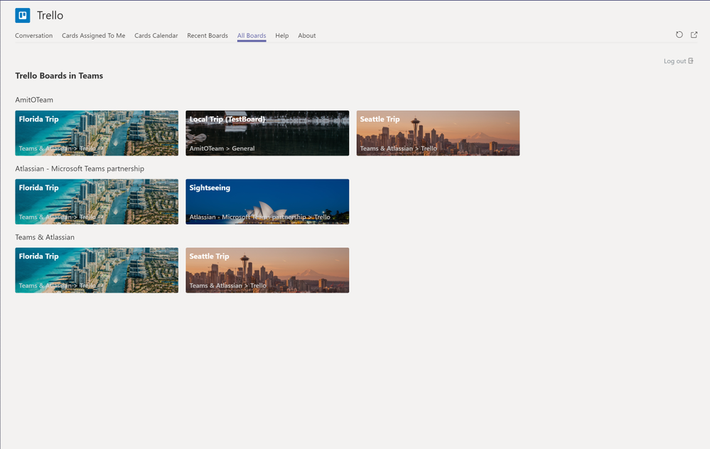
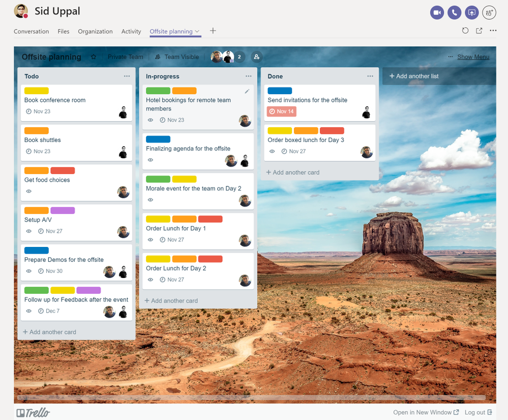

从初创企业到《财富》500强公司, Trello是团队在任何项目上进行合作的视觉方式。在Microsoft Teams中, 我们发现围绕项目进行大量对话和协作的方式。因此, 一个首屈一指的项目管理工具应该与团队协作的终极枢纽进行合作, 以便让员工更好地一起工作。

如你所知, 我们已经为Microsoft Teams提供了一段时间的Trello。我们很高兴地宣布, 随着 Trello 个人应用功能的上线, 这种集成刚刚得到增强。Trello在Microsoft Teams中的个人应用程序将允许用户访问他们的所有 Trello 看板卡。

## Trello个人应用功能

* **分配给我的卡**: 此视图允许用户访问分配给他们的所有看板和Trello卡。用户正在参与的每个看板将将根据其列表分组显示卡片。用户可以点击卡片, 并选择从同一视图对其进行编辑。用户还可以选择将任何单个看板的视图从 "我的卡片" 翻转到 "所有卡片"。在 "所有卡片" 视图中, 无论分配给哪个用户，所有卡片都将显示在看板上。

* **卡片日历**: 此视图将所有卡片按照它们的截止日期显示在日历视图里。

* **最近的看板**: 此视图显示用户最近一直在为之做出贡献的看板。要使看板显示在此视图中, 需要将其添加到团队中的一个频道中。点击看板将带你到添加看板的团队视图。此视图还将显示按用户本周、本月等互动频率排序的看板。

* **所有看板**: 此视图显示用户被分配了任务的所有Trello看板。要使看板显示在此视图中, 需要将其添加到团队中的一个频道中。点击看板将带你到添加看板的团队视图。此视图还将显示按添加它们的团队排序的看板。

* **群聊中的Trello:**

Microsoft Teams刚刚发布了添加选项卡聊天的功能。Trello现在可以在1:1聊天或群聊中使用。用户现在可以在聊天中固定Trello看板, 并从那里进行协作。要在聊天中使用Trello看板, 需要将看板设置为团队可见模式。

在Teams里，利用您最喜爱的Atlassian开发工具，加上Trello
我们最近对 Bitbucket Cloud、Jira cloud、Jira Service Desk Cloud和Confluence Cloud进行了集成, 通过您最喜爱的开发工具, 将您的Trello看板放入应用程序。

**今天就想要Trello for Teams吗？**

你可以从Microsoft Teams应用商店获得Trello个人应用。如果您已经安装了Trello应用, 则需要同意应用更新。在安装了应用的任何团队, 进入 "应用", 然后单击Trello以授予使用新功能，更新应用的权限。

\[原文\] [https://techcommunity.microsoft.com/t5/Microsoft-Teams-Blog/New-Trello-Personal-app-available-in-Microsoft-Teams/ba-p/288942](https://techcommunity.microsoft.com/t5/Microsoft-Teams-Blog/New-Trello-Personal-app-available-in-Microsoft-Teams/ba-p/288942)

