使用Teams的快捷键可以帮助我们提高日常沟通协作的效率。

## 一、快捷键分类
- 1.常规
- 2.导航
- 3.聊天输入界面
- 4.团队和会议

### 1.常规

<table>
<colgroup>
<col width="40%" />
<col width="30%" />
<col width="30%" />
</colgroup>
<thead>
<tr class="header">
<th>功能</th>
<th>桌面版本快捷键</th>
<th>WebApp版本快捷键</th>
</tr>
</thead>
<tbody>
<tr>
<td markdown="span">搜索</td>
<td markdown="span">Ctrl+E</td>
<td markdown="span">Ctrl+E</td>
</tr>
<tr>
<td markdown="span">显示命令</td>
<td markdown="span">Ctrl+Slash (/)</td>
<td markdown="span">Ctrl+Slash (/)</td>
</tr>
<tr>
<td markdown="span">goto</td>
<td markdown="span">Ctrl+G</td>
<td markdown="span">Ctrl+Shift+G</td>
</tr>
<tr>
<td markdown="span">开始新聊天</td>
<td markdown="span">Ctrl+N</td>
<td markdown="span">Alt+N</td>
</tr>
<tr>
<td markdown="span">打开设置</td>
<td markdown="span">Ctrl+Comma (,)</td>
<td markdown="span">Ctrl+Comma (,)</td>
</tr>
<tr>
<td markdown="span">打开帮助</td>
<td markdown="span">F1</td>
<td markdown="span">Ctrl+F1</td>
</tr>
</tbody>
</table>

#### 1.1 搜索
在Teams 的任意页面按Ctrl+E,会出现如图效果：
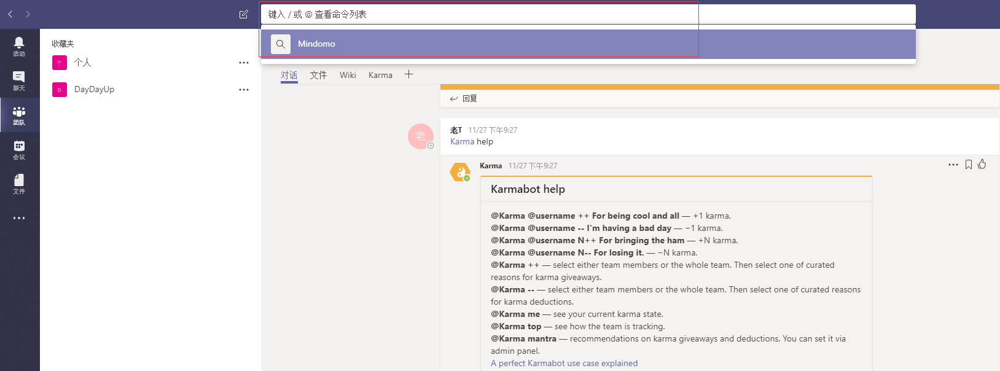

#### 1.2 显示命令
在Teams 的任意页面按Ctrl+Slash (/),会出现如图效果：
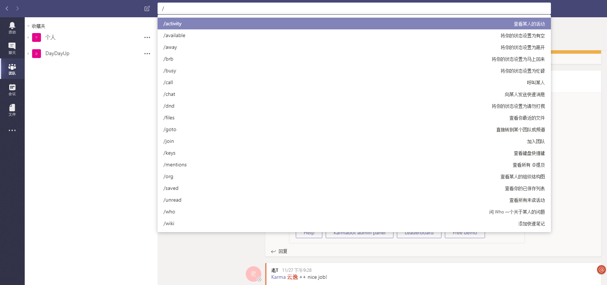

#### 1.3 goto
在Teams 的任意页面按Ctrl+G,会出现如图效果：
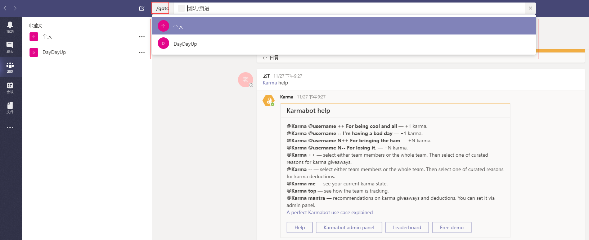

#### 1.4 开始新聊天
在Teams 的任意页面按Ctrl+N,会出现如图效果：
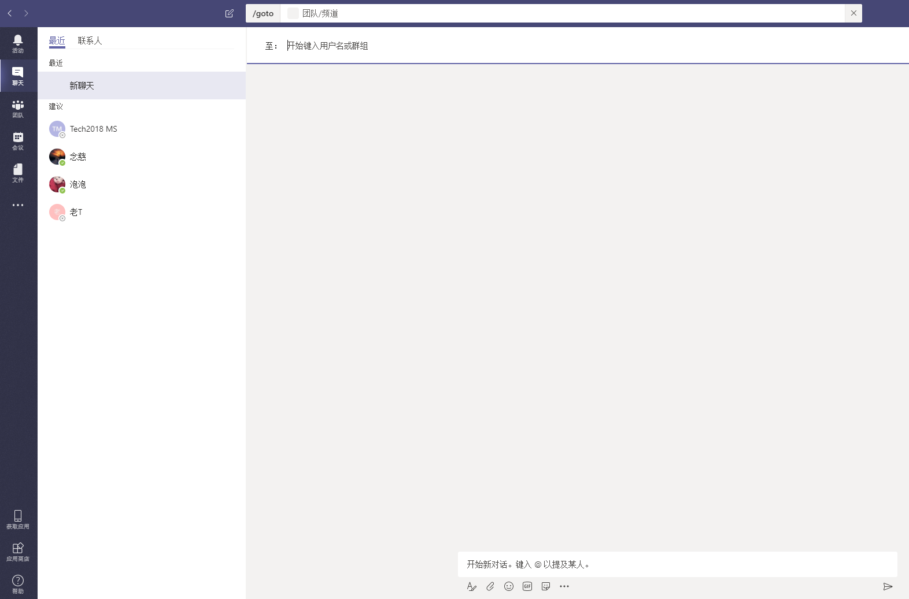

#### 1.5 打开设置
在Teams 的任意页面按Ctrl+Comma (,),会出现如图效果：
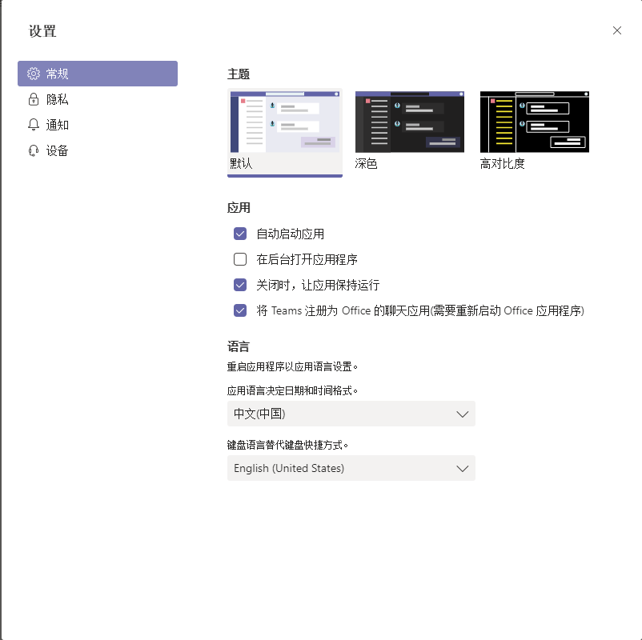

#### 1.6 打开帮助
在Teams 的任意页面按F1,会跳转至浏览器页面地址https://support.office.com/zh-cn/teams，如图效果：
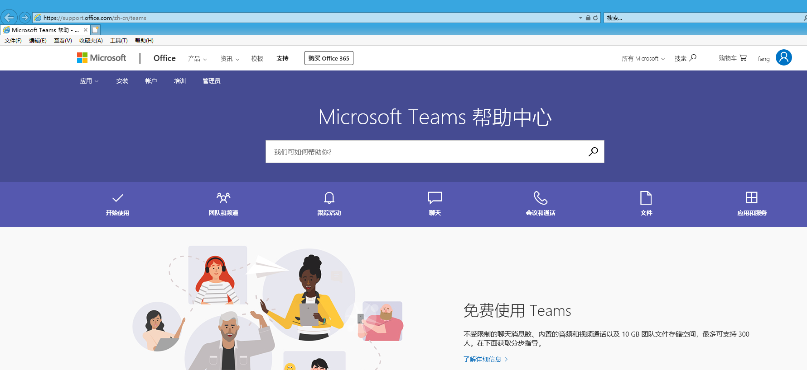

### 2.导航

<table>
<colgroup>
<col width="40%" />
<col width="30%" />
<col width="30%" />
</colgroup>
<thead>
<tr class="header">
<th>功能</th>
<th>桌面版本快捷键</th>
<th>WebApp版本快捷键</th>
</tr>
</thead>
<tbody>
<tr>
<td markdown="span">打开活动</td>
<td markdown="span">Ctrl+1</td>
<td markdown="span">Ctrl+Shift+1</td>
</tr>
<tr>
<td markdown="span">打开聊天</td>
<td markdown="span">Ctrl+2</td>
<td markdown="span">Ctrl+Shift+2</td>
</tr>
<tr>
<td markdown="span">打开团队</td>
<td markdown="span">Ctrl+3</td>
<td markdown="span">Ctrl+Shift+3</td>
</tr>
<tr>
<td markdown="span">打开会议</td>
<td markdown="span">Ctrl+4</td>
<td markdown="span">Ctrl+Shift+4</td>
</tr>
<tr>
<td markdown="span">打开文件</td>
<td markdown="span">Ctrl+5</td>
<td markdown="span">Ctrl+Shift+5</td>
</tr>
</tbody>
</table>

#### 2.1 打开活动
在Teams 的任意页面按Ctrl+1,会跳转如图效果：
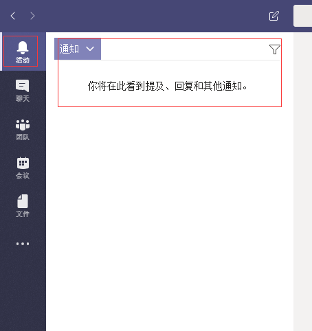

#### 2.2 打开聊天
在Teams 的任意页面按Ctrl+2,会跳转如图效果：
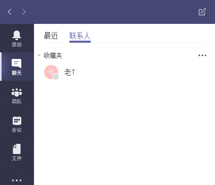

#### 2.3 打开团队
在Teams 的任意页面按Ctrl+3,会跳转如图效果：
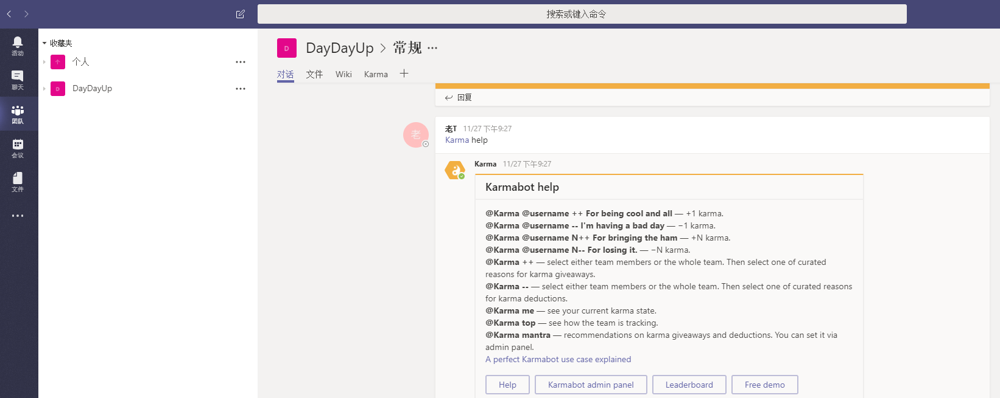

#### 2.4 打开会议
在Teams 的任意页面按Ctrl+4,会跳转如图效果：
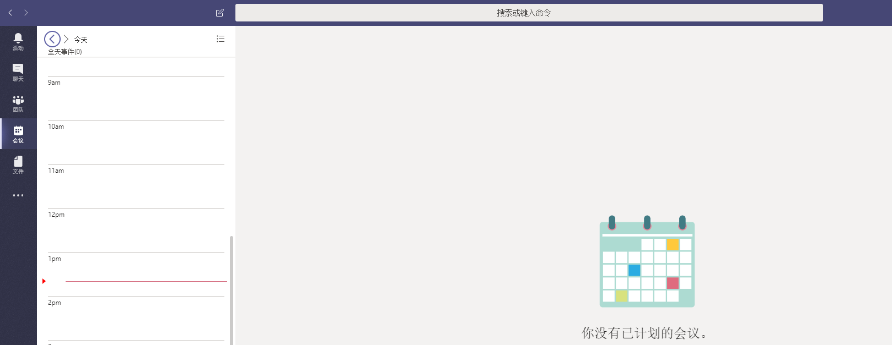

#### 2.5 打开文件
在Teams 的任意页面按Ctrl+5,会跳转如图效果：
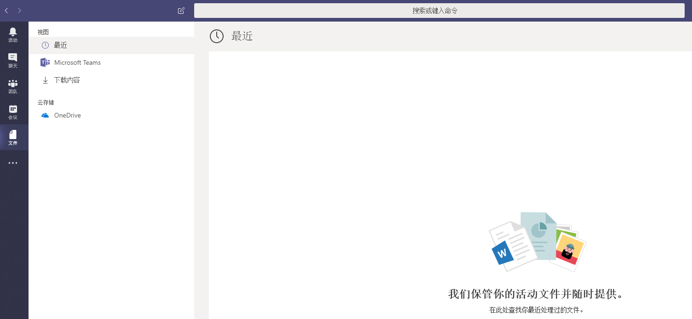

### 3.聊天输入界面

<table>
<colgroup>
<col width="40%" />
<col width="30%" />
<col width="30%" />
</colgroup>
<thead>
<tr class="header">
<th>功能</th>
<th>桌面版本快捷键</th>
<th>WebApp版本快捷键</th>
</tr>
</thead>
<tbody>
<tr>
<td markdown="span">展开组合框</td>
<td markdown="span">Ctrl+Shift+X</td>
<td markdown="span">Ctrl+Shift+X</td>
</tr>
<tr>
<td markdown="span">发送消息</td>
<td markdown="span">Ctrl+Enter</td>
<td markdown="span">Ctrl+Enter</td>
</tr>
<tr>
<td markdown="span">添加附件</td>
<td markdown="span">Ctrl+O</td>
<td markdown="span">Ctrl+Shift+O</td>
</tr>
<tr>
<td markdown="span">换行</td>
<td markdown="span">Shift+Enter</td>
<td markdown="span">Shift+Enter</td>
</tr>
<tr>
<td markdown="span">标记为重要</td>
<td markdown="span">Ctrl+Shift+I</td>
<td markdown="span">Ctrl+Shift+I</td>
</tr>
</tbody>
</table>

#### 3.1 展开组合框
在Teams 的聊天输入页面按Ctrl+Shift+X,会跳转如图效果：
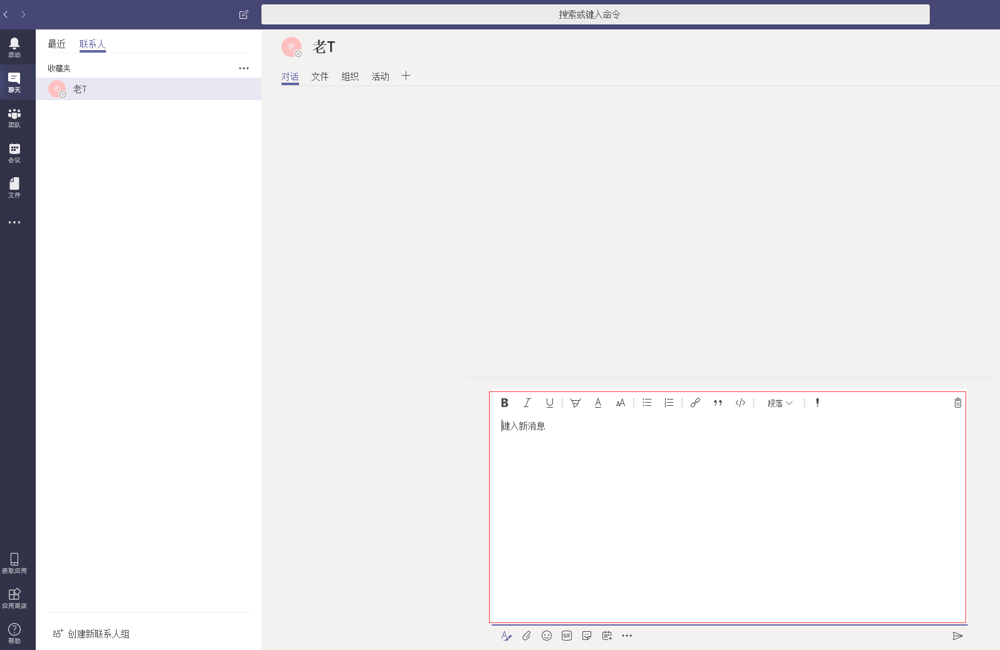

#### 3.2 发送消息
在Teams 的聊天输入页面按Ctrl+Enter,会跳转如图效果：
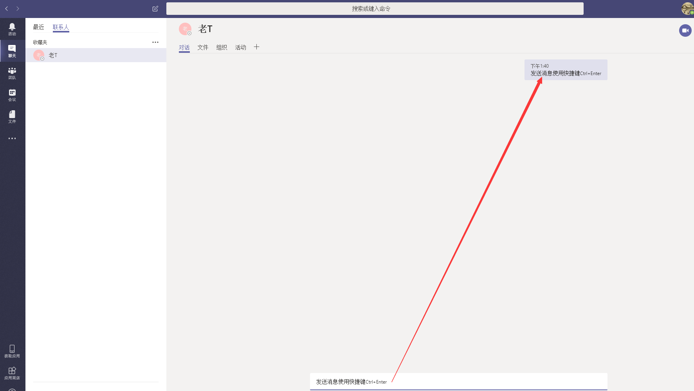

#### 3.3 添加附件
在Teams 的聊天输入页面按Ctrl+O,会跳转如图效果：
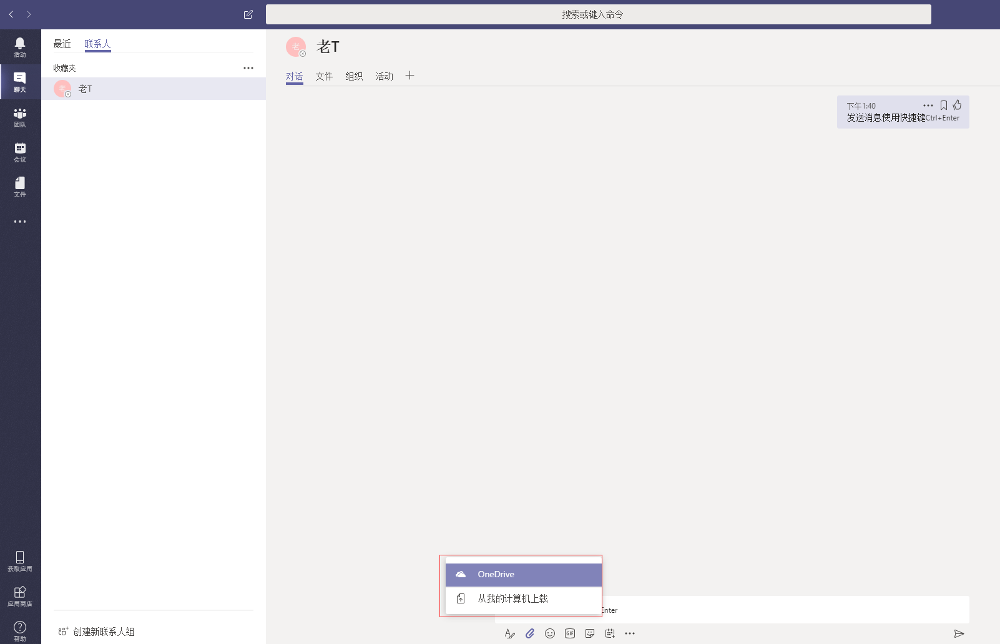

#### 3.4 换行
在Teams 的聊天输入页面按Shift+Enter,会跳转如图效果：
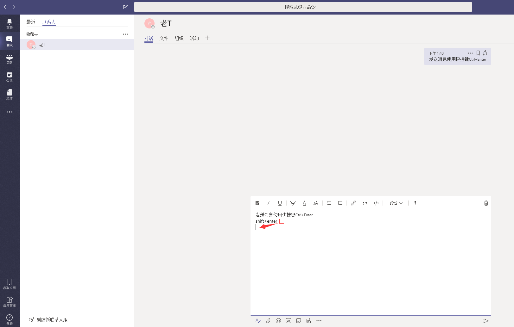

#### 3.5 标记为重要
在Teams 的聊天输入页面按Ctrl+Shift+I,会跳转如图效果：
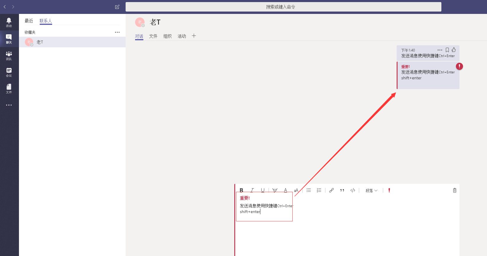

### 4. 会议

<table>
<colgroup>
<col width="40%" />
<col width="30%" />
<col width="30%" />
</colgroup>
<thead>
<tr class="header">
<th>功能</th>
<th>桌面版本快捷键</th>
<th>WebApp版本快捷键</th>
</tr>
</thead>
<tbody>
<tr>
<td markdown="span">接受语音呼叫</td>
<td markdown="span">Ctrl+Shift+A</td>
<td markdown="span">Ctrl+Shift+A</td>
</tr>
<tr>
<td markdown="span">接受视频呼叫</td>
<td markdown="span">Ctrl+Shift+S</td>
<td markdown="span">Ctrl+Shift+S</td>
</tr>
<tr>
<td markdown="span">拒绝呼叫</td>
<td markdown="span">Ctrl+Shift+D</td>
<td markdown="span">Ctrl+Shift+D</td>
</tr>
<tr>
<td markdown="span">开始语音呼叫</td>
<td markdown="span">Ctrl+Shift+C</td>
<td markdown="span">Ctrl+Shift+C</td>
</tr>
<tr>
<td markdown="span">开始视频呼叫</td>
<td markdown="span">Ctrl+Shift+U</td>
<td markdown="span">Ctrl+Shift+U</td>
</tr>
</tbody>
</table>

#### 4.1 开始语音呼叫
在Teams 的聊天输入页面按Ctrl+Shift+C,会跳转如图效果：
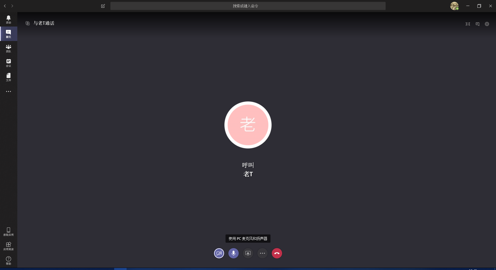

#### 4.2 开始视频呼叫
在Teams 的聊天输入页面按Ctrl+Shift+U,会跳转如图效果：

