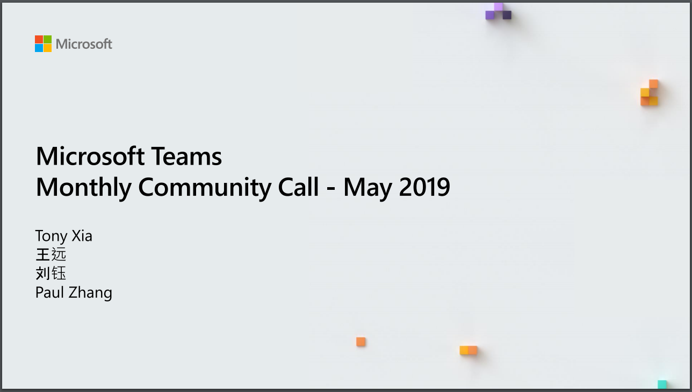

这个月有四个话题：
* Tony Xia：这个月的Teams的产品更新，Teams开发能力的更新，开源项目更新，库更新
* 王远：升级/迁移到Microsoft Teams
* 刘钰：Teams账号注册探索指南
* Paul Zhang/Cheung：Build2019上Teams的最新动态

会议视频：

[Download Video](https://greatchinaoffice365-my.sharepoint.com/personal/tony_greatchinaoffice365_onmicrosoft_com/_layouts/15/onedrive.aspx?viewid=8e48b823%2D2bed%2D40e9%2Da270%2D0b58d3d03e26&id=%2Fpersonal%2Ftony%5Fgreatchinaoffice365%5Fonmicrosoft%5Fcom%2FDocuments%2FPublic%2F201905MonthlyMeeting%2Emp4&parent=%2Fpersonal%2Ftony%5Fgreatchinaoffice365%5Fonmicrosoft%5Fcom%2FDocuments%2FPublic)
