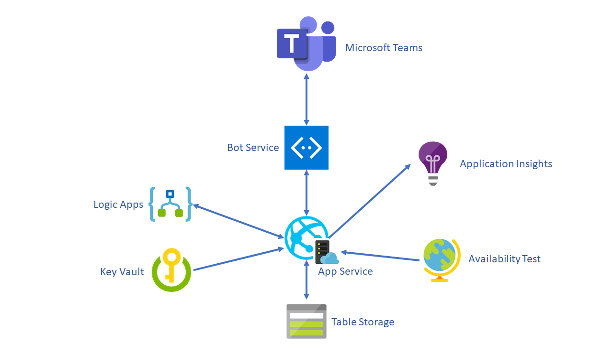
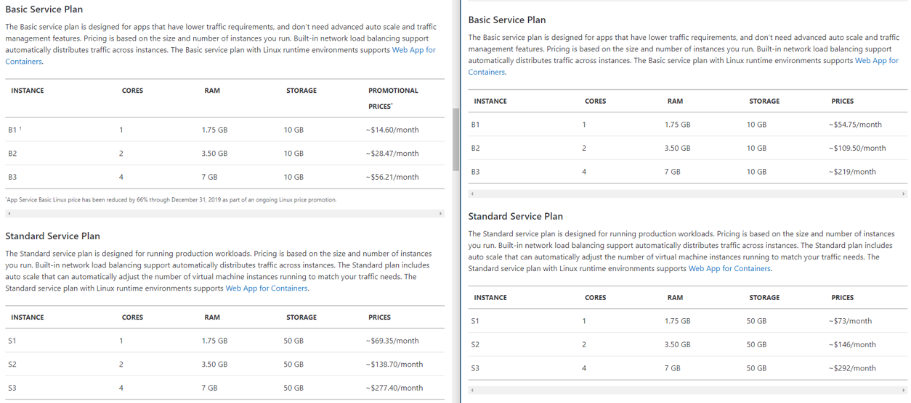
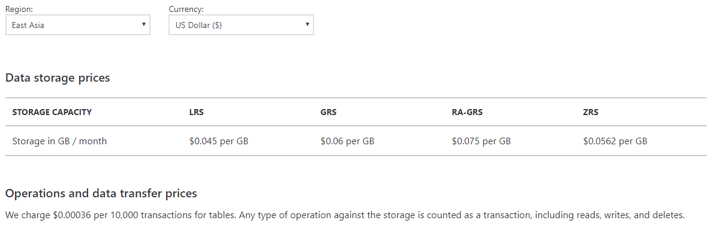
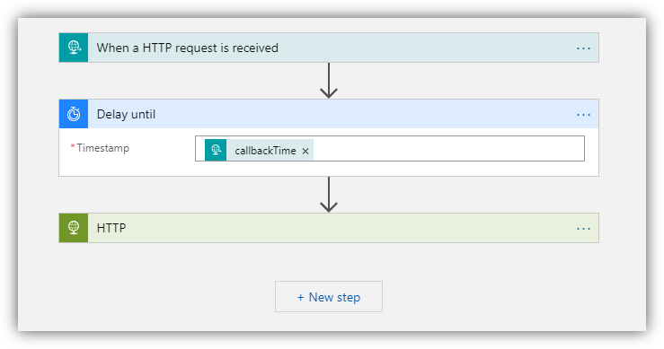
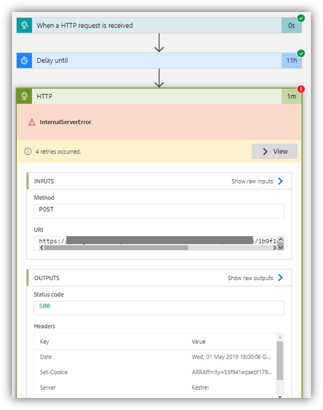
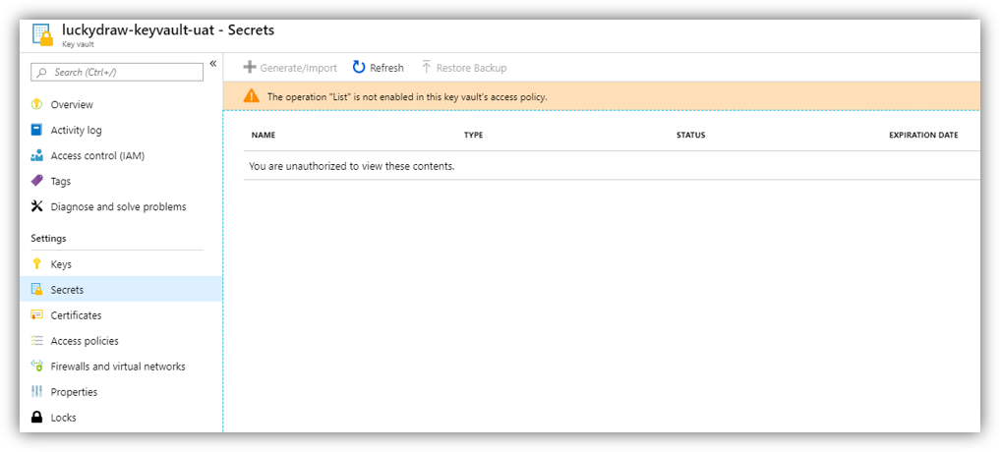
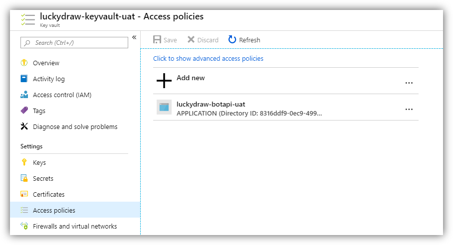
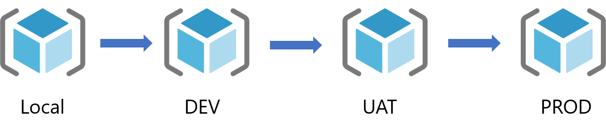
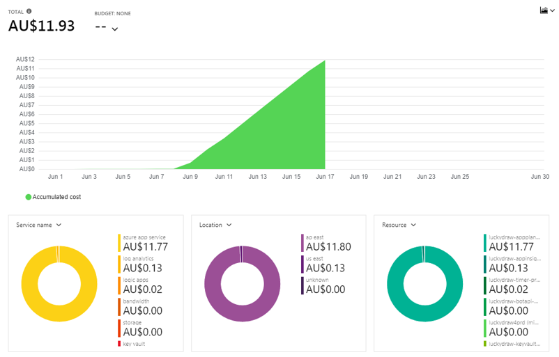
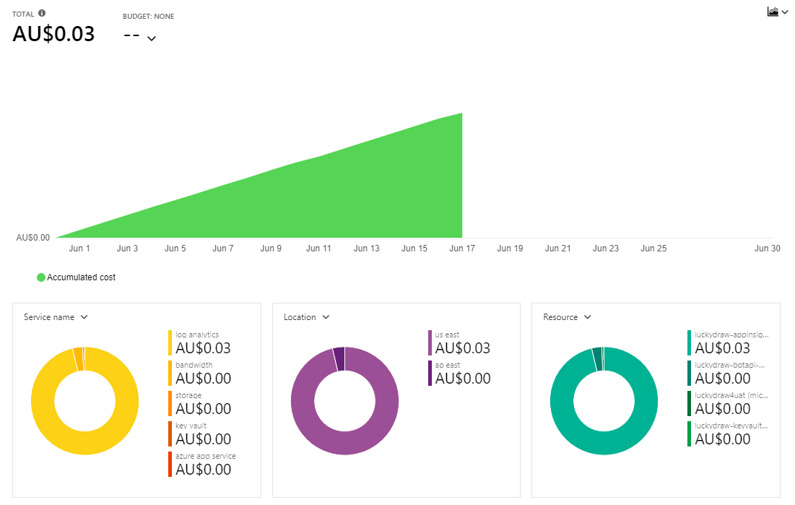

今天我们来聊一下，一个Teams app的infrastructure，我在考虑LuckyDraw的主要出于这么几个出发点：

* 可管理性。因为这是一个个人产品，以后维护工作也只有我一个人，所以我希望整个infrastructure简单、易管理，不要太花我时间

* 高可用。Teams的用户遍布全世界，所以LuckyDraw的用户来自不同时区，这个基础架构要能很好的支持7x24小时高可用

* 高可扩展。Office365的用户有1B，所以LuckyDraw的用户可能会在某个时间点爆发（只是可能）。这个架构需要能快速的扩展成支持上百万的用户

* 低成本。一个字：穷。我穷啊

下面这张图展示了LuckyDraw整体的基础架构（构建在Azure上）

中间是Azure App Service，运行着Bot，由Bot Service打通我的Bot和Teams之间的通道。数据库使用的是Table Storage。Key Vault里保存着连接字符串，bot密钥等等。Log Apps用来出发抽奖（每个抽奖都在某个指定的时间点被触发），Application Insights用来存储日志，Availability Test（它实际上属于Application Insights）用来确保我的LuckyDraw Bot的高可用。

接下来我就一个个具体说一下我为什么要这么设计：

#### App Service：
选用App Service主要是因为它可以非常方便的向上扩展和水平扩展，而且还支持auto scale，当他检测到cpu占用与高于某个阈值时，自动水平扩展，这样我就很容易管理了，不需要担心机器是否够用。而且App Service和Azure里的其他资源非常容易整合。最最关键的是它有Free版本，虽然free版本有一些限制，但是也足够用于DEV和UAT环境了。

实际上下个版本，我准备把App Service Plan从Windows换成Linux，这样我的生产环境可以更加便宜，而且可以看到B1系列的linux还有优惠，便宜到爆

#### Table Storage

选用Table Storage主要是因为：便宜！太便宜了，我计算过一次抽奖算他平均5KB的数据，也就是一百万次抽奖一个月才0.225美金，人民币按照6.8来算，才1.53元。而且我还可以吧已经结束的抽奖移到Archive Storage，才6分人民币每个月每一百万次抽奖。是不是觉得便宜到不可相信的地步？

当然，使用Table Storage也不是没有缺点的，不然那些SQL老大哥们怎么活啊。使用Table Storage有几点需要注意：
* 目前没有成熟的自带的备份方案，但可以自己写脚本实现
* 每row数据，每个column的数据有大小限制
* 开发是不能使用EF，Dapper等成熟的ORM库

#### Logic Apps
当时为了找一个timer的方案，很是头痛，我并不希望把我的bot的服务做成stateful，这样会影响它的scalability。然后我又研究了Azure Durable Function，Azure Scheduler等方案，最后在好友Ares的建议下，研究了Logic Apps，发现这个用来做Timer是一个很好的方案。

而且它还有自动的retry机制，而且一旦出错，也非常容易查找当时出错的原因。

#### Availability Test
这个是Application Insights里的一个功能，可以从选定的机房往你指定的Service上发送请求，并且监控是否请求成功和网络延迟。下图就是从我选定的5个region给我的bot服务发送请求。延迟最大的是美国东部，因为我的bot服务部署在香港，所以美国东部距离最远。

#### Key Vault

Azure的Key Vault可以很好的帮助我们保存密码，密钥，连接字符串之类的。而且MSI很好用，我可以只给我的Bot服务有访问Key Vault的权限，我连我自己的azure账号都不给访问权限，真正的安全啊。

### 环境

上面的全套基础架构只是一个环境，我在整个开发流水线中，一共有三个环境，分别是DEV，UAT和PROD，使用Azure DevOps来完成CI/CD。都是微软自家产品，所以AzureDevOps和Azure完美结合。我后面会另外再写一篇关于我如何使用AzureDevOps来自动部署整个infrastructure的文章。

下图就是运行了9天的生产环境的成本，一共是12澳币，大约60元不到的人民币，主要是花在了App Service Plan，因为我需要开启Always On功能。以后改成Linux的App Service Plan后会便宜不少。

这个是UAT环境运行18天左右，才花了3澳分，相当于人民币1角5分不到。所以如果你对Azure的服务十分了解，并且你的服务是Cloud Native的，真心便宜啊。而且整个架构是高度可扩展的。

