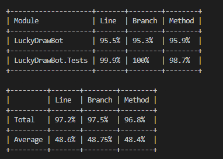
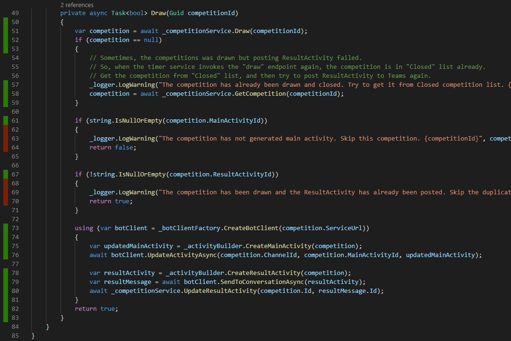

在我昨天的文章中介绍了如果对Teams bot做service level的测试，那到底要写多少的测试代码才算够？如何才算测试到位了？这个时候我们就需要用"测试覆盖率"来衡量，虽然覆盖率高并不一定代表着就可以高枕无忧的以为我们软件质量高了，但是测试覆盖率是一个代码质量的很好的信心指数。😄

在传统的ASP.NET下有很多的用来做测试代码覆盖率的工具和库，在Core时代的工具选择就更加多了，在我的LuckyDraw bot里，我使用了Scott Hanselman推荐的[Coverlet](https://www.hanselman.com/blog/NETCoreCodeCoverageAsAGlobalToolWithCoverlet.aspx)。

用法也比较简单，首先在csproj项目文件中添加此工具。当然也可以在你当前的开发机器里使用`dotnet tool install -g <package id>`来全局安装coverlet工具，但是我还是比较喜欢针对项目来安装。
``` xml
<Project Sdk="Microsoft.NET.Sdk">
  ...
  <ItemGroup>
    <PackageReference Include="coverlet.msbuild" Version="2.6.0">
      <IncludeAssets>runtime; build; native; contentfiles; analyzers</IncludeAssets>
      <PrivateAssets>all</PrivateAssets>
    </PackageReference>
  </ItemGroup>
  ...
</Project>
```

然后我又在我的项目根目录下运行：
``` cmd
dotnet test .\test\LuckyDrawBot.Tests\LuckyDrawBot.Tests.csproj /p:CollectCoverage=true /p:CoverletOutputFormat=lcov /p:CoverletOutput=.\lcov.info
```

在所有测试用例都执行完后，coverlet就可以显示出测试覆盖率了。



可以看到LuckyDraw bot的覆盖率有95%以上。这里面的三个指标的分别是：
Line：代码行的覆盖率
Method：函数方法的覆盖率
Branch：这个概念指执行路径的覆盖率，具体的含义可以看[这里](https://www.tutorialspoint.com/software_testing_dictionary/branch_testing)

另外，如果大家使用VS code的话，我推荐一个插件：Coverage Gutters. https://github.com/ryanluker/vscode-coverage-gutters
coverlet搭配这个插件，就可以在VS Code里可视化你的代码测试覆盖率，如下图：



绿色部分代表我的代码已经被测试覆盖到，红色部分（62-64行，68-70行）还没有覆盖到，所以我应该在下个版本中增加更多的测试用来来覆盖。
