Teams的app studio很多用户可能不知道，但是对于一个teams平台的开发人员来说，这个是开发利器，利用这个工具你可以轻松的配置manifest文件，可以轻松的一站式创建teams app所需要的所有东西。而且你可以很方便的可视化配置adaptive card。
那就让我们来看看如何使用app studio来创建一个teams app。

首先你需要安装app studio，这个工具本身就是一个teams的app，所以安装也和其他teams app的安装方法类似。点击Teams左下方的Apps按钮，进入到store，搜索app studio。

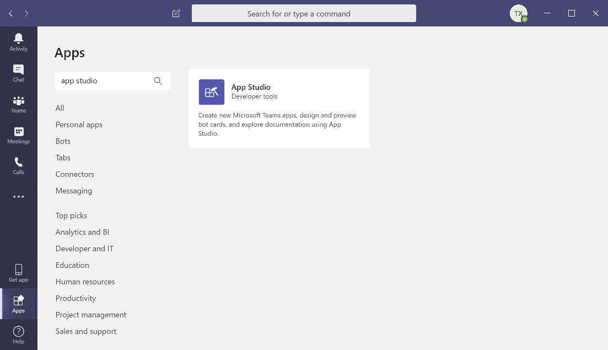

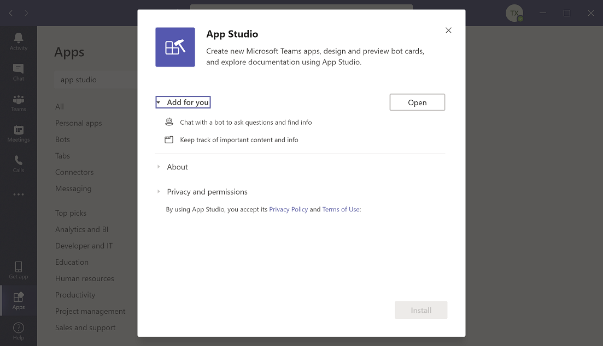

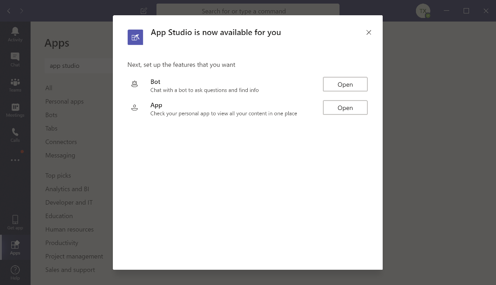

安装后，在侧边的的“...”菜单中就有了App Studio这一项

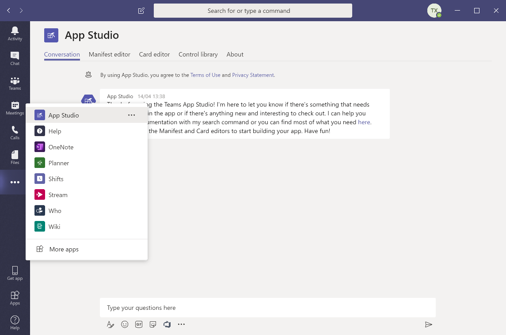

点击第二个tab: Manifest editor

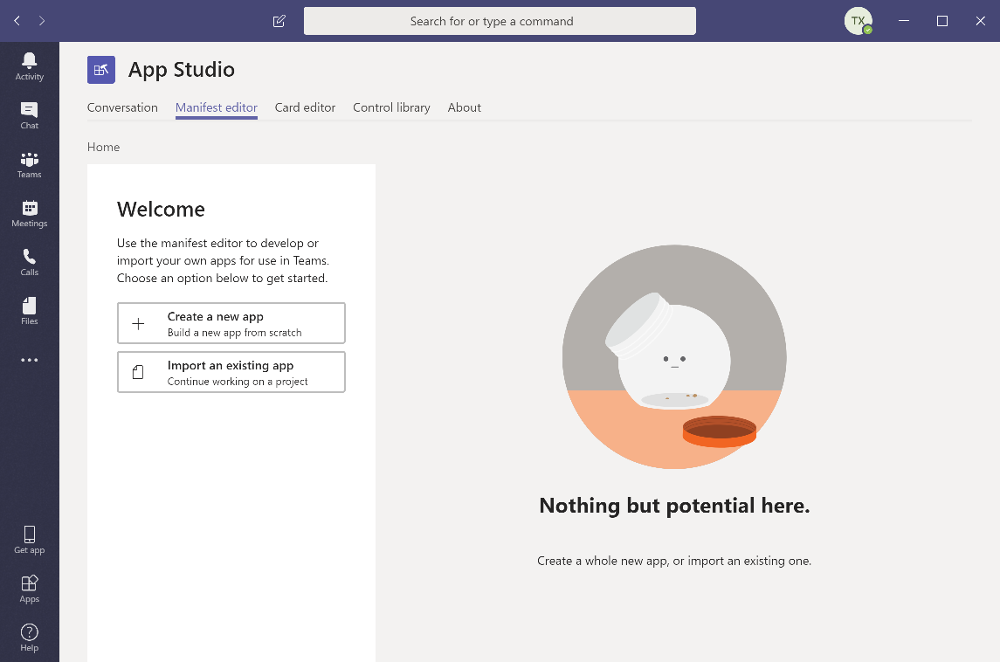

我们来新建一个app，然后填写一些这个app的基本信息

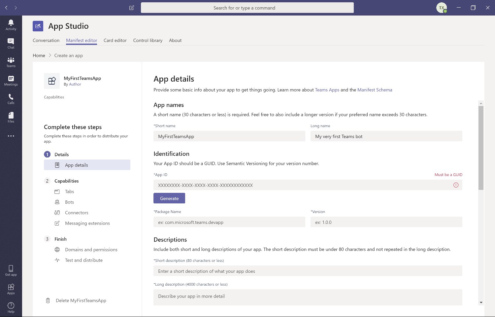

需要注意一点，teams app可以对teams进行多种扩展，可以扩展tab，可以开发一个bot，可以是teams的一个connector，所以是一个message extension。一个teams app可以身兼数职。也可以指针对一个方面进行扩展。所以我们先创建app，然后再针对我们需要的扩展进行专门的配置。

比如我们来配置一个Teams Tab
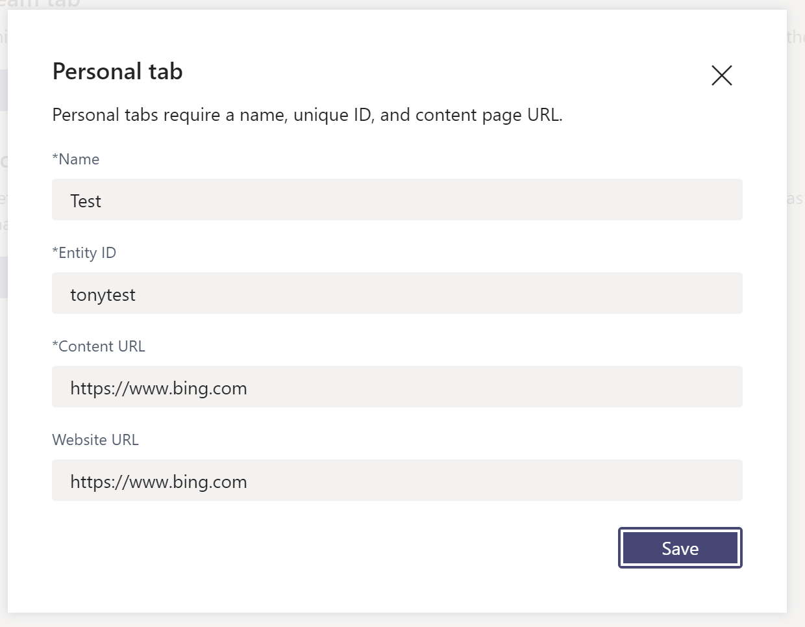

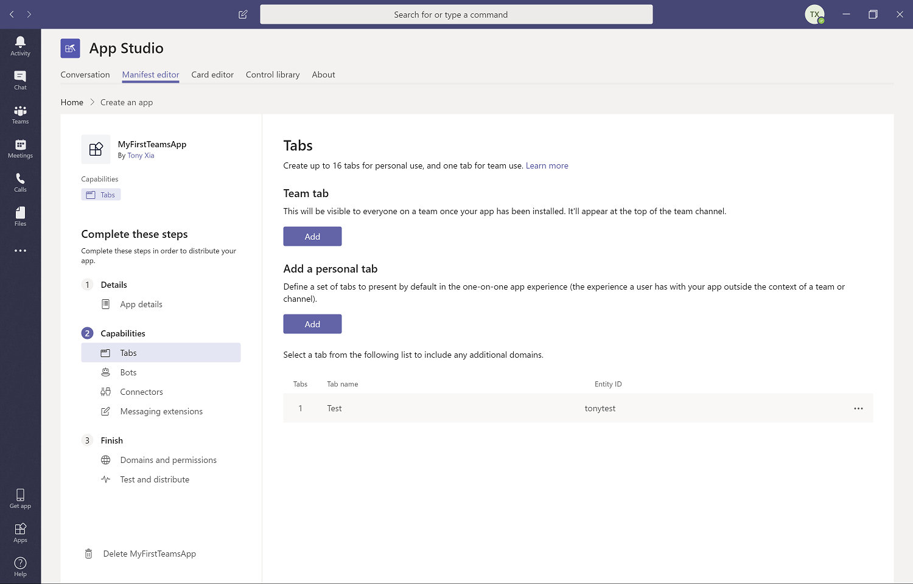

最后，我们全部配置好后，就可以进行调试我们的app，app studio一共提供了两种方式，一种是直接把你当前配置的app安装到某个team里或者某个channel里。或者让你下载整个manifest zip包，这样你可以在安装之前再进行最后的修改，这个实际上很有用，如果teams最新版本支持了一些高级的新功能，但是app studio还没有来得及跟上，那就可以手动再编辑一下manifest.xml，来enable一些新功能。
最后一个选项是提交到teams的app store（office store）。这个我们以后再展开介绍

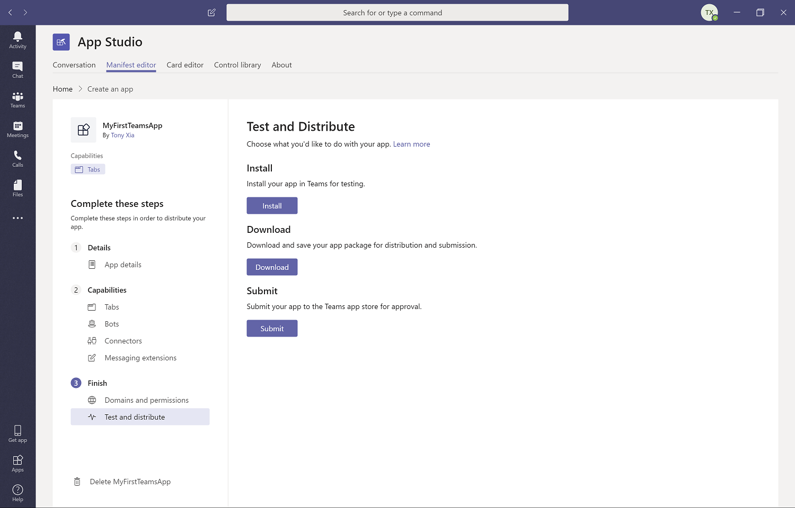

因为我们并没有开发一个bot的后台api服务，所以我们就先只enable tab，安装完后可以在你的channel里看到你的tab了。

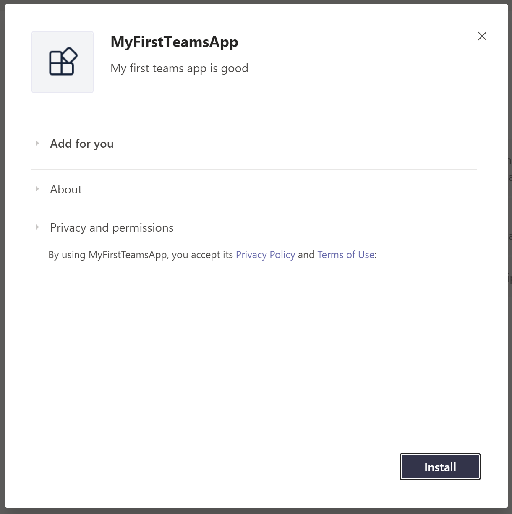

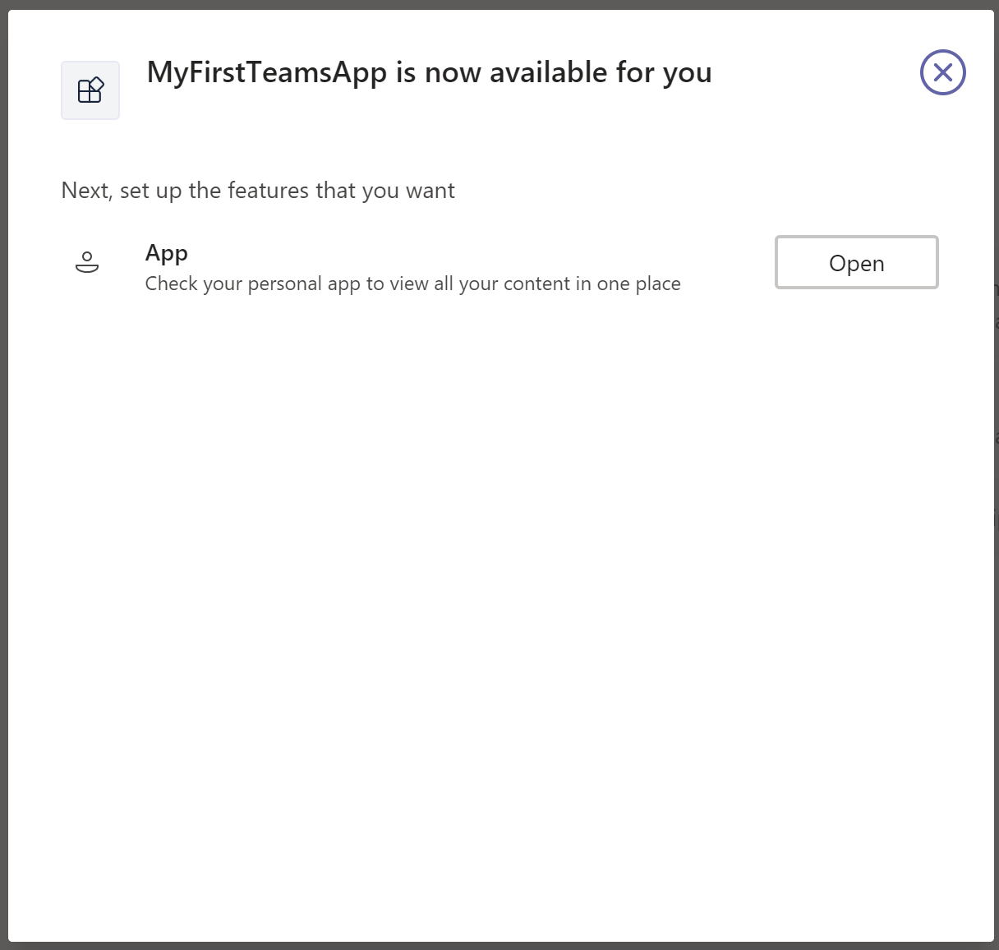

安装完后我们就能看到第一个teams app的效果了。有了App Studio一切都变得很简单了。赶快动手做一下吧。

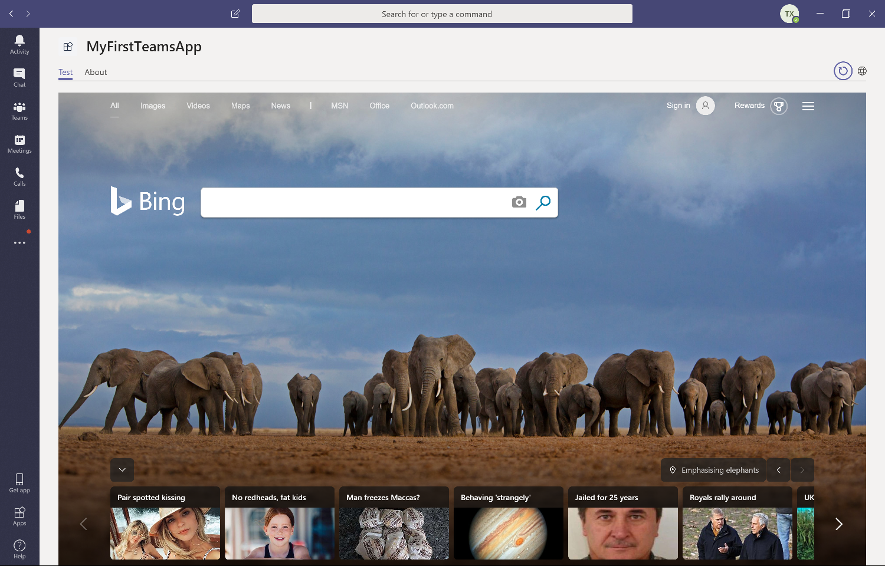
