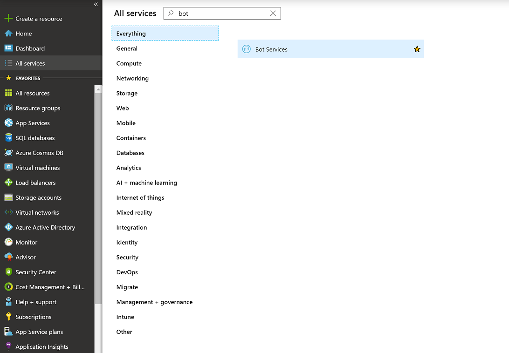
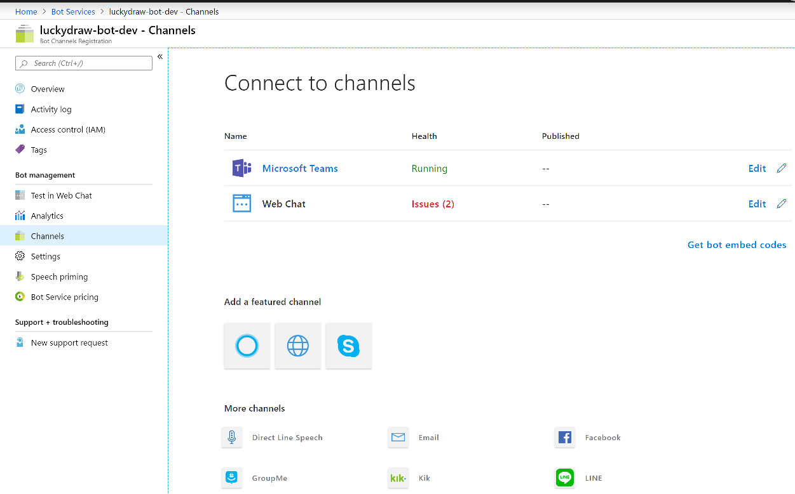

相信很多devops已经全面开始使用ARM来创建azure资源了，ARM有很多方便的地方，比如简单易学，Infrastructure as Code，但是深入使用ARM开始会发现一些有待改进的方面。这篇文章主要是分享一下我在做Teams app的时候使用ARM来创建资源的经验，以及遇到的一些问题。希望大家以后遇到类似问题可以少走弯路。

在一个teams bot中有一个比较特殊的azure资源需要创建，就是Bot service，一年多前你还可以在另一个微软的独立网站上创建bot，但是现在已经全部整合到azure的大旗下了。



这个资源主要用来干什么？它主要是用来作为Teams和你的api service的通讯桥梁。它会从Teams（也可以是其他，比如skype）里接受消息，然后抽象成一个统一的bot通信数据模型后，传递给你的api service，当你的api service完成处理后，它又将返回的信息，发送回Teams。所以这个资源必不可少。



我们先看看它长什么样子，注意一点：目前在azure上这个Bot Channels Registration还不支持Export Template，所以还不能反向工程成ARM

```json
{
    "name": "YourBotServiceName",
    "type": "Microsoft.BotService/botServices",
    "apiVersion": "2018-07-12",
    "location": "global",
    "tags": {
      "displayName": "Bot Service"
    },
    "sku": {
    "name": "F0"
    },
    "kind": "bot",
    "dependsOn": [
      "[resourceId('Microsoft.Insights/components/', variables('appInsightsName'))]"
    ],
    "properties": {
    "displayName": "LuckyDraw",
    "endpoint": "https://api.yourapiservice.com/messages",
    "msaAppId": "[parameters('microsoftAppId')]",
    "developerAppInsightKey": "[reference(resourceId('Microsoft.Insights/components', variables('appInsightsName')), '2015-05-01').InstrumentationKey]"
    }
},
```

有几点需要注意：
* apiVersion目前最新是2018-07-12，我就使用了这个版本。[Microsoft.BotService botServices template reference](https://docs.microsoft.com/en-us/azure/templates/microsoft.botservice/2018-07-12/botservices)
* location是global，这个和一般的azure resource不同，需要特别注意
* endpoint就是你的api服务的endpoint
* msaAppId是你的Microsoft application的id，这个需要另外申请，我这里是作为外部参数传入的
* developerAppInsightKey，为了以后调试方便，所以创建了一个application insight，然后把key配置到这里

大家需要注意一点，当使用ARM创建完bot service后，默认情况下没有打开Teams通道。这点我研究了很久也没有找到答案，可能在以后版本中会支持这个，如果大家知道如何做，也请留言告诉我。我有几次忘记打开这个，然后就发现teams发送不了消息到我的api服务，而且也没有详细的出错信息。

所以我们需要登入azure portal，然后手动打开teams通道，完成后就一切就绪，可以和你的api服务进行通信了。


