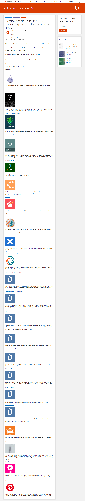

上个月微软进行了一个全世界提名活动，目标是选出微软2019年度People's Choice app。

很幸运，我的LuckyDraw bot得到了来自世界各地使用者的投票，其中也包含Teams中国社区和很多朋友的支持。
[https://developer.microsoft.com/en-us/microsoft-teams/blogs/vote-today-for-peoples-choice-award-for-2019-microsoft-app-awards/](https://developer.microsoft.com/en-us/microsoft-teams/blogs/vote-today-for-peoples-choice-award-for-2019-microsoft-app-awards/)

虽然最终的获奖app要等到今年微软Ignite大会上才会公布，不过能进入这个决赛名单，能和Pinterest、Pickit和CorelCAD等大牌app列在一起,我已经心满意足了。

再次谢谢大家的支持!

