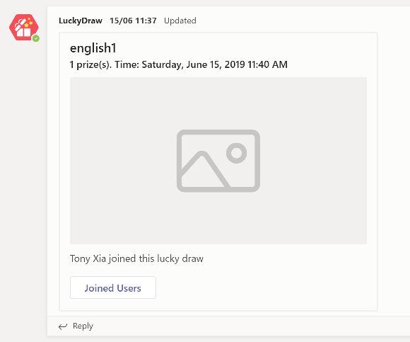

我的LuckyDraw上线后收到了不少有价值的反馈，其中有一部分是针对图片的，有一些用户说他们填写了image的url，但是图片显示不出来。

实际上这个问题在我提交这个应用到微软审核团队的时候，审核团队也提出了类似问题。但这个是Teams本身的限制。具体的文档见：
[https://docs.microsoft.com/en-us/microsoftteams/platform/concepts/cards/cards-reference](https://docs.microsoft.com/en-us/microsoftteams/platform/concepts/cards/cards-reference)

其中有一段
> Your card can contain an inline image by including a link to your publically available image. For performance purposes we highly recommend you host your image on a public content-delivery network (CDN).
>
> Images are scaled up or down in size while maintaining the aspect ratio to cover the image area, and then cropped from center to achieve the appropriate aspect ratio for the card.
>
> Images must be at most 1024×1024 and 1 MB in PNG, JPEG, or GIF format; animated GIF is not officially supported.

说白了，实际上Teams对于内嵌的card image有这么一些要求：
* 图片是公开可访问的。也就是说你的图片url在任何可以上网的机器上都应该可以打开。不需要输入用户名密码，不需要登入
* 图片的长宽最大是1024×1024。意思是宽度不能超过1024像素，高度也不能超过1024像素。这两者必须同时满足
* 图片文件的大小不能超过 1 MB
* 图片格式必须是PNG，JPEG，或者GIF。不支持BMP，TIFF，webp等其他图片格式。并且Teams是不支持GIF动画的

知道这个限制就简单很多了。但是很多开发者也问过，如果要求用户的图片要满足这些要求，好像有点困难，这也会是的app的用户体验比较差。有没有更好的办法。

办法实际上有不少，最简单的是可以使用第三方的图片服务，比如国内的七牛云图片功能，可以方便得转换图片格式和大小。从而满足Teams的上面这些需求。

当然我们也可以自己做一套简易的图片处理服务，下篇我会分享一下我为LuckyDraw 2.0版本开发的图片处理服务。
