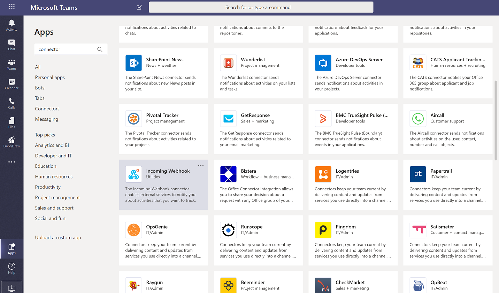
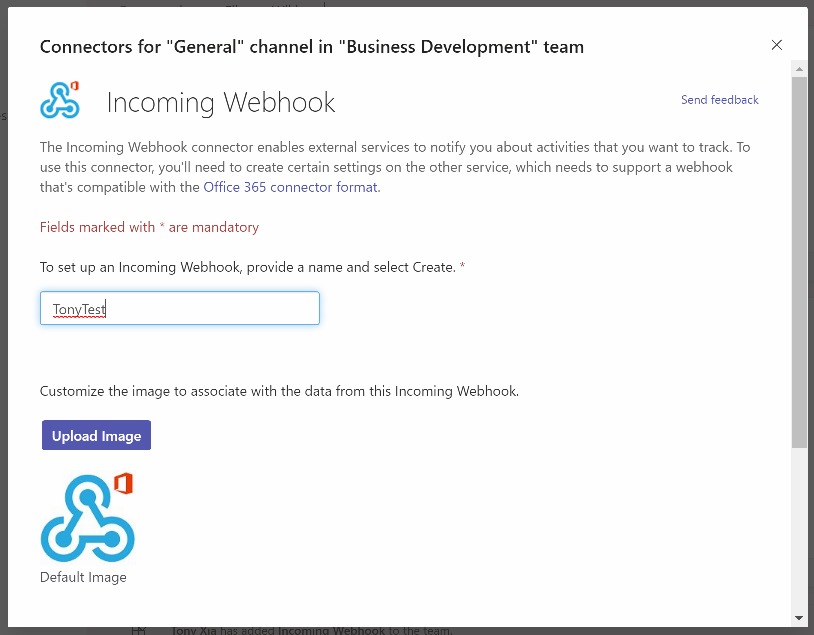
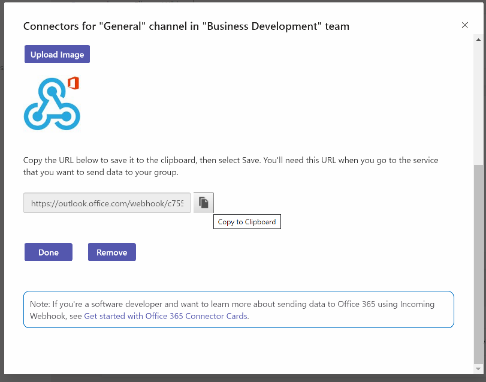
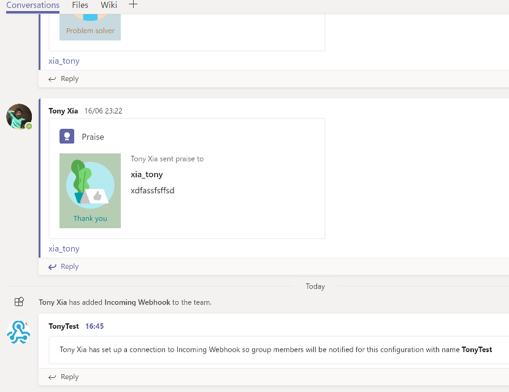
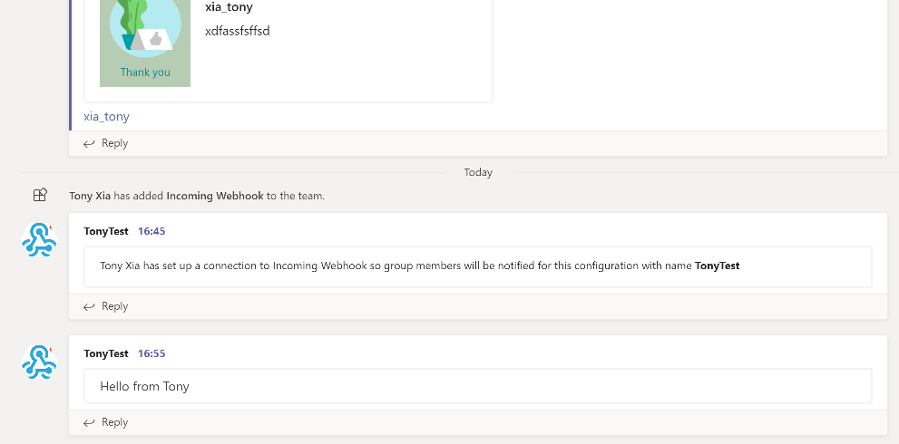

我在去年的一篇文章里介绍过Teams的outgoing webhook，这个可以用来实现一个简单的用户和service对话机制。

Teams除了outgoing webhook以外，还有一个incoming webhook，从名字上我们也可以立刻知道，这个webhook是用来处理进入Teams的消息。比如，企业里有一个企业内部通知平台，你希望一旦这个平台有一条新的通知发布，在Teams的某个channel里就会有一条对应的消息，来通知大家。incoming webhook就是为此需求而生的。

我们来看看如果创建一个incoming webhook，实际上很简单：

1. 选中一个Team，进入这个Team的管理界面，选择App，在Teams的app store里选择"Incoming webhook"这个app



2. 确认一下要消息推送到的channel。


3. 输入你的incoming webhook的名字，如果需要的话，可以上传一个头像



4. 点击“Create”按钮

5. 稍等几秒中后，就可以看到如下界面。

**注意**：记得拷贝下面这个生成的URL。千万不要忘记



6. 点击“Done”按钮后，incoming webhook就创建完成了，你在你的channel里已经可以看到一条消息。



7. 配置好了incoming webhook后，如何推送消息到这个channel里呢？实际上很简单，从测试的角度，我们使用curl或者powershell

``` bash
curl -H "Content-Type: application/json" -d "{\"text\": \"Hello from Tony\"}" <YOUR WEBHOOK URL>
```

``` powershell
Invoke-RestMethod -Method post -ContentType 'Application/Json' -Body '{"text":"Hello from Tony"}' -Uri <YOUR WEBHOOK URL>
```

调用完成后，在你之前指定的channel里已经可以看到你刚才推送的消息了。



是不是很简单？赶快行动起来让你的企业应用和Microsoft Teams互动起来！

