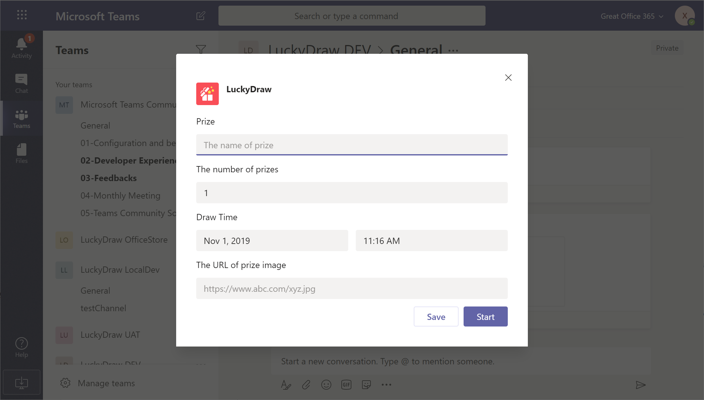
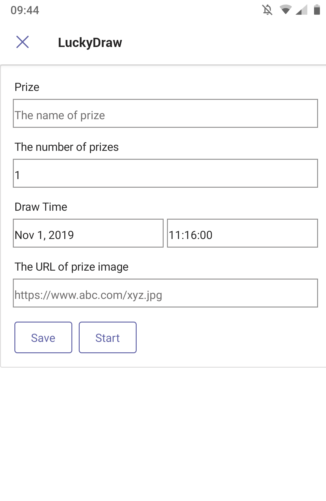
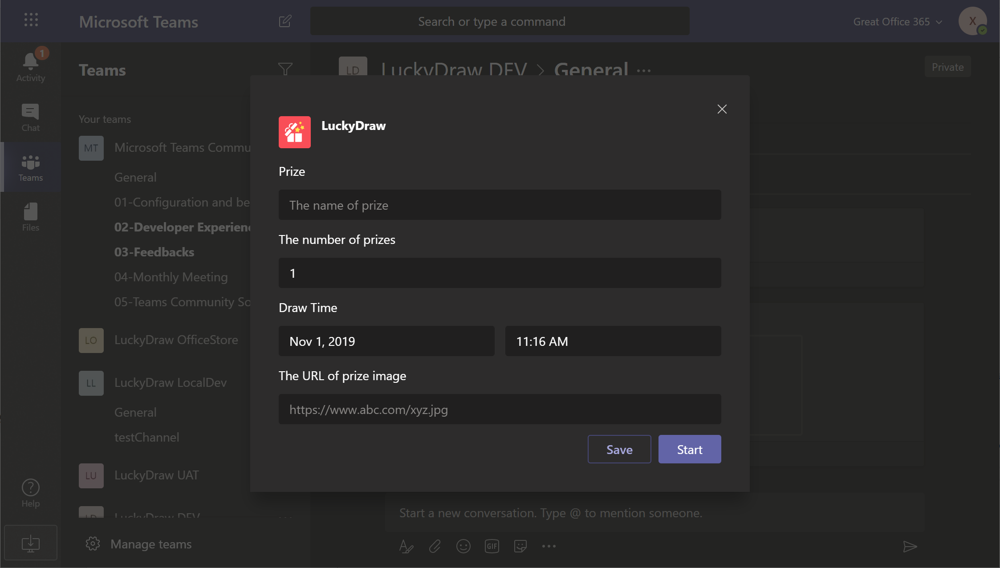
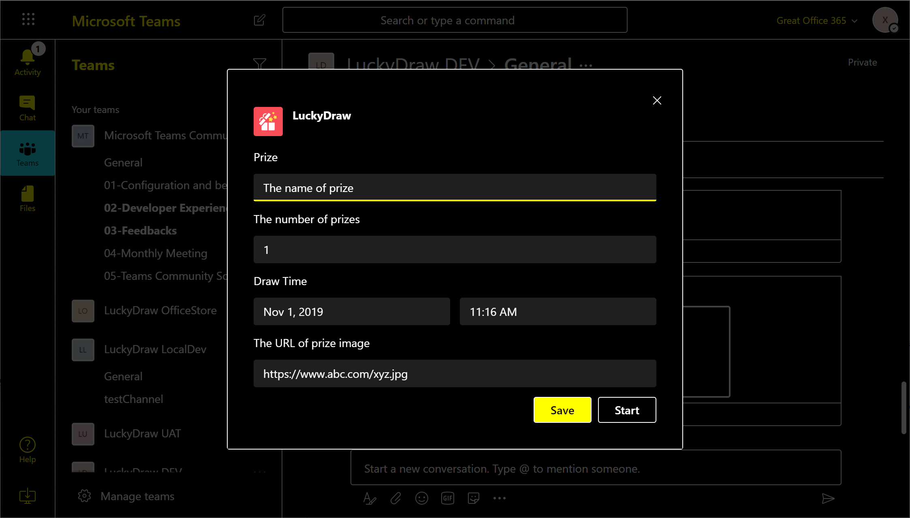
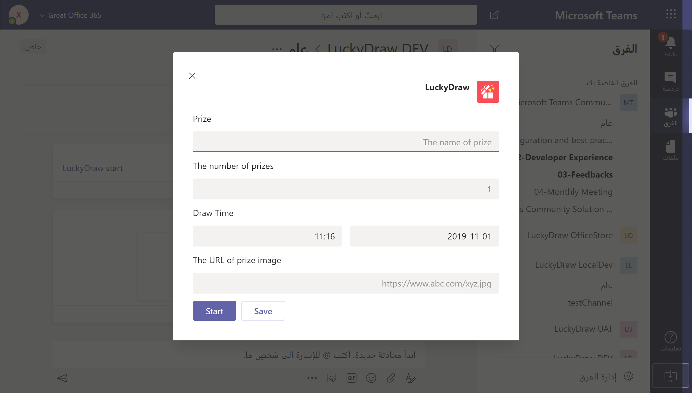

Teams app的task module十分好用，当用户点击了一个卡片上的按钮是可以在Teams里弹出一个对话框，对话框的内容可以是开发人员自己的一个网页页面，或者是adaptive card。
在我的LuckyDraw bot里，我比较了这两种的优势和劣势，最后选择了Adaptive card。如果采用网页，那最大的优势就是可以实现任何你想要的功能和界面互动，只要是html+css+js可以做到的，基本都可以在这个弹出的对话框里实现，劣势就是工作量大。可能有很多读者会质疑说开发一个html页面有什么难的，早就轻车熟路了。那我先来介绍一下到底adaptive card有哪些功能，然后再来看实现这些功能的页面会需要多少工作量。

### 自动适配桌面宽屏和和手机窄屏。

只要是Teams支持的客户端平台，微软就会为adaptive card提供对应的适配支持，并且对不同的屏幕分辨率提供自适应。

### 自动适配teams的不同主题。

除了大家常用的默认主题，teams实际上还有一款深色主题，很适合夜间使用。如果使用adaptive card，开发人员完全不用处理主题的切换和处理，所有一切teams内建支持。

Teams还有一个主题是高对比度的主题，主要是给视力有障碍的人士设计的。同样，使用adaptive card的开发人员天生就有这个benefit。

### 自动适配不同时区的用户。

adaptive card可以根据当前用户所在的时区，自动把UTC时间转换成当前用户时区的时间显示。

### 自动适配不同语言的布局（从右到左，和从左到右）。

虽然teams无法自动把界面文字给翻译了，但是它会针对语言的文字左右布局，自动调整，比如从右到左的阿拉伯文：

### teams升级后的adaptive card的界面自动跟进

当以后teams有升级，teams的界面空间风格有变化，微软会第一时间对应的升级adaptive card的界面。或者有一个新的Teams界面主题出来，微软也会提供对用的adaptive card的风格，作为开发人员完全不用操心，完全不用再花时间去升级界面。

看完上面五点后，大家是否还觉得自己开发写html页面工作量小吗？当然，我并不是说自己写页面没有用，而且想告诉大家，不到万不得已，千万不要自己为难自己，自己给自己增加工作量。
