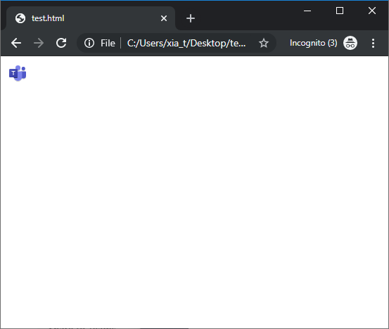
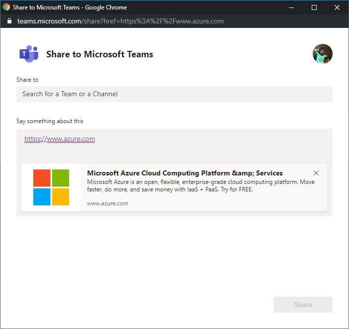
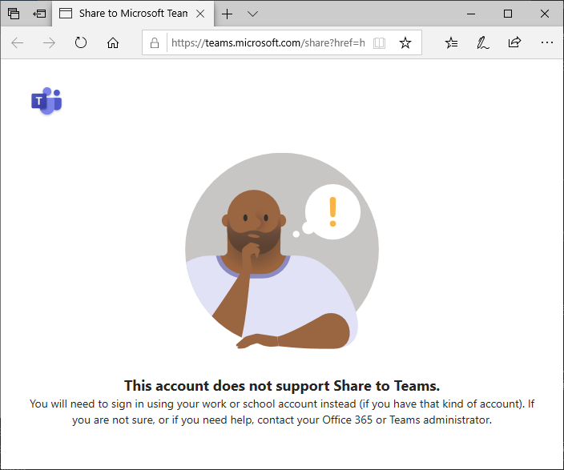

在今年三月份末，Teams的官方文档推出了一个新功能：将网页（一个URL）分享到Teams里。

也就是说开发人员现在可以很方便的开发一个页面，页面里有一个Teams的图标，当访问此页面的最终用户点击这个图标后可以将指定的一个URL分享到用户的Teams里。用户在分享时可以指定分享到Teams的哪个Channel中，在分享前还可以编辑分享的文字。开发人员来可以指定页面预览的内容。是不是很赞？让我们一起来试一下吧。

首先让我们创建一个最简单的html页面：
``` html
<html>
<head>
    <script async defer src="https://teams.microsoft.com/share/launcher.js"></script>
</head>
<body>
    <div class="teams-share-button" data-href="https://www.azure.com"></div>
</body>
</html>
```

使用Edge或者Chrome浏览器打开这个html文件（注意：当前版本只支持edge和chrome）。



点击这个Teams的图标，会弹出一个新窗口，在这个窗口中，用户就可以选择要分享到的team或者channel了，也可以对要分享的文字在进行修改。另外还有一个网页的预览。



注意一点：当前版本不支持免费(Freemium)和guest账号，也就是说你需要是一个office365账号，并且你只能分享到你所在的office365 tenant中。如果你是一个Freemium账号，你会看到如下的界面。



为了适应不同的页面需求，可以通过`data-icon-px-size`来指定Teams图标的大小。比如：
``` html
<div
  class="teams-share-button" data-href="https://https://www.azure.com"
  data-icon-px-size="64">
</div>
```

还可以使用`data-preview`来禁止预览页面。
``` html
<div
  class="teams-share-button" data-href="https://https://www.azure.com"
  data-preview="false">
</div>
```

另外，我们还可以指定预览的文字和图片
|Value|Meta tag| Open Graph|
|----|----|----|
|Title|`<meta name="title" content="页面标题">`|`<meta property="og:title" content="页面标题">`|
|Description|`<meta name="description" content="页面简短说明">`|`<meta property="og:description" content="页面简短说明">`|
|Thumbnail Image| none |`<meta property="og:image" content="预览图的URL">`|

赶快行动起来吧，让你的页面被海量的Teams用户分享吧！
