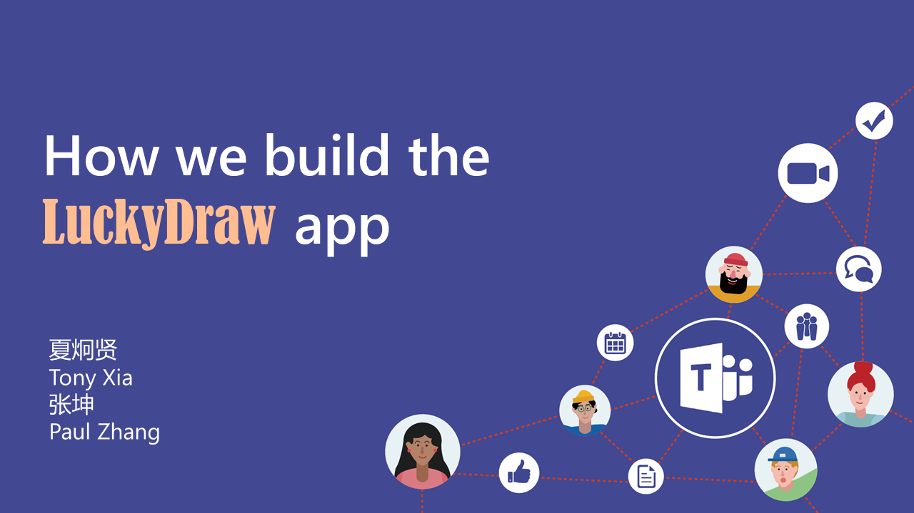
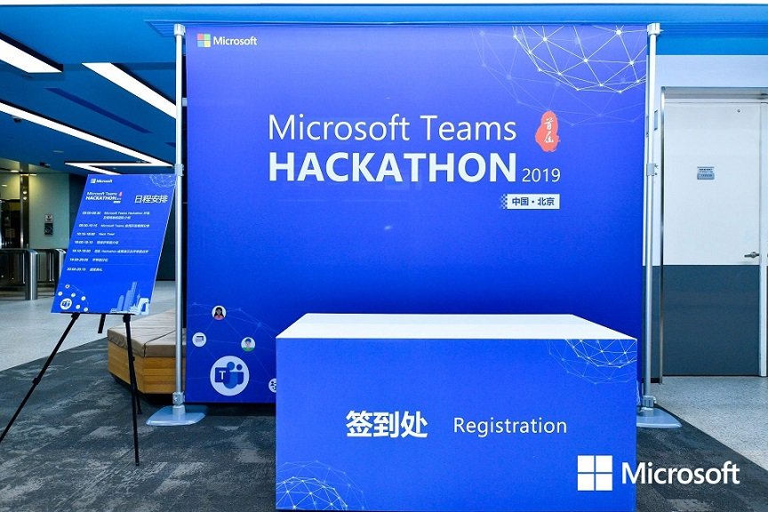

很荣幸有机会在今天的Teams Hackathon上介绍LuckyDraw这个teams app。

因为到场的都是各路开发高手，所以当时在准备这个ppt的时候特别增加了难度等级，哈哈。

从如何构建云原生的Teams app，到IaC，重点讲了如何开发一个面向全球用户的Teams App。

最后虽然由于种种原因只能请另一位app作者张坤帮我完成讲解，但能把开发LuckyDraw的经验分享给这么多优秀的开发精英们，非常开心。 :)

