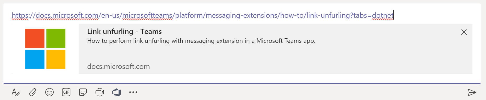

Teams中有一个不太被大家注意的扩展点，名字叫Link unfurling，就是对于一些特殊域名的URL进行特别的解释。

可能这么说，大家还是无法理解，我们看一下下面这个图，当用户在message输入框中输入了一窜url后，Teams会按照自己本身的一种规则来对URL指定的网页产生预览。但是如果你想要生成你自己的特殊的预览卡片的话，就需要这种扩展了。



一说到时间，就会联想到时区，夏令时等头痛的问题，不同国家有不同国家的规定。如果你希望你的Teams Bot可以判断出当前用户所在的时区，从而可以针对性的进行一些处理时，你要做好心理准备，这个复杂程度远远超过你的想象。因为一个用户这次在一个时区内登入Teams，下一次可能就在另一个时区了。

怎么做呢？很简单，两步，首先现在你的app的manifest文件中申请一下你的bot可以支持这种功能，值得一提的是，你可以同时指定多个域名哦。

``` json

"composeExtensions": [
  {
    "botId": "abc123456-ab12-ab12-ab12-abcdef123456",
    "messageHandlers": [
      {
        "type": "link",
        "value": {
          "domains": [
            "*.specialdomain.com"
          ]
        }
      }
    ]
  }
],

```

如果你使用App Studio，也可以。在Message Extension页里，找到Message Handlers，然后就可以一个个的添加你的预览的域名。

第二步，你需要让你的bot能够处理“composeExtension/queryLink”这种命令。

如果你使用的是C#，代码类似于：

``` csharp
protected override async Task<MessagingExtensionResponse> OnTeamsAppBasedLinkQueryAsync(
    ITurnContext<IInvokeActivity> turnContext, AppBasedLinkQuery query, CancellationToken cancellationToken)
{
    // 访问query.link来分析这个网页

    var card = new ThumbnailCard
    {
        Title = "你所希望显示的标题",
        Text = "你所希望显示的文字",
        Images = new List<CardImage> { new CardImage("https://yourimages.com/yourimage.png") },
    };
    var attachments = new MessagingExtensionAttachment(HeroCard.ContentType, null, card);
    var result = new MessagingExtensionResult(AttachmentLayoutTypes.List, "result", new[] { attachments }, null, "mytest");
    return new MessagingExtensionResponse(result);
}
```

如果使用的是nodejs：

``` javascript
class TeamsLinkUnfurlingBot extends TeamsActivityHandler {
  handleTeamsAppBasedLinkQuery(context, query) {
    // 访问query.url来分析这个网页
    const attachment = CardFactory.thumbnailCard('你所希望显示的标题',
      query.url,
      ['https://yourimages.com/yourimage.png']);
    const result = {
      attachmentLayout: 'list',
      type: 'result',
      attachments: [attachment]
    };
    const response = {
      composeExtension: result
    };
    return response;
  }
}
```

当前版本的Teams并不支持所有的卡片格式，到写这篇博客为止只支持以下几种：
* Hero card
* Thumbnail card
* Adaptive Card
* Office 365 Connector card

赶快写一个你的app试试看吧

