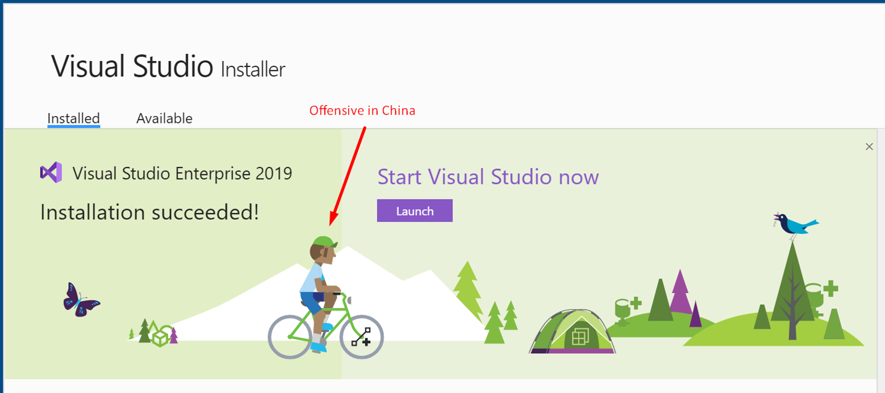

我在前一篇文章里分享了Global Ready的app时会遇到的不同文化对于数字方面的挑战。这篇我继续分享不同文化对于计量单位和禁忌方面的挑战。

我们先来看一个例子，假如有一个teams bot，它告诉你一些动物的速度，比如它告诉你：
> 猎豹能以每小时63英里的速度奔跑

当你看到这个“每小时63英里”是不是觉得还是不知道这个有多快？

再来一个例子，如果一个teams app发消息告诉你：
> 明天室外温度是38度

如果是夏天，你能理解这个温度很热，出门需要穿的尽量凉快点。但是如果现在是冬天呢？有些同学会立刻反应过来，这个的温度是华氏温度，而不是我们熟悉的摄氏温度。不过，即使告诉你是华氏38度，你能立刻反应过来这个华氏38度很冷，还是一般冷，出门是要穿羽绒服，还是薄外套？

看到这里，各位同学明白了吗？一款好的Global Ready的app，不是把文字翻译到位，翻译精确就可以了。需要针对用户所在的国家区域的文化，进行一些调整。比如我们熟悉的是公里，那不能直接把`63 miles/hour`翻译成`每小时63英里`，而应该转换成`每小时100公里`，把`华氏38度`转换成`摄氏3度`。

除了距离，温度，还有体积，重量等不同：
> 长度: 1 kilometer = 0.6 miles

> 体积: 1 liter =33.8 ounces

> 重量: 1 kilogram = 2.2 pounds

除了计量单位，我们再来看一个更加难的文化问题：

下面这张图是VS2019的一个预览版RC版本的一个issue，当时我们mvp社区的一个大牛，看到了这个画面，就提了一个issue，因为这个是visual studio，用户是广大程序员，图中的这个程序员带了一顶绿绿的帽子，我相信大家看到这里就在笑了，因为大家基本都知道绿帽子是什么意思，但是远在美国的VS产品设计团队可能不知道。

好在微软visual studio产品团队立刻就采纳了这个建议，后一个RC版本就做了修正。所以我们在做本地化的时候需要处处用心

这就是文化差异，不同国家和地区，在做本地化的时候不是简单的翻译，而是应该按照当地的文化，进行处理。我们要有微软CEO Satya Nadella提倡的Growth mindset，对于用户提出的反馈需要保持开放的心态，积极的响应和处理。这样你的teams app才能在一轮轮迭代中，不断改进，越来越符合全球不同用户的文化需求。

> 如果大家对Teams app开发感兴趣，强烈推荐中国微软的牛人Ares陈老师最近出了一套的Teams开发系列视频讲座：[Microsoft Teams开发入门和实践 https://aka.ms/teamsdev163study](https://aka.ms/teamsdev163study) ，从入门到精通Teams开发，对于准备从事或者正在从事Teams app开发的同学来说，必看！
