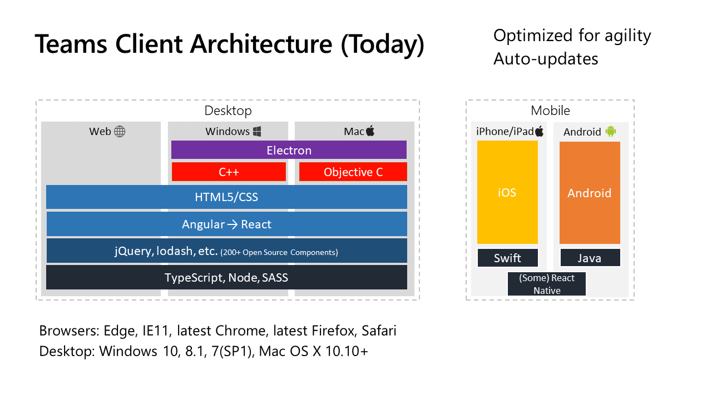
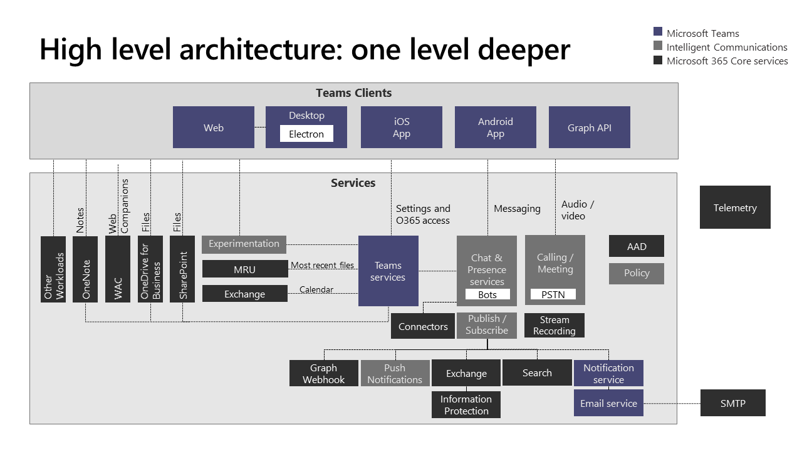
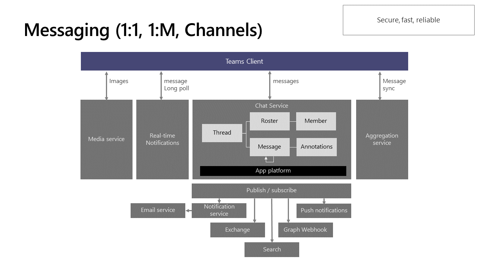
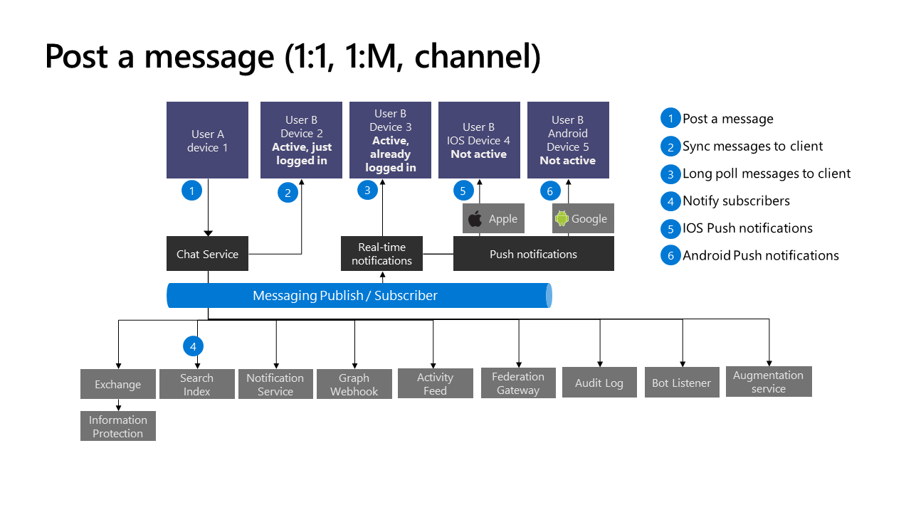
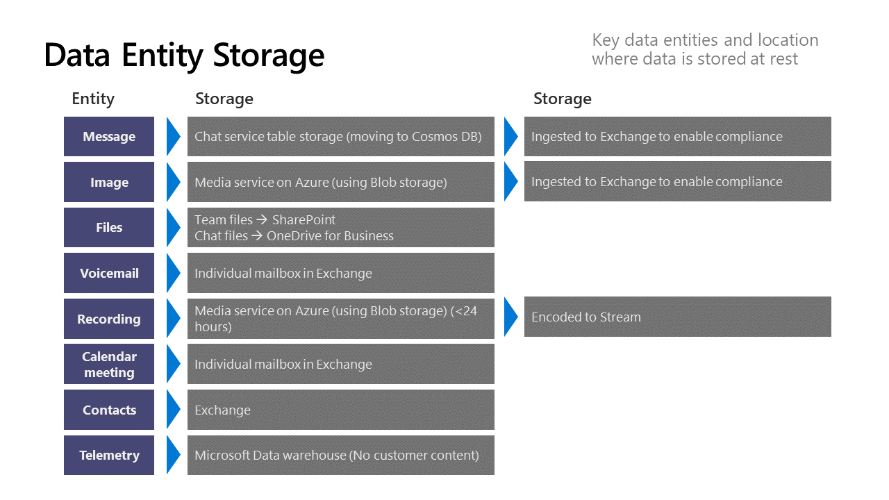

在上个月刚刚结束的Ignite大会上，Teams产品的架构师[Bill Bliss](https://myignite.techcommunity.microsoft.com/speaker/590160?source=sessiondetail&sessionId=83471)给大家奉上了最新的Teams的架构设计，之前2017年和2018年微软的技术大会上都Teams架构的分享，但是今年大神把Teams架构讲得很深入，覆盖面很广。我这里就挑一些，根据我的理解和各位分享一下。

先来看一下Teams客户端的架构。

* 三大桌面端：Web，Windows，Mac。技术栈基本统一
* 使用TypeScript，大牛Anders Hejlsberg的力作啊，此语言也是我的最爱，在web开发上快要一统江湖了
* 目前正在从Angular慢慢的转成React，原因也很简单，一旦全部转成React，就可以和手机客户端的React Native重用大量代码，进一步降低研发成本。
* Windows和Mac桌面端使用Electron作为外壳，提供原生系统的调用能力。并且使用C++和ObjectiveC来处理音频视频编码和桌面共享等功能。
* 手机平台使用原生语言Swift和Java开发的，期待明年可以看到Kotlin的身影

再来看一下云端的架构设计：

* 首先客户端是和服务器端的不同service直接打交道。这点Bill Bliss也在视频里特别提到了，这点和一般大家想象中的不太一样，一般的架构是有一个api gateway来聚集后台的api。我觉得teams这么做可能希望负责不同feature的每个研发团队可以尽量独立，完成端到端的开发。
* 云端的服务拆分的比较合理，以Teams Services作为核心
* Publish/Subscribe是和底层服务和第三方服务松耦合的一种做法，对于一个大型平台来说，pub/sub设计用的非常多

下面两张图很好的介绍了消息系统，对于想做消息平台的同学来说，非常值得学习。特别是后面一张，非常精炼的说明了消息同步的高层设计。可以看到前面说的pub/sub架构在这里的运用

* 这里使用了long poll这种方式，是我没有想到的，虽然我觉得long poll能适用各种复杂的网络情况，但是不太高效，我觉得以后应该会引入类似SignalR等机制作为补充。

下面这页说明了Teams中的附件，消息等数据是如何存储在Office365和Azure上的。左边一列storage是第一层存储，后边是第二层长期的存储。

* 可以看到对于数据的合规性，很多是交由Exchange来处理的，毕竟Exchange老大哥混了这么多年，已经积累的大量的compliance规则。
* Teams真的是Office365服务的集大成者，Teams底层实际上还是大量的依赖于其他服务，比如：SharePoint, Exchange, OneDrive for Business, Stream等等

Bill Bliss的整个分享视频，可以在这里观看: [https://myignite.techcommunity.microsoft.com/sessions/83471?source=sessions](https://myignite.techcommunity.microsoft.com/sessions/83471?source=sessions)。PPT下载在[这里](../images/post20191224/BRK3215.pptx)

另外，中国微软的牛人Ares陈老师最近出了一套的Teams开发系列视频讲座：[Microsoft Teams开发入门和实践 https://aka.ms/teamsdev163study](https://aka.ms/teamsdev163study) ，从入门到精通Teams开发，对于准备从事或者正在从事Teams app开发的同学来说，绝对值得观看！
