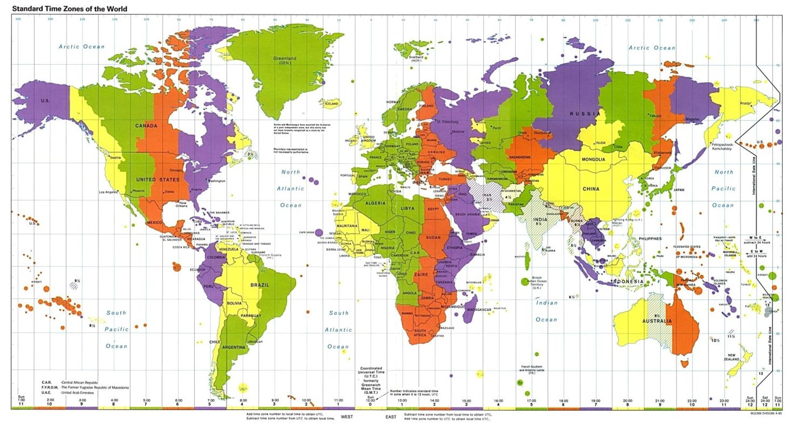
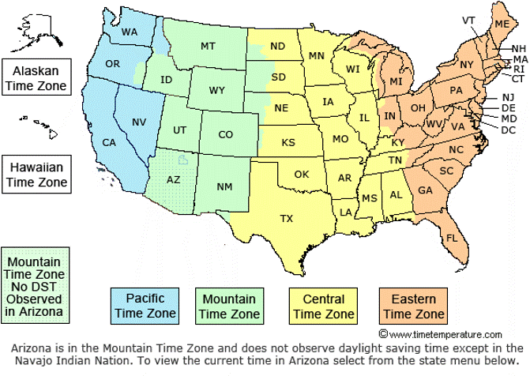
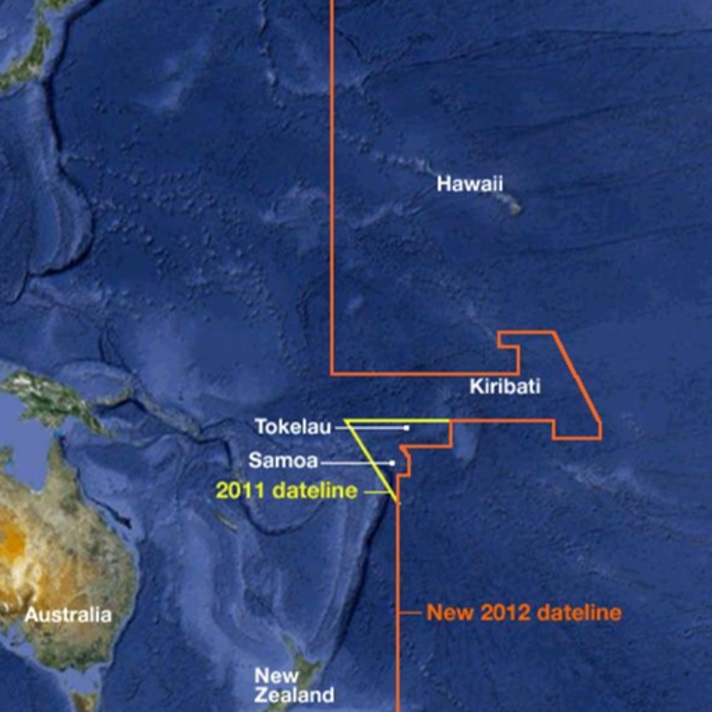

我在前两篇文章里分享了Global Ready的app时会遇到的不同文化的挑战。这篇我继续分享在时区方面的挑战。

时间是最复杂的，最容易出错的部分。时间复杂的最根本原因是时区问题。

首先，大家都知道，我们地球是圆的，这个意味着如果大家都想要中午12点是白天，是有太阳的时候，那就要分时区，我们国家比较简单，大家都生活在一个时区，北京时间。但是有很多其他国家，他们有多个时区，这意味着你可以说我们在中国时间早上8点打个通过话，但是你不能说我们在美国时间8点打个电话，因为美国有很多时区。你会经常听到什么东部时间，西部时间等等。

我们就拿美国为例，来具体感受一下时区，这张图表明了美国的时区，美国主要大陆上有4个时区，单单阿拉斯加是一个时区，夏威夷是一个单独的时区。

特别需要注意的一点是，即使在美国的一个小州里，也会有不同时区，所以，时区的划分你无法简单的用经纬度，或者州县这类来划分。需要查表。

一般大家都会认为，时区就是从-12到+12，一个小时一个时区，但是真实情况比这个复杂很多。很多时区，不一定是整数的一个个小时，比如印度的时区是5个半小时，伊朗是三个半小时。

还有更加夸张的：泥泊尔Nepal时区是是5小时45分钟，所以如果大家把时区设计成一个整数类型，在数据库里使用了整型来表示时区的小时数。那赶快修改设计，升级系统吧。

我们再来看一个更加夸张的时区问题。世界上有两个国家Samoa和Tokelau（Samoa就是最新一部速度与激情里面Hobbs的家乡，很原始很漂亮）。

Samoa和Tokelau这两个国家没有2011年的12月30日这一天，为什么?!?! 怎么会这样？

原因就是这两个国家在这个时间点改了时区，本来他们是跟着美国的时区，但是后来发现他们经常和澳大利亚，新西兰有生意往来，大家在商务沟通上经常有误解，比如说我们1月20日货船把货运到，因为时差将近20多小时，会正好相差一天，很容易搞错，所以这两个国家决定跟着澳洲时区，所以在切换的那一天里，就少了一天。所以你看到时区分界线很奇怪。

而且他们的时区从原来的UTC-11变成了UTC+13，注意，是+13，所以不要以为时区的范围是-12到+12，现实情况是会超过这个范围，而且当夏令时到来时，他们是UTC+14。

这种时区的变化，谁也不能保证以后类似的事情不会再次发生。所以大家可以想想看你的软件系统是否准备好了，是否有能力处理这种情况。

> 如果大家对Teams app开发感兴趣，强烈推荐中国微软的牛人Ares陈老师最近出了一套的Teams开发系列视频讲座：[Microsoft Teams开发入门和实践 https://aka.ms/teamsdev163study](https://aka.ms/teamsdev163study) ，从入门到精通Teams开发，对于准备从事或者正在从事Teams app开发的同学来说，必看！
