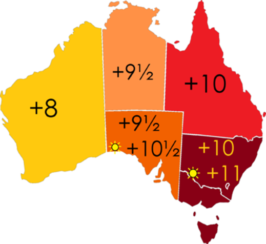

我在前两篇文章里分享了Global Ready的teams app时会遇到的不同挑战。这篇我继续分享在夏令时方面的挑战。

夏令时，主要是为了节约能源，英文里通常缩写成DST(Daylight Saving Time)。一般在天亮早的夏季人为将时间调快一小时，可以使人早起早睡，减少照明量，以充分利用光照资源，从而节约照明用电。各个采纳夏时制的国家具体规定不同。目前全世界有近110个国家每年要实行夏令时。

当然夏令时也有一些弊端：
* 对低纬度地区，夏令时作用不大。尤其这些地方在夏天十分湿热，夜晚降临时闷热无法入眠，而清晨正是睡眠的好时间。
* 当夏令时开始和结束时，人们必须将所有计时仪器调快或调慢；当夏令时结束时，某些时间会在当天出现两次，这些都容易构成混乱。并且影响航班的时间。
* 夏令时违背了设定时区的原意──尽量使中午贴近太阳上中天的时间。

我们以下图为例，这个是澳大利亚的时间，一般情况下，分为三个时区，分别是加8，加9小时半，加10小时，但是在夏令时，下面几个州会将时间调整为加10个半小时，和加11个小时。所以整个澳大利亚变成了有5个不同时间。



哪些国家，哪些区域有夏令时？这些没有什么规则，因为这个完全是有不同的国家，州自行规定的。我们teams app里是需要去查表的，和时区划分一样，没有什么简单的规则。

我们国家之前也有过夏令时，在1986年至1991年，具体开始和结束日期分别是：
* 1986年5月4日至9月14日
* 1987年4月12日至9月13日
* 1988年4月10日至9月11日
* 1989年4月16日至9月17日
* 1990年4月15日至9月16日
* 1991年4月14日至9月15日

大家可以看到每年的开始和结束时间都不同。所以我们在开发teams app的时候不要自己尝试的去判断夏令时，建议使用成熟的library，不要重复造轮子，目前任何一门热门的编程语言，都有很成熟的用于时间日期的库或者SDK。我们学习如何使用就好。

另外需要和大家说一点，teams里目前发送给我们app的内容里，没有包含夏令时信息，如下：

``` json
{
    "name": "composeExtension/fetchTask",
    "type": "invoke",
    "timestamp": "2019-06-17T14:32:04.956Z",
    "localTimestamp": "2019-06-18T00:32:04.956+10:00",
    "id": "f:1361493733941541435",
    "channelId": "msteams",
    "serviceUrl": "https://smba.trafficmanager.net/apac/",
    "locale": "en-US",
    ...
}
```

timestamp和localTimestamp两个字段，通过这两个字段，我们可以获取用户当前的UTC时间和用户所在地的本地时间。比如上面这个json表明了，用户在这个本地时间是在加10的时区。但是，并没有告诉我们app用户所在的时区和是否正在经历夏令时，这个+10，可能是在+10时区，也可能是+9时区，但是正在经历夏令时，所以+10小时。

> 如果大家对Teams app开发感兴趣，强烈推荐中国微软的牛人Ares陈老师最近出了一套的Teams开发系列视频讲座：[Microsoft Teams开发入门和实践 https://aka.ms/teamsdev163study](https://aka.ms/teamsdev163study) ，从入门到精通Teams开发，对于准备从事或者正在从事Teams app开发的同学来说，必看！

