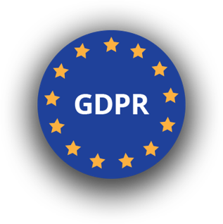
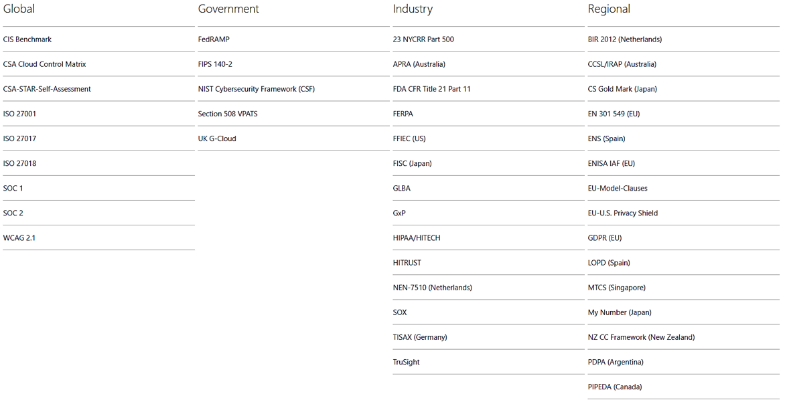

我在前两篇文章里分享了Global Ready的app时会遇到的不同挑战。这篇我继续分享在合规性方面的挑战。

说到合规性compliance，不得不说GDPR标准，当我们发布了一个teams app后，微软会要求开发人员做一个security self assessment，这个assessment大约有100个问题，其中有10多个问题都是针对GDPR的。

实际上，说白了GDPR的要求也不复杂，但是实现起来肯定让各位程序猿/程序媛多掉头发。

它的要求是：
* Right to be informed
* Right to restrict processing
* Right to rectification
* Right of access
* Right to data portability
* Right to object 
* Rights in relation to automated decision making and profiling
* Right to erasure/to be forgotten

你软件系统使用的任何用户数据，需要告知用户你是怎么用的，你不能把数据在用户不知情的情况下给第三方。当用户想要查看他的数据，你系统要提供，当用户需要导出他自己的数据，你需要能导出，当用户需要删除他自己的数据，你需要能彻底删除，包括你的所有历史数据和备份数据。这点实际上很要命，如果你把一些备份数据放在一些硬盘上，然后把硬盘放在仓库里。删个数据就是要命的事情了。但是如果你希望你的软件能进入欧洲市场，GDPR是必须跨过的门槛

让我们来看一下我们强大的Office365符合了哪些compliance:

[https://www.microsoft.com/en-us/TrustCenter/Compliance/complianceofferings](https://www.microsoft.com/en-us/TrustCenter/Compliance/complianceofferings)

可以看到，不愧为拥有10几亿用户群的Office365，不单是满足全球各类严格的标准，各类地区的标准也都满足。我们要知道，完成一个功能的工作量，和这个功能能满足这些compliance的是有巨大的差别。

听我讲了这么就，他们觉得做一款全球性的app是非常有挑战的。我再给大家一个挑战：有些规定是有相互矛盾的地方的。
比如刚才讲的GDPR，和澳大利亚的2018通过的这个Assistance and Access Act，就是矛盾的。

[https://iapp.org/news/a/australias-anti-encryption-collision-with-gdpr-sub-processing/](https://iapp.org/news/a/australias-anti-encryption-collision-with-gdpr-sub-processing/)

GDPR要求数据加密，并且不能提供给任何第三方。但是澳洲的这项法规要求软件需要留有后门，当政府要求的时候，公司需要向政府提供解密后的数据。

所以，你的软件系统如何做？满足哪一个？这个时候你必须要对于不同的地区有不同的数据安全策略。

有这么几点最佳实践分享给大家：
* 只获取你所需要的数据，获取你真正需要的数据
* 处理完数据后，只保存你需要的数据，保存的越多，你的责任就越大
* 及时删除你不需要的数据，比如一些运行日志数据，一般一个月后就没有太多意义了。
* 尽量让用户自己可以控制自己的数据，如果用户希望删除自己的数据，就应该让他们删除。
* 把你如何使用用户的数据，保存了哪些数据，都列在你的使用条款里，这样可以避免很多法律责任
* 数据尽量存储在用户的本国，很多国家对数据离境有很多额外的条款要求

> 如果大家对Teams app开发感兴趣，强烈推荐中国微软的牛人Ares陈老师最近出了一套的Teams开发系列视频讲座：[Microsoft Teams开发入门和实践 https://aka.ms/teamsdev163study](https://aka.ms/teamsdev163study) ，从入门到精通Teams开发，对于准备从事或者正在从事Teams app开发的同学来说，必看！
