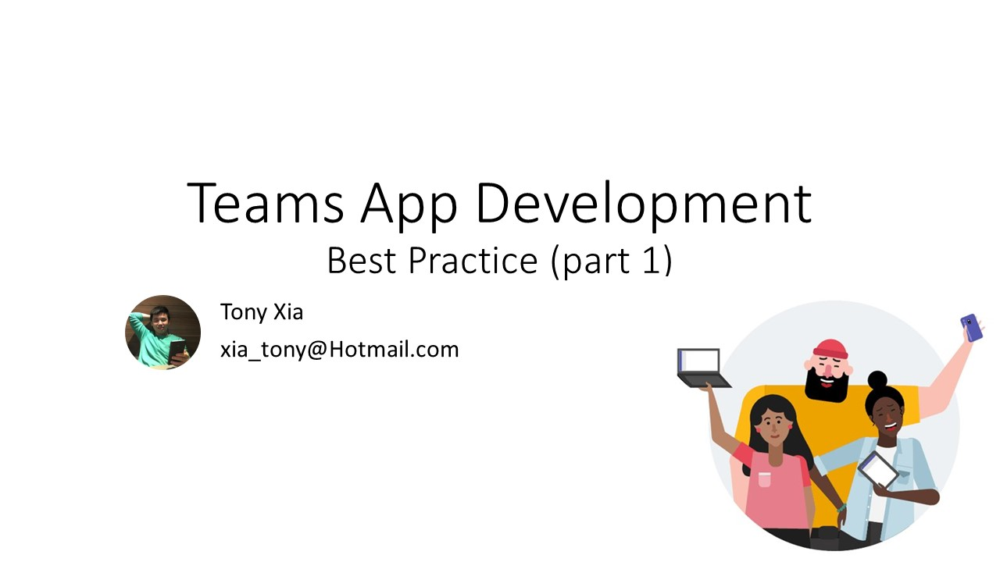

我在2020年2月Teams Community Call(China)上分享了我自己总结的Teams app的一些最佳实践

会议视频： 00:43:10 - 01:04:15

[Download Full Video](https://greatchinaoffice365-my.sharepoint.com/:v:/g/personal/tony_greatchinaoffice365_onmicrosoft_com/EXttcvT5eSpBlwlE7qfwGCIBeRkWWVLpjv350j7kF5XSDg?e=J1FdnV)
My Talk Session: 00:43:10 - 01:04:15

