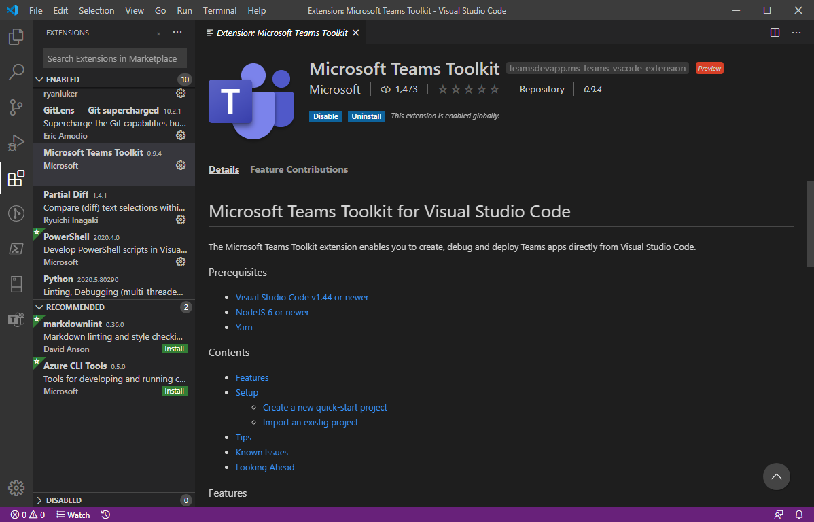
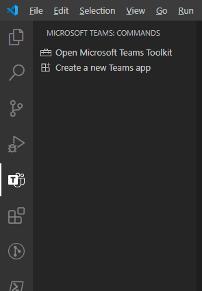
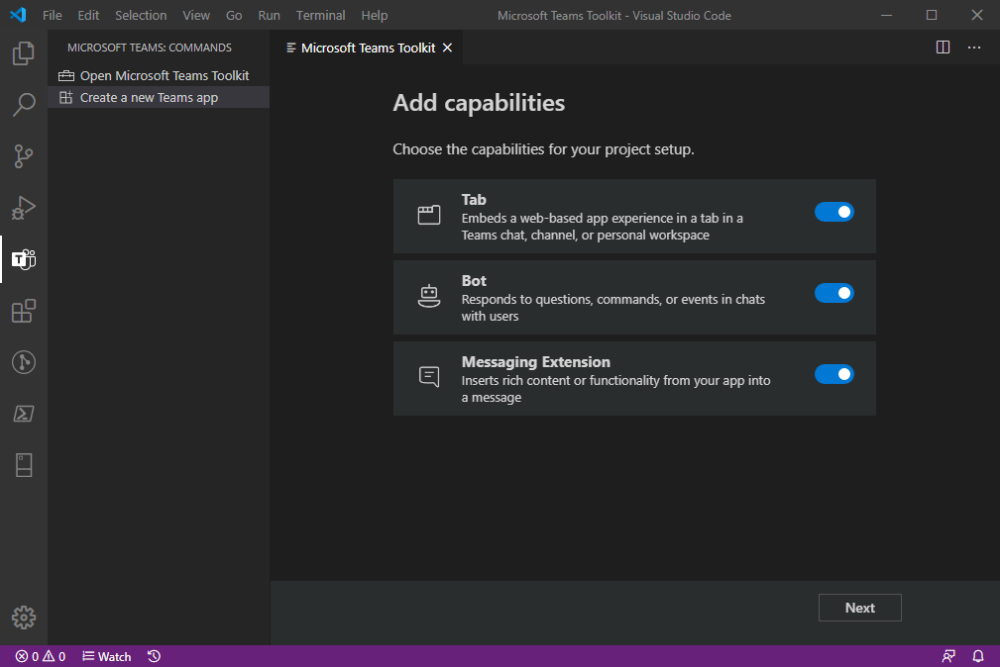
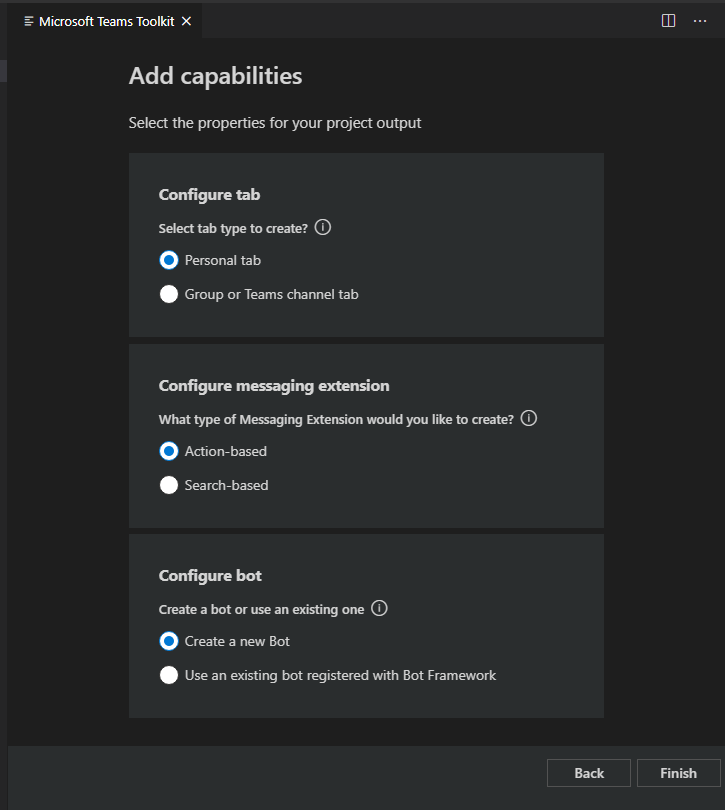
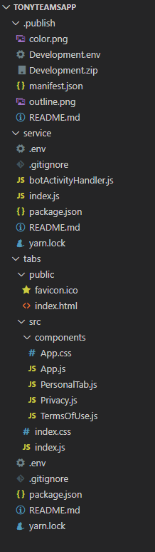
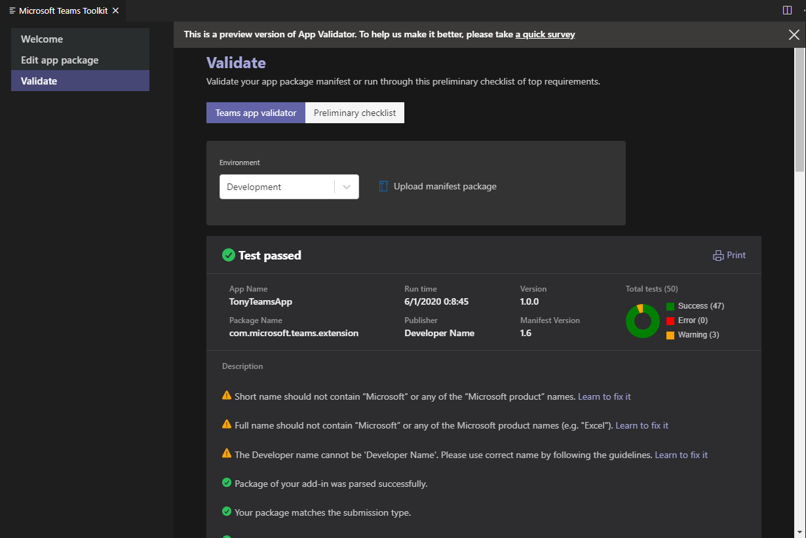

随着今年在线的Build大会的结束，又是一大波的 Teams 新功能，新工具，新SDK。我接下来几篇博客就会详细和大家一一介绍。我今天先从VSCode的插件开始。

打开VS Code，搜索Teams，就可以找到Microsoft Teams Toolkit插件，在我写这篇文章的时候，这个插件只是Preview版本，从版本号 0.9.4来看，最终版本应该很快就会来到。:)

安装之后，在 VSCode 的左边工具栏里就会多一个Teams图标，点击后可以看到一个简单的两项菜单："Open Microsoft Teams Toolkit" 和 "Create a new Teams app"。

让我们先来创建一个Teams app看看，点击 "Create a new Teams app"，输入你想要的app名字，然后选择一个目录来生成代码。然后就会到这个界面，让你来选择app的能力：Tab，Bot，Message Extension。我这里都选上了这些选项。然后点击 "Next"。

根据上一步选择的不同选项，下面这个界面可能不同，这个界面是进一步选择你的app的不同能力。对于Tab，可以选择 "Personal tab" 或者 "Group or Teams channel tab"。如果之前选择了 "Message Extension"，这里就可以进一步选择是 Action-based 或者 Search-based。对于Bot，你可以创建一个新的bot或者使用一个现有的bot。

我们点击"Finish"后，插件就将代码生成好了，如下图，一共有两个目录，".publish"，"service"和"tabs"

.publish 目录里是Teams App发布是需要的文件，大家最熟悉的应该就是manifest.json。当前manifest版本已经到了1.6，赞！

service 目录就是我们的bot app service，目前是nodejs，使用了botbuilder package。

tabs 目录里是react webapp，用来在tab里展现的web页面。

总体来说，整个插件非常棒！我觉得可以改进的一点是可以让用户选择需要开发语言，比如可以选择是nodejs express或者c# asp.net core，是react或者blazor。

另外，推荐大家有一个很有用的功能，点击"Validate"，你可以看到manifest检测的结果，这个可以帮助大家在提交teams app的时候大大增加通过的几率！

