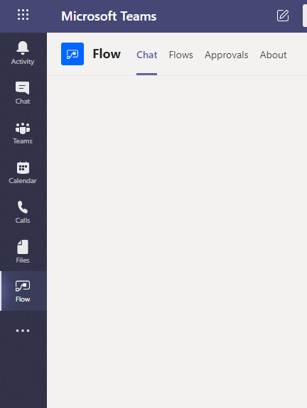
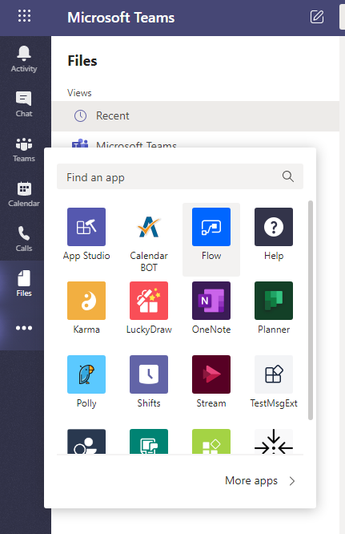
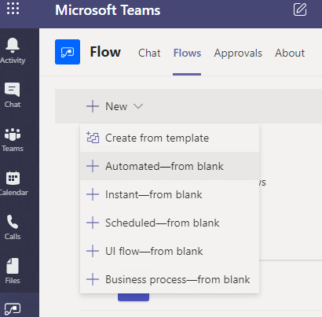
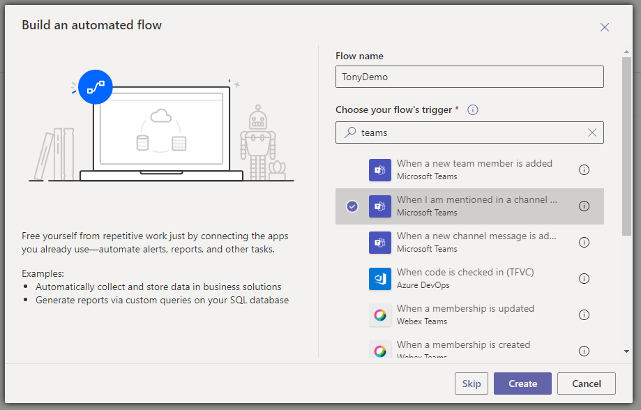
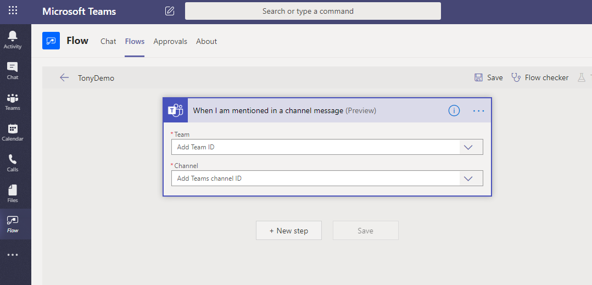
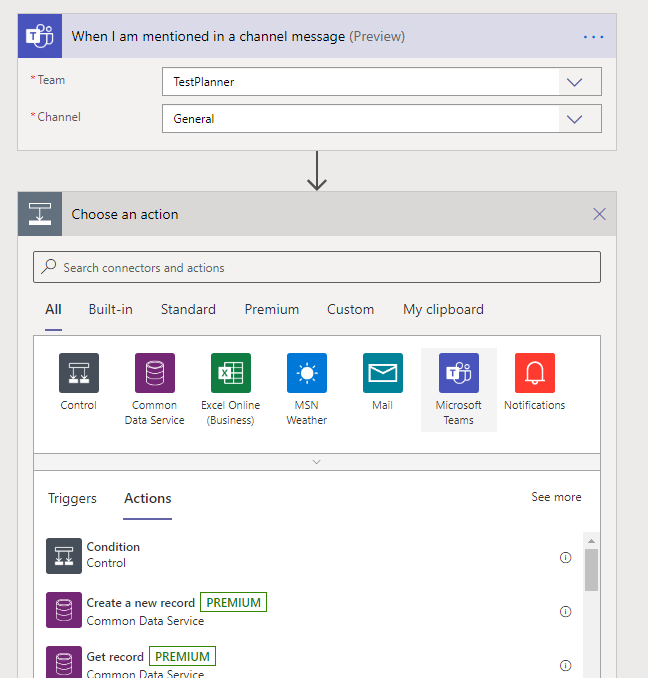
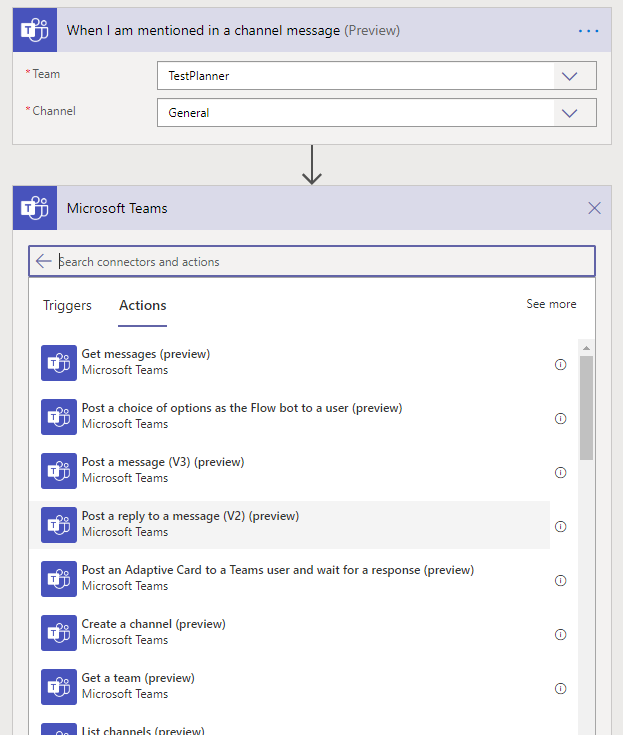
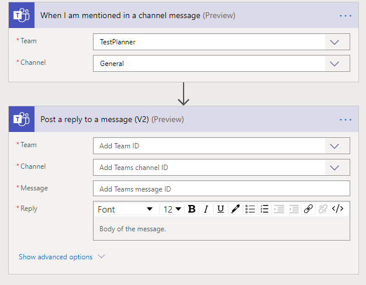
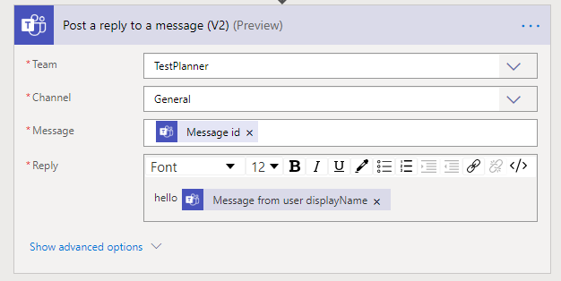
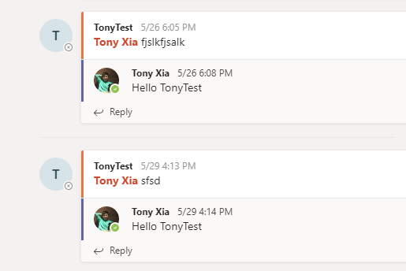

继续我的上一篇博客，这篇继续介绍BUILD大会里的内容：Flow。

Flow是微软power平台的一个服务，通过简单的拖拽就可以完成一个业务逻辑的处理，现在Flow和Teams的结合十分紧密。我们来试一下。

先点击Teams左边的Flow菜单。

如果你的Teams左边菜单里没有Flow按钮，那可以点击“...”，从弹出的菜单里可以找到Flow。如果还没有，那你需要联系你Office365管理员，有些公司会禁用某些app。

打开Flow之后，选择 Flows 菜单，点击 +New 按钮，在下拉菜单里选择 "Automated -- from blank"

在弹出的对话框里，我们先输入一个Flow名字，这个名字如果觉得不好，以后可以再修改。

下面列出了所有可以使用的触发器，一个Flow的运行是靠触发器来触发的，可以看到目前已经有了三个关于Teams的触发器，我们选择 "When I am mentioned in a channel"，意思就是当有人在Teams里的频道中 @ 了我，这个Flow就会被触发。点击 Create 按钮

下图是一个标准的Flow编辑器，我们选一个Team，然后再选择一个Channel，就是说如果在这个channel频道里如果有人 @ 我，那这个flow就开始执行。

当flow开始执行了，我们做什么呢？flow内建了很多很多的动作，还支持循环和 if 判断，所以flow可以完成十分复杂的业务逻辑，那我们这个demo里为了简单起见，就先选择 Microsoft Teams。

选择后就列出了teams相关的所有action，大家可以仔细看一遍，有很多有用的action，我这里为了简单起见，就选择了 Post a reply to a message (V2) (preview)，就是回复 @ 我的用户一条消息。

下面就是这个action的一些参数。

我们可以按照下图的方式填写参数，这些参数的意思是，在上面同样这个channel里，回复用户 @ 我的那条消息，消息的文字内容是 “Hello” 加上那个用户的名字。

好了以后，保存。然后用另一个账号，来到我们之前设置的channel频道中，@ 我自己，我这里是使用"Tony Xia"这个账号创建的Flow，现在我用TonyTest这个账号来 @Tony Xia，等上几分钟后，就可以看到我自己的回复了。（我觉得这个几分钟有点久，希望以后的版本会更快更及时一些）

是不是非常的简单？我这个例子里用的是最简单的逻辑，通过使用Flow，我们可以很方便的创建非常复杂的业务逻辑，最重要的是不需要写代码就可以完成，而且在Teams里就可以一气呵成！
