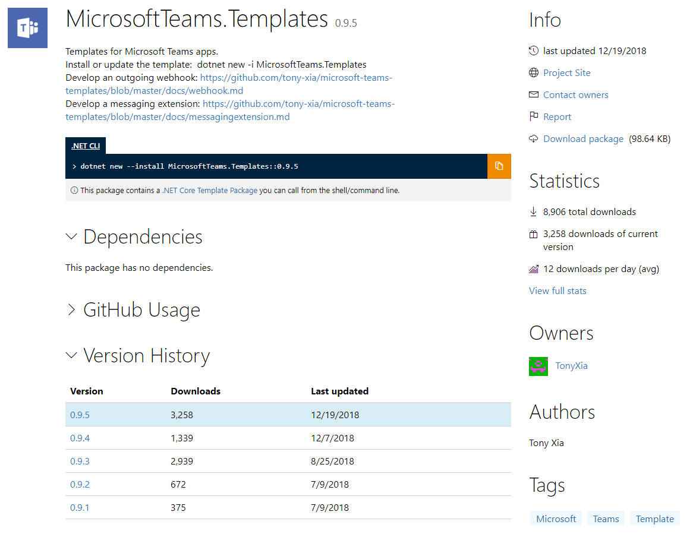

为了方便开发者开发Teams应用，我在2018年做了dotnet c#的一套模板，这套模块一共有三种类型，一个是Teams OutgoingWebhook，一个是MessagingExtension，还有一个就是Tab。



今天特地去nuget上看了一下，下载量还很不错，达到了将近9k的下载。看起来的确帮到了不少Teams的开发人员。 :)

当年做的时候的版本是对应dotnet core 2.1，去年年底dotnet团队又出了继2.1 LTS后的新一个LTS：3.1，经过半年的稳定，修补和改进，目前是5月19日发布的3.1.4版本。所以我上两周把我的Teams模板也升级到了3.1。

我这里讲一下我升级的主要内容：如果你的项目原来是用我的Teams Template生成，目前也想升级到.net 3.1，那希望这些信息对你有帮助：

### csproj文件
* 将`TargetFramework`改成`netcoreapp3.1`
* 将`Microsoft.Bot.Builder`包升级到`4.9.3`

### Program.cs文件
* 改用标准的 3.1 模板的写法
* 另外如果大家用过SonarQube的话，可能知道之前的写法会有code smells，我做了一些改进，把Program声明成static class，并且去掉了Main函数的参数

```cs
    public static class Program
    {
        public static void Main()
        {
            CreateHostBuilder(null).Build().Run();
        }

        public static IHostBuilder CreateHostBuilder(string[] args) =>
            Host.CreateDefaultBuilder(args)
                .ConfigureWebHostDefaults(webBuilder =>
                {
                    webBuilder.UseStartup<Startup>();
                });
    }
```

### Startup.cs文件
* 改用3.1的mvc写法：`AddControllers()`, `UseRouting()`和`UseEndpoints()`
* 把`IHostingEnvironment`改成了`IWebHostEnvironment`

希望这次的升级能够给更多的Teams开发人员带来方便，更希望能吸引/帮忙更多的开发人员参与到Teams开发中来。

[MicrosoftTeams.Templates nuget](https://www.nuget.org/packages/MicrosoftTeams.Templates/)

[MicrosoftTeams.Templates源代码](https://github.com/tony-xia/microsoft-teams-templates)
