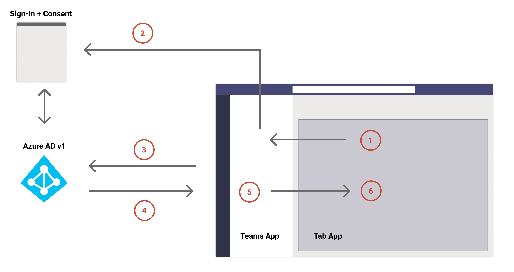
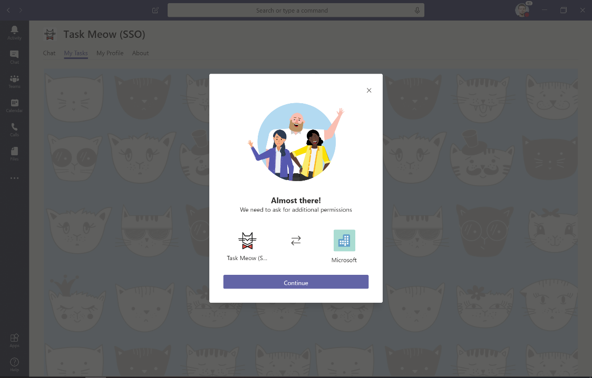

在我写这篇文章的时候，这个SSO机制还是在 Developer Preview 阶段，可能在发布前还会有一些改进。不过我觉得这个功能很好，所以先和大家分享一下。

如果大家之前已经开发过Teams的tab应用，可能会发现如果你需要一个当前用户的token十分繁琐，这个SSO的设计就是用来解决这个问题的，目前只支持工作组织账号（暂不支持Microsoft Account）。

我们先来看一下处理的流程：



1. 在你的tab前端代码里，调用`getAuthToken()`方法，这个方法会告知Teams客户端，你的tab app想要一个token。
2. 如果这个是当前用户第一次，并且你的app需要用户审核，那teams客户端就会弹出一个审核的窗口。类似于下图



3. Teams客户端会向Azure AD发送申请用户token的请求。
4. 如果一切顺利，AzureAD就会把token返回给Teams客户端
5. Teams客户端把token返回给你的tab应用，token作为`getAuthToken()`的返回对象。要注意，这是一个异步的调用
6. 你的tab app拿到token后就可以对token进行解析获取用户的一些身份信息，下面是一个tab app的解析的代码：[https://github.com/ydogandjiev/taskmeow](https://github.com/ydogandjiev/taskmeow)

```javascript
  parseTokenToUser(token) {
    // parse JWT token to object
    var base64Url = token.split(".")[1];
    var base64 = base64Url.replace(/-/g, "+").replace(/_/g, "/");
    var parsedToken = JSON.parse(window.atob(base64));
    var nameParts = parsedToken.name.split(" ");
    return {
      family_name: nameParts.length > 1 ? nameParts[1] : "n/a",
      given_name: nameParts.length > 0 ? nameParts[0] : "n/a",
      upn: parsedToken.preferred_username,
      name: parsedToken.name
    };
  }
```

由于整个配置步骤较多，大家可以参考 [官方文档](https://docs.microsoft.com/en-us/microsoftteams/platform/tabs/how-to/authentication/auth-aad-sso) 一步步来做，并且可以参考这个 [开源项目](https://github.com/ydogandjiev/taskmeow) 的代码，十分有用。

需要注意的是：目前这种方式获取到的token只是用户等级权限的token，并不能用来调用Graph API，如果需要用来调用Graph API的token，需要使用 [基于网页的AzureAD授权方式](https://docs.microsoft.com/en-us/microsoftteams/platform/tabs/how-to/authentication/auth-tab-aad#navigate-to-the-authorization-page-from-your-popup-page)。如果你的认证中心不是AzureAD，那就要使用 [网页授权方式](https://docs.microsoft.com/en-us/microsoftteams/platform/concepts/authentication/authentication)
