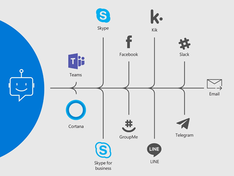

很多朋友问我如何开发一个成功的Teams Bot，他们说Bot Framework SDK看起来简单，但是真要的去开发一款成熟的bot，很多地方还是不知道如何使用。我从最早的bot framework还在beta的时候开始用，后来framework经历了多次大的改动，目前版本是v4，我想通过一系列的文章来系统的介绍如何使用bot framework来开发一个功能齐全的teams bot。

这篇文章我先给大家一个总体的介绍，让大家理解Teams，Azure Bot Service，Bot Framework，和我们自己的bot代码是什么关系。

在过去的一二十年的互联网和移动互联网的发展，产生了很多的聊天工具，skype，teams，slack等等，这些聊天工具在聊天方面有一些共同模式。比如一个用户可以参与到多个对话中，每个对话由一系列的消息组成。用户和用户可以一对一聊天，也可以多个用户一起群聊。所以微软看到了一个机会：可以抽象出一个模型，如果基于这个通用的模型进行开发bot，那这个bot就可以同时适用于所有的聊天工具。

Azure Bot Service就是链接各种聊天服务的一个服务，它把在不同平台上抽象出一个统一的模型，并且把这个统一模型传递到后端的开发人员开发的bot服务，当bot服务需要发送一个消息或者事件的时候，把这个信息再传递给不同的聊天服务。

明白了Azure Bot Service后，我们来看一下Bot Framework SDK，刚才我们说了Azure Bot Service把各种聊天服务的统一模型传递到大家开发的bot服务，虽然我们可以完全自己去处理这种统一模型，但是事实证明，这个处理会非常的繁琐，这个时候我们就需要使用Bot Framework SDK。这个SDK把这个统一模型进一步处理，抽象出了turn等概念，并且做了一整套处理bot的framework(adapter, middleware, state等等)。目标是把整个bot服务可以标准化，流程化。我之后的文章将针对整个bot framework进行详细的讲解。

理解了上面这两个概念后，我们来看一下Teams，Teams app实际上包含很多方面，bot只是teams app里面的一种，或者说是一个teams app能提供的众多能力中的一种，当然也是最重要的一种能力。teams app出了这种，还可以是一个tab应用，connector等等。

希望上面的说明能够给大家提供一个teams和azure bot service的大局观。我后继文章会慢慢具体解释所有的细节。我去年自己开发的teams app：LuckyDraw，实际上并没有使用全套的bot framework，只是用了一些activity的模型，在实际开发中完全自己来处里各种复杂的具体细节，比较繁琐，导致后期增加功能的时候维护成本增大。我今年的目标是全面使用bot framework出一版的新LuckyDraw。

最后我想说一下我自己对于Azure Bot Service的看法，虽然Azure Bot service的初衷是统一各类聊天平台，让开发人员可以一次开发，就把bot用于所有平台。这个有点像当年.net的初衷（一套代码，支持各种操作系统），但是.net可是走了多少年才走到这一步。bot service虽然不会像.net这么复杂庞大，但是各个聊天平台的差异性不是这么容易统一的。可以看一下 [这篇文档](https://docs.microsoft.com/en-us/azure/bot-service/bot-service-channels-reference?view=azure-bot-service-4.0)，大家就能知道有多少差异性了，为了把这些差异性尽量统一并同时支持平台特有的一些功能，实际上bot framework已经变得有点臃肿了。

Bot framework路还很长，而且bot的功能发展也很快，希望它能一步步走踏实。
