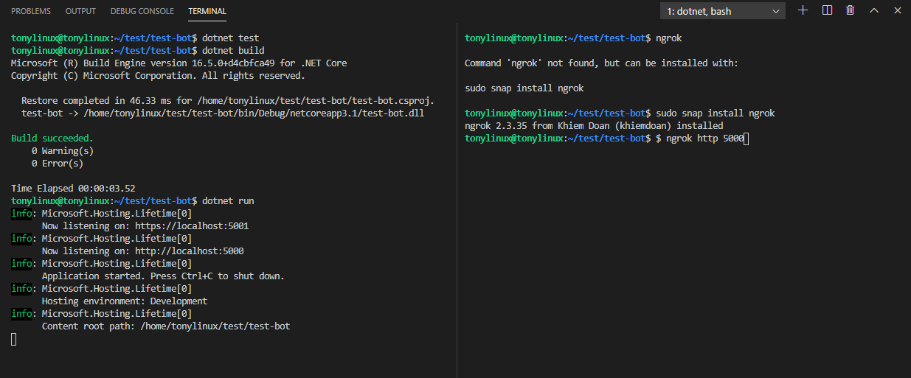
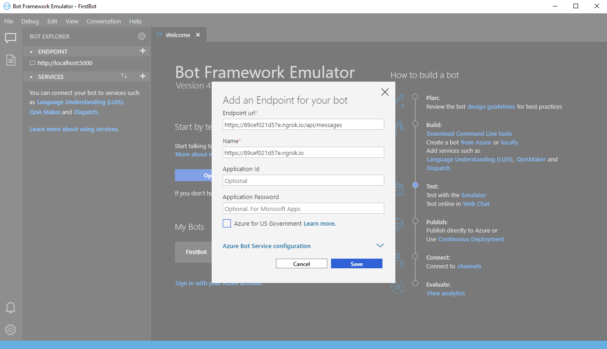
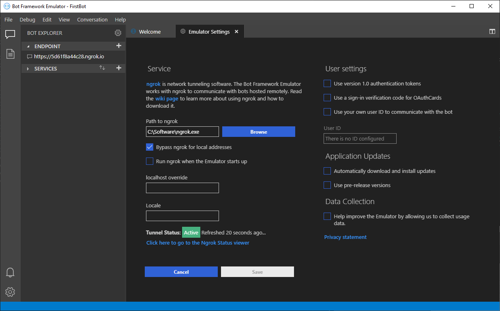
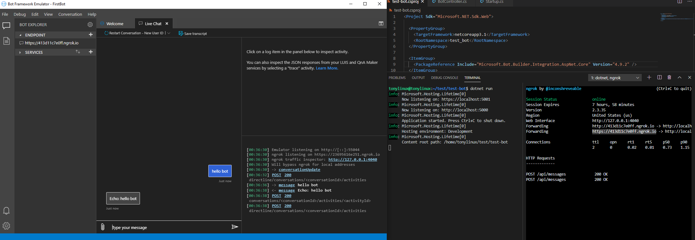

我使用VS Code开发已经有蛮长一段时间了，时间长了，越来越喜欢VS Code，虽然有些时候会没有传统的VS方便，比如开发Azure Function时你需要编写一下launch.json，而且你需要手动启动StorageEmulator，但是也正是由于缺少VS的自动配置，需要你自己手动把环境一步步搭建出来，也让自己更加理解一些框架和技术。

最近练习做一个简单的docker image，并且想做一个windows上的image，但是下载一个server core的image让我崩溃了，虽然能够下载，但是那个速度简直疯掉了，等待一个晚上下载完成后，我做了一个image需要upload到ACR，那个叫龟速，而且我稍微一改代码就要重新build，重新docker build，重新docker push。虽然我的layer很小，而且ACR也选择了离我最近的region创建的，但是一次push我都可以完成一杯咖啡了。

后来，我突然想到了VSCode的Remote功能，立刻在云端创建了一台linux虚机，在上面做开发，瞬间感觉到了云时代的优势了，虽然我的虚机配置很低，但整个docker build，push过程比在本地快了起码10倍，而且VScode的remote体验很好，基本感觉不到在remote的感觉。

所以我想在这篇博客里介绍了一下，如何在VSCode Remote环境下开发Teams Bot。如果你还没有remote环境的话，可以参考 [这个](https://code.visualstudio.com/docs/remote/ssh) 来搭建一个remote的开发环境，然后安装最新的 [dotnet SDK](https://docs.microsoft.com/en-us/dotnet/core/install/linux-package-manager-ubuntu-1910)

先ssh到远程，我们先创建一个简单的webapi

```bash
$ mkdir test-bot
$ cd test-bot
$ dotnet new webapi
```

在VSCode里打开这个远程folder。打开`test-bot.csproj`，增加这两个package
```xml
  <ItemGroup>
    <PackageReference Include="Microsoft.Bot.Builder.Integration.AspNet.Core" Version="4.9.2" />
  </ItemGroup>
```

打开Startup.cs文件，简化Configure方法
```cs
        public void Configure(IApplicationBuilder app, IWebHostEnvironment env)
        {
            app.UseRouting();
            app.UseEndpoints(endpoints =>
            {
                endpoints.MapControllers();
            });
        }
```

到controller目录下，创建一个新的BotController.cs
```cs
using System.Threading;
using System.Threading.Tasks;
using Microsoft.AspNetCore.Mvc;
using Microsoft.Bot.Builder;
using Microsoft.Bot.Builder.Integration.AspNet.Core;
using Microsoft.Bot.Schema;

namespace test_bot.Controllers
{
    [Route("api/messages")]
    [ApiController]
    public class BotController : ControllerBase
    {
        private static readonly IBotFrameworkHttpAdapter Adapter = new BotFrameworkHttpAdapter();

        [HttpPost, HttpGet]
        public async Task PostAsync()
        {
            await Adapter.ProcessAsync(Request, Response, new EchoBot());
        }
    }

    public class EchoBot : ActivityHandler
    {
        protected override async Task OnMessageActivityAsync(ITurnContext<IMessageActivity> turnContext, CancellationToken cancellationToken)
        {
            var replyText = $"Echo: {turnContext.Activity.Text}";
            await turnContext.SendActivityAsync(MessageFactory.Text(replyText, replyText), cancellationToken);
        }
    }
}
```

我还需要一个工具ngrok，先在remote运行下面这个命令安装ngrok，然后启动ngrok
```bash
$ sudo snap install ngrok
$ ngrok http 5000
```



在本地启动bot emulator，增加一个bot endpoint，输入上面ngrok产生的一个url



因为我们是用本机的bot emulator连到另一台机器的bot service，所以我们本地的bot emulator需要配置本地ngrok的路径，如下图：



完成后，我们就可以在emulator里打开这个bot，发送文字，然后就可以收到你的remote bot的回复了。 :D


