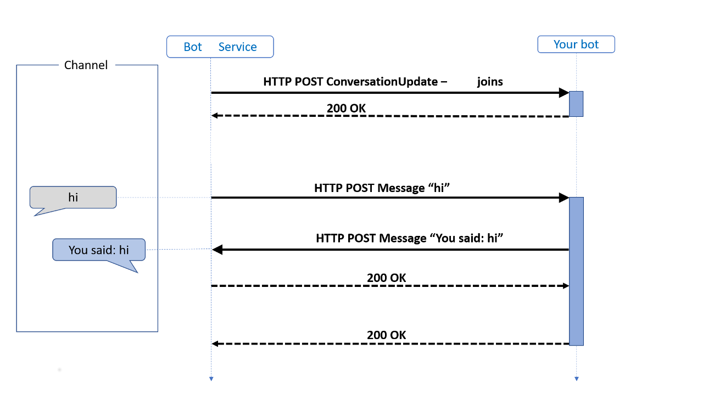

上次我们讲了Teams Bot开发的概述，讲了Azure Bot Service，Bot Framework SDK和我们自己的bot服务的概念，这篇文章就带大家看看Azure Bot Service和我们的bot是如何发生关系的。

我们自己开发的bot服务实际上就是一个api service，需要提供一个支持 POST 请求的endpoint。然后把这个endpoint的url注册到Azure Bot Service，这样当有人和你的bot进行聊天的时候，这个endpoint就会被Azure Bot Service所调用。

我们来看一个简单例子：用户在模拟器里对bot发送一个"hi"消息，然后bot回复一个"You said: hi"消息。整个流程如下：



1. 当用户准备开始和bot进行聊天的时候，azure bot service就会向我们的bot endpoint上 POST 一个关于 conversationUpdate 的HTTP请求，告诉我们的bot，有一个用户准备要和bot聊天了。下面是Bot Emulator，相当于Azure Bot Service传递给我们bot endpoint的http request body

```json
{
  "channelId": "emulator",
  "conversation": {
    "id": "5d2a6fa0-a8c4-11ea-9482-fbaa8563d339|livechat"
  },
  "from": {
    "id": "f2dc881f-5c55-4f44-a50a-0ecdb4717950",
    "name": "User",
    "role": "user"
  },
  "id": "5d354510-a8c4-11ea-9482-fbaa8563d339",
  "localTimestamp": "2020-06-07T23:39:51+10:00",
  "locale": "en-US",
  "membersAdded": [
    {
      "id": "5d2a4890-a8c4-11ea-9762-2d13acd3a3d5",
      "name": "Bot"
    },
    {
      "id": "f2dc881f-5c55-4f44-a50a-0ecdb4717950",
      "name": "User"
    }
  ],
  "membersRemoved": [],
  "recipient": {
    "id": "5d2a4890-a8c4-11ea-9762-2d13acd3a3d5",
    "name": "Bot",
    "role": "bot"
  },
  "serviceUrl": "https://762eb0b511e7.ngrok.io",
  "timestamp": "2020-06-07T13:39:51.905Z",
  "type": "conversationUpdate"
}
```

可以看到channelId说明是用模拟器聊天平台发出来的信息，`from`用户，`type`是`conversationUpdate`，具体内容是有两个新增加的成员(`membersAdded`)，分别是`User`和`Bot`。大家需要注意一个conversation id，这个id是针对这次对话的，这次对话里可以你一句，我一句，每一句的id不同，但是他们的conversation id是一样的。

2. 当用户发送一个 "hi" 文字内容给bot，这时候我们的bot endpoint会收到另一个POST 请求，内容如下：

```json
{
  "channelData": {
    "clientActivityID": "1591537203426cjob1jjckwm",
    "clientTimestamp": "2020-06-07T13:40:03.426Z"
  },
  "channelId": "emulator",
  "conversation": {
    "id": "5d2a6fa0-a8c4-11ea-9482-fbaa8563d339|livechat"
  },
  "entities": [
    {
      "requiresBotState": true,
      "supportsListening": true,
      "supportsTts": true,
      "type": "ClientCapabilities"
    }
  ],
  "from": {
    "id": "f2dc881f-5c55-4f44-a50a-0ecdb4717950",
    "name": "User",
    "role": "user"
  },
  "id": "6414c2c0-a8c4-11ea-9482-fbaa8563d339",
  "localTimestamp": "2020-06-07T23:40:03+10:00",
  "locale": "en-US",
  "recipient": {
    "id": "5d2a4890-a8c4-11ea-9762-2d13acd3a3d5",
    "name": "Bot",
    "role": "bot"
  },
  "serviceUrl": "https://762eb0b511e7.ngrok.io",
  "text": "hi",
  "textFormat": "plain",
  "timestamp": "2020-06-07T13:40:03.436Z",
  "type": "message"
}
```

可以看到这此的`type`是`message`，说明是一条消息，消息文字格式是纯文本`plain`，文字内容`text`是`hi`。

对照我们上面的conversation id，是不是发现这条的conversation id是一样的，说明这条消息和上一条是在同一个对话里进行的。

这里有一个`serviceUrl`，这个是我们Azure bot service模拟器的url，如果你的bot要回复用户一条消息，那这个消息就是发送到这个url上。

3. 我们的bot收到上面这条用户发来的消息后，回复用户一条"You said: hi"的文字消息，bot就组建一个http request，POST 到上面这个service Url上，请求的body也是json格式，内容如下：

```json
{
  "attachments": [],
  "channelId": "emulator",
  "conversation": {
    "id": "5d2a6fa0-a8c4-11ea-9482-fbaa8563d339|livechat"
  },
  "entities": [],
  "from": {
    "id": "5d2a4890-a8c4-11ea-9762-2d13acd3a3d5",
    "name": "Bot",
    "role": "bot"
  },
  "id": "6504a100-a8c4-11ea-9482-fbaa8563d339",
  "inputHint": "acceptingInput",
  "localTimestamp": "2020-06-07T23:40:05+10:00",
  "locale": "en-US",
  "recipient": {
    "id": "f2dc881f-5c55-4f44-a50a-0ecdb4717950",
    "role": "user"
  },
  "replyToId": "6414c2c0-a8c4-11ea-9482-fbaa8563d339",
  "serviceUrl": "https://762eb0b511e7.ngrok.io",
  "speak": "You said: hi",
  "text": "You said: hi",
  "timestamp": "2020-06-07T13:40:05.008Z",
  "type": "message"
}
```

可以看到conversation id没有变化，需要注意的是`replyToId`，它表示bot回复的"You said: hi"，是针对用户前面发的那条"hi"消息的回复。所以这个`replyToId`的值就是前面那个消息的`id`。

大家看了这个流程了对应的json，是不是对bot的运作有一个具体的感觉了？ :D

