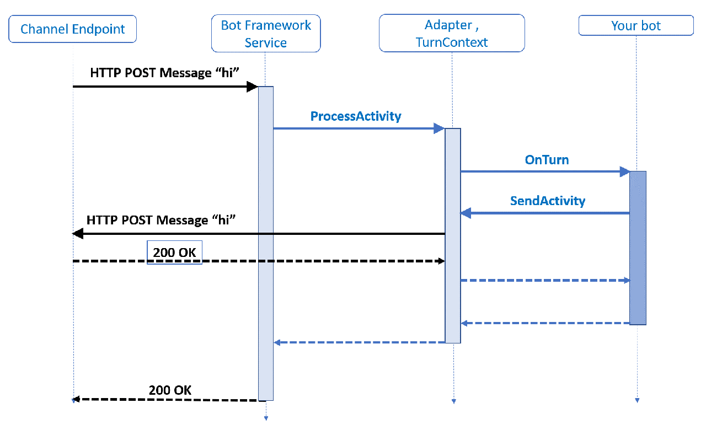

上篇文章介绍了什么是Activity，Turn，TurnContext和BotAdapter，这篇文章我们看看这些东西是如何窜起来的，他们是如何处理用户发给bot的消息的。

我们以一个最简单的bot，echo bot为例子，所谓的echo bot就是用户发什么消息，它就照样回复一条消息。为了简单起见，大家可以先安装VS2019的一个扩展插件[BotBuilderVSIX.vsix template](https://aka.ms/bot-vsix)，然后创建一个NET core 3.1的Echo bot。


可以看到这个模板为什么创建了一个项目，我们先到Startup.cs看一下：

```cs
// Create the Bot Framework Adapter with error handling enabled.
services.AddSingleton<IBotFrameworkHttpAdapter, AdapterWithErrorHandler>();

// Create the bot as a transient. In this case the ASP Controller is expecting an IBot.
services.AddTransient<IBot, EchoBot>();
```

可以看到DI了两个类，值得注意的是，`AdapterWithErrorHandler`使用的是Singleton，而`EchoBot`使用的是Transient，如果大家不同模板来生成的话，这两个千万不能写错，不然会出意想不到的错误，而且非常难查。

打开`AdapterWithErrorHandler.cs`文件，可以看到它从`BotFrameworkHttpAdapter`继承下来。主要是提供了一些针对异常错误的处理

```cs
public class AdapterWithErrorHandler : BotFrameworkHttpAdapter
{
    public AdapterWithErrorHandler(IConfiguration configuration, ILogger<BotFrameworkHttpAdapter> logger)
        : base(configuration, logger)
    {
        OnTurnError = async (turnContext, exception) =>
        {
            ...
        };
    }
}
```

从bot sdk的源代码里，我可以知道 `BotFrameworkHttpAdapter` 一层层往上，最终到达 `BotAdapter`

```cs
public class BotFrameworkHttpAdapter : BotFrameworkHttpAdapterBase, IBotFrameworkHttpAdapter
{
    ...
}

public class BotFrameworkHttpAdapterBase : BotFrameworkAdapter, IStreamingActivityProcessor
{
    ...
}

public class BotFrameworkAdapter : BotAdapter, IAdapterIntegration, IExtendedUserTokenProvider, IConnectorClientBuilder
{
    ...
}

public abstract class BotAdapter
{
    ...
}
```

现在，我们结合下面这张图来理解整个的处理过程。



1. 可以看到，当用户发了一条文字消息 "Hi"，这个消息被发到我们bot服务的时候，我们调用Adapter的`ProcessActivity`方法。我们在`BotController.cs`可以看到这个。

```cs
[Route("api/messages")]
public class BotController : ControllerBase
{
    private readonly IBotFrameworkHttpAdapter Adapter;
    private readonly IBot Bot;

    public BotController(IBotFrameworkHttpAdapter adapter, IBot bot)
    {
        Adapter = adapter;
        Bot = bot;
    }

    [HttpPost, HttpGet]
    public async Task PostAsync()
    {
        await Adapter.ProcessAsync(Request, Response, Bot);
    }
}
```

2. Adapter创建TurnContext后，调用bot上的OnTurn方法，但是生成的Echo bot里并看不到OnTurn方法，我们先看一下`EchoBot.cs`

```cs
public class EchoBot : ActivityHandler
{
    protected override async Task OnMessageActivityAsync(ITurnContext<IMessageActivity> turnContext, CancellationToken cancellationToken)
    {
        var replyText = $"Echo: {turnContext.Activity.Text}";
        await turnContext.SendActivityAsync(MessageFactory.Text(replyText, replyText), cancellationToken);
    }
}
```

可以看到我们的EchoBot从ActivityHandler继承下来，我们查看一下SDK的源代码，可以发现：

```cs
public class ActivityHandler : IBot
{
    public virtual async Task OnTurnAsync(ITurnContext turnContext, CancellationToken cancellationToken = default(CancellationToken))
    {
        switch (turnContext.Activity.Type)
        {
            case ActivityTypes.Message:
                await OnMessageActivityAsync(new DelegatingTurnContext<IMessageActivity>(turnContext), cancellationToken).ConfigureAwait(false);
                break;
            ...
        }
    }

    protected virtual Task OnMessageActivityAsync(ITurnContext<IMessageActivity> turnContext, CancellationToken cancellationToken)
    {
        return Task.CompletedTask;
    }

    ...
}
```

从上面sdk的源代码就可以发现adapter调用了EchoBot的父类`ActivityHandler`的`OnTurnAsync()`方法，后者根据Activity的Type来调用到了`EchoBot`的`OnMessageActivityAsync`。

3. 当我们在EchoBot里调用`SendActivityAsync()`回复一条消息，会由Adapter来调用Azure Bot Service。

大家可以在 [微软botbuilder-dotnet repo](https://github.com/Microsoft/botbuilder-dotnet) 里找到上面的源代码。
