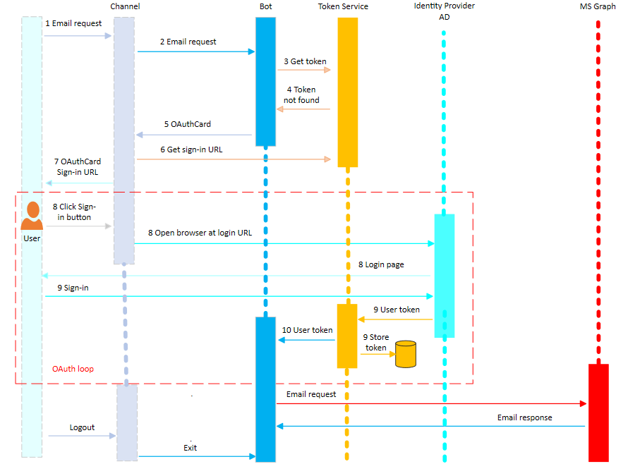

我们今天来说一下authentication，authentication一直是一个复杂的问题。bot里的authentication也不简单。我们先来看一个概念：Bot Framework Token Service，根据官方定义，这个token service主要是：

> * Facilitating the use of the OAuth protocol with a wide variety of external services.
> * Securely storing tokens for a particular bot, channel, conversation, and user.
> * Acquiring user tokens

可以看到这个service会和外部的服务沟通，保存一些已经获取的token，这样下次再来申请token的时候Bot Framework Token Service可以返回已经保存的token。

我们以一个例子来看一下具体的做法：

假设用户促发了一个操作，要完成这个操作需要我们的bot调用Graph API，而调用Graph API需要有调用的Token。

1. 用户促发了一个email请求操作

2. 这个操作作为一个activity被发送给了Bot Framework channel service，后者把这个请求进一步发送给了我们的bot服务。

3. 我们的bot service发现用户的activity需要一个访问Graph API的token，所以就问Token Service请求这个token

4. 由于这是此用户第一次发起这个请求，Bot Framework Token Service之前没有保存过这用户的token，所以它返回给我们bot说，没有找到token。

5. bot会为了获取token，需要用户确认授权，所以bot创建了一个OAuthCard对象，并且含有GraphConnection的名字，并且把这个OAuthCard穿回Channel Service

6. Bot Framework Channel Service收到这么一个请求后，就会调用Bot Framework Token Service来获取一个合法的OAuth登入网址。这个登入网址会被加入到OAuthCard对象

7. Bot Framework Channel Service将含有OAuth登入网址的OAuthCard对象发送回用户，这个对象会有一个sign-in的按钮。

8. 用户收到OAuthCard对象，点击上面的登入按钮，聊天客户端会打开用户登入的网页，让用户登入。

9. 在用户登入授权后，外部的Identity Provider就会把token传回给Bot Framework Token Service，Bot Framework Token Service则会安全地把token保存下来。

10. 我们的bot收到token后就可以对Graph API发起请求了。

等到下一次如果我们bot又需要同一个用户的token时，Bot Framework Token Service会从TokenStore里找到之前保存的token，如果token还没有过期的话，就直接返回给bot了。

authentication实际上是一个十分庞大复杂的topic，有兴趣的读者还可以参考 [这篇文档](https://docs.microsoft.com/en-us/azure/bot-service/bot-builder-authentication?view=azure-bot-service-4.0&tabs=aadv2%2Ccsharp)