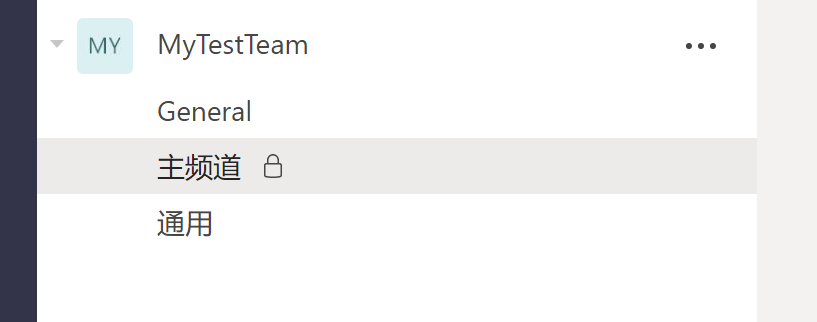

当我们在Teams里创建一个团队team的时候，系统会默认创建一个频道channel，这个频道就是我们最主要最核心的一个channel，那我们如何可以用Graph API来找到这个主channel呢？

比如，我这个team里有三个channel：



我们如果使用普通的获取channel列表的接口，结果如下：
```
GET /teams/{team-id}/channels
```

```json
{
    "@odata.context": "https://graph.microsoft.com/v1.0/$metadata#teams('31420d16-c88f-49c4-8eef-9344dd057697')/channels",
    "@odata.count": 3,
    "value": [
        {
            "id": "19:000e15b4bc0449e5afbe30be01182762@thread.tacv2",
            "displayName": "General",
            "description": null,
            "email": "",
            "webUrl": "https://...",
            "membershipType": "standard"
        },
        {
            "id": "19:c5afc4adab4f487fae760536b93e9c50@thread.tacv2",
            "displayName": "通用",
            "description": null,
            "email": "",
            "webUrl": "https://...",
            "membershipType": "standard"
        },
        {
            "id": "19:8c9c7238918d412fbbc8f95242f99a84@thread.tacv2",
            "displayName": "主频道",
            "description": null,
            "email": "",
            "webUrl": "https://...",
            "membershipType": "private"
        }
    ]
}
```

可以看到上面的结果里，每个channel的内容基本一样，很难判断出哪个才是主要的channel，好在Graph API前几个月出了一个新的api：
```
GET /teams/{team-id}/primaryChannel
```

从这个endpoint的url就可以知道，是用来获取某个指定的team的primary channel，就是我们所说的主频道。我们来看看它的返回结果，基本内容和上面的某个channel object类似，但是当前的1.0版本和beta版本返回的字段有一些不同。

1.0版本
```json
{
    "@odata.context": "https://graph.microsoft.com/v1.0/$metadata#teams('31420d16-c88f-49c4-8eef-9344dd057697')/primaryChannel/$entity",
    "id": "19:000e15b4bc0449e5afbe30be01182762@thread.tacv2",
    "displayName": "General",
    "description": null,
    "email": "",
    "webUrl": "https://teams.microsoft.com/l/channel/19%3a000e15b4bc0449e5afbe30be01182762%40thread.tacv2/General?groupId=31420d16-c88f-49c4-8eef-9344dd057697&tenantId=53213f63-c1e6-4416-bdab-da54fcb7b4b7",
    "membershipType": "standard"
}
```

beta版本
```json
{
    "@odata.context": "https://graph.microsoft.com/beta/$metadata#teams('31420d16-c88f-49c4-8eef-9344dd057697')/primaryChannel/$entity",
    "id": "19:000e15b4bc0449e5afbe30be01182762@thread.tacv2",
    "createdDateTime": null,
    "displayName": "General",
    "description": null,
    "isFavoriteByDefault": null,
    "email": "",
    "webUrl": "https://teams.microsoft.com/l/channel/19%3a000e15b4bc0449e5afbe30be01182762%40thread.tacv2/General?groupId=31420d16-c88f-49c4-8eef-9344dd057697&tenantId=53213f63-c1e6-4416-bdab-da54fcb7b4b7",
    "membershipType": "standard",
    "moderationSettings": null
}
```

通过对比，我们可以发现，新的beta版本多了很多新的属性`createdDateTime`,`isFavoriteByDefault`，`moderationSettings`，也就是说Teams团队将把越来越多的功能暴露给开发人员，让开发者可以开发出功能更加丰富的应用！期待！
