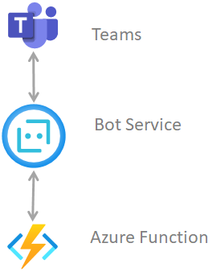
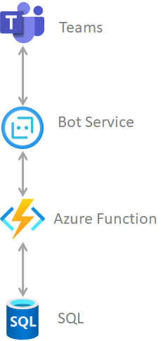
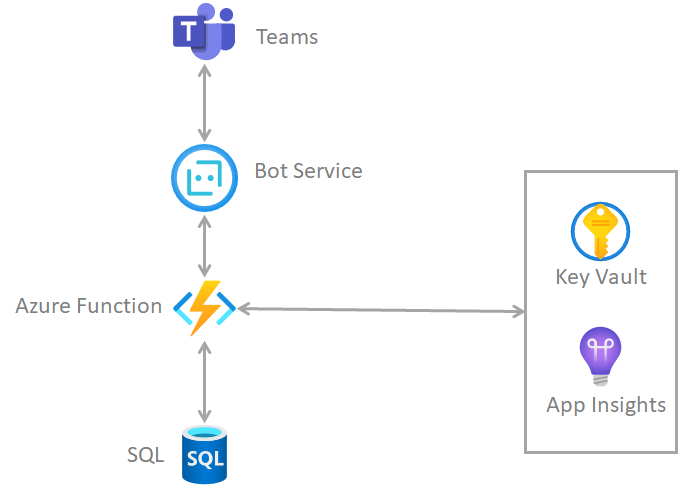

Azure Function可以说比较早期的一个serverless服务，随着这些年云服务的大行其道，Serverless在概念越来越火，什么叫serverless？

> Serverless computing (or serverless for short), is an execution model where the cloud provider is responsible for executing a piece of code by dynamically allocating the resources. And only charging for the amount of resources used to run the code.

从上面的定义可以知道serverless指的是用户不用考虑服务器之类的，只需要把的代码放到云服务商提供的serverless服务里运行，并且收取的费用是按照执行代码时占用的资源。所以如果你的代码不是需要一直运行着的，那就意味着你使用serverless服务比使用传统的服务更加省钱。

在Azure里越来越多的服务有了serverless，除了刚才说的Azure Function，还有了Serverless Kubernetes(使用virtual nodes)，数据库方面CosmosDB，和传统的SQL也都有了serverless，让用户在使用时更加省钱。

> [Azure SQL Database serverless: https://docs.microsoft.com/en-us/azure/azure-sql/database/serverless-tier-overview](https://docs.microsoft.com/en-us/azure/azure-sql/database/serverless-tier-overview)

> [Azure Cosmos DB serverless: https://docs.microsoft.com/en-us/azure/cosmos-db/serverless](https://docs.microsoft.com/en-us/azure/cosmos-db/serverless)

通常我们在开发一个应用时需要用到好几个环境，比如开发环境，测试环境，生产环境，有时候还会需要一个UAT环境，一般除了生产环境，其他环境的使用率都会比较低，这时候如果使用serverless的服务，那会剩下很多云服务费用。

那我们看看在开发Teams app的时候如何使用serverless，一个最最简单（用来demo级别的）的teams app的架构如下：

Teams和Azure的bot service进行交互，然后bot service和我们的服务通过HTTP api进行交互，在这里我们使用的是Azure Function，在Function里使用HTTP trigger，这样就可以把http接口暴露给bot service。

这个架构我之所以说是demo级别，因为连数据库都没有用，我们知道通常情况下一个系统肯定需要DB。好，让我们加上数据库。

我们这里可以使用上面说的SQL serverless或者是Cosmos DB serverless，但这个架构我只能说是pilot级别的架构，就是说只是用来做一些尝试性的试验项目。

如果我们要做一个真正的产品，哪怕是一个微型的产品，我们至少还需要日志系统（用来监控运行情况或者查错）和存放秘密的地方（比如保存数据库的连接字符串）。我们再来升级一下：

我们可以使用Azure的App Insights和Key Vault这两个服务，这两个可以算是serverless，因为我们在使用它们的时候不需要关心任何的运行他们的服务器，只需要根据保存数据的多少和调用次数进行付费，非常好用。

上面这个架构只是一个微型teams app产品的架构，如果需要做一个面向全球用户的teams app，那整套架构会非常复杂，我后面会写多篇文章来说明如何设计一个面向全球用户的teams app架构。
