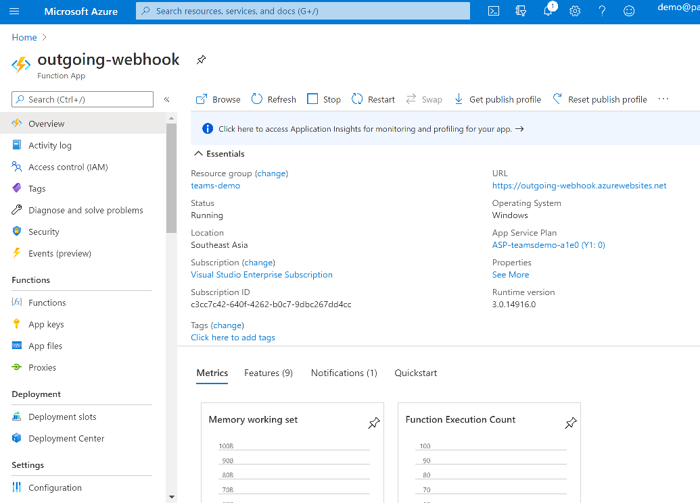

上篇文章讲了teams app的serverless架构，这篇主要讲如何真正使用Azure Function来开发一个最最简单的Teams Outgoing Webhook。

我们先登入azure的portal，创建一个azure function。我这里创建了一个名字叫outgoing-webhook的azure function。完成后如下图，记住这个azure function的URL，我这里是 `https://outgoing-webhook.azurewebsites.net`



在左边菜单里选择"Functions"，点击"Add"创建一个新的function


选择Trigger，我们使用HTTP Trigger


输入我们function的名字，我这里叫HandleMessage，有一点需要注意，Authorization level需要选择"Anonymous"，然后点击Create Function


完成后就可以看到我们有了HandleMessage这个函数。


输入我们的outgoing webhook代码。


```cs
#r "Newtonsoft.Json"

using System.Net;
using Microsoft.AspNetCore.Mvc;
using Microsoft.Extensions.Primitives;
using Newtonsoft.Json;

public class Message
{
    public string Text { get; set; }
}

public static async Task<IActionResult> Run(HttpRequest req, ILogger log)
{
    log.LogInformation("C# HTTP trigger function processed a request.");
    string requestBody = await new StreamReader(req.Body).ReadToEndAsync();
    var message = JsonConvert.DeserializeObject<Message>(requestBody);
    return new OkObjectResult(new Message { Text = "Echo: " + message.Text });
}
```


回到Teams，先选择需要添加outgoing webhook的一个team，选择"Manage team"


进入"Apps"页面，在右下方，点击 "Create an outgoing webhook"，你有可能看不到这个选项，如果看不到，你需要用管理员账号按照下面的步骤到office365后台进行设置


使用你的Office365管理员账号登入"https://portal.office.com"，点击"Admin"菜单


在左侧找到"Teams"菜单


然后找到 "Teams app"，点击"Permission policies"，点击你所在policy组，我这里是默认的"Global (Org-wide default)"


确保Custom apps是Allow all apps


再到Setup policies，确保 "Upload custom apps"是打开的状态


回到Teams，刷新页面，或者重新登入，现在你应该可以看到 "Create an outgoing webhook"的连接了，点击它。


在弹出的页面里输入你的webhook名字，和URL。


我这里使用名字"OutgoingWebhookTest"，URL是`https://outgoing-webhook.azurewebsites.net/api/HandleMessage`。这个URL就是我们前面创建的azure function的URL，加上function的名字。
```
{azure function url}/api/{http-triggered function name}
```


创建完后进入一个channel，at这个webhook，我这里是 @outgoingWebhookTest


后面跟上你想发给这个webhook的文字。


发送后，等几秒钟后，你就可以收到我们function发回来的回复了。


如果你点开Azure Function的log，可以实时的看到我们function被teams调用的记录


使用Azure Function开发的好处是代码简单，不需要ngrok之类的工具，而且当你webhook只是用来自己测试玩玩，基本是免费的，这也是Azure serverless的一大优势！
