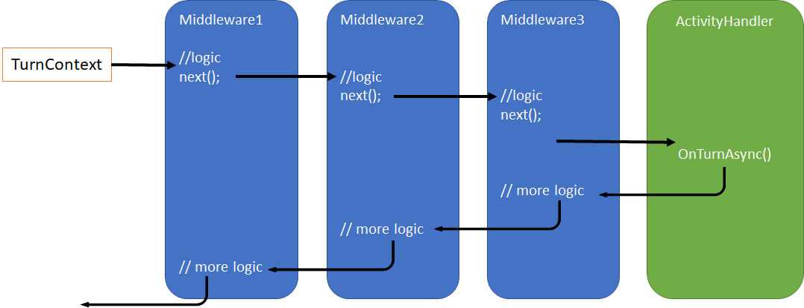

middleware是目前一些framework比较流行的概念，通常一个开发框架需要提供一些可扩展可定制化的功能。所以middleware这种pattern就很实用。

熟悉asp.net core的开发可能第一个想到的就是asp.net core的middleware，如下图：


当一个http request进入到处理的pipeline后，先被一个个middleware嵌套的执行，完成后在一个个推出。如果我们需要一些定制化功能，比如想把每个request要做一个统计记录，那开发可以自己写个middleware，加入到这个pipeline里，这样任何一个request都会从这个middleware通过，middleware就可以对request进行统计分析。

我自己整理了一下bot framework的middleware，如下图：



可以看到当 Adapter 把 TurnContext 创建好后，就会开始一个个调用middleware，每一个middleware会通过调用`next()`来触发下一个middleware，在middleware pipeline的终点是ActivityHandler的`OnTurnAsync()`方法。

如果一个middleware想要短路（Short circuiting）整个turn的处理，可以很简单的不调用next来达到这个目的。

下面我们先来看一下IMiddleware接口：

```cs
public interface IMiddleware
{
    Task OnTurnAsync(ITurnContext turnContext, NextDelegate next, CancellationToken cancellationToken = default(CancellationToken));
}
```

一个最简单的middleware如下：

```cs
public class MyMiddleware : IMiddleware
{
    public async Task OnTurnAsync(ITurnContext turnContext, NextDelegate next, CancellationToken cancellationToken = default)
    {
        // some logic
        await next(cancellationToken).ConfigureAwait(false);
        // more logic
    }
}
```

有了自己的middleware后，我们需要在我们自己的Adapter类的构造函数里，把middleware加入到middleware列表。

```cs
public class MyHandler : BotFrameworkHttpAdapter
{
    public MyHandler(IConfiguration configuration, ILogger<BotFrameworkHttpAdapter> logger)
        : base(configuration, logger)
    {
        Use(new MyMiddleware());
    }
}
```

### Middleware的调用顺序是如何的？

我们用代码来说明，创建两个middleware，A和B

```cs
public class MyHandler : BotFrameworkHttpAdapter
{
    public MyHandler(IConfiguration configuration, ILogger<BotFrameworkHttpAdapter> logger)
        : base(configuration, logger)
    {
        Use(new TestAMiddleware(logger));
        Use(new TestBMiddleware(logger));
    }
}

public class TestAMiddleware : IMiddleware
{
    private readonly ILogger _logger;
    public TestAMiddleware(ILogger logger)
    {
        _logger = logger;
    }

    public async Task OnTurnAsync(ITurnContext turnContext, NextDelegate next, CancellationToken cancellationToken = default)
    {
        _logger.LogInformation("Middleware A begin");
        await next(cancellationToken).ConfigureAwait(false);
        _logger.LogInformation("Middleware A end");
    }
}

public class TestBMiddleware : IMiddleware
{
    private readonly ILogger _logger;
    public TestBMiddleware(ILogger logger)
    {
        _logger = logger;
    }

    public async Task OnTurnAsync(ITurnContext turnContext, NextDelegate next, CancellationToken cancellationToken = default)
    {
        _logger.LogInformation("Middleware B begin");
        await next(cancellationToken).ConfigureAwait(false);
        _logger.LogInformation("Middleware B end");
    }
}
```

当在处理一个activity时，我们可以看到打印出来的log：
```
    Middleware A begin
    Middleware B begin
    OnMessageActivityAsync
    Middleware B end
    Middleware A end
```

现在各位看到这里就清楚了吧，先通过`Use()`加入的middleware将会先被调用到。
